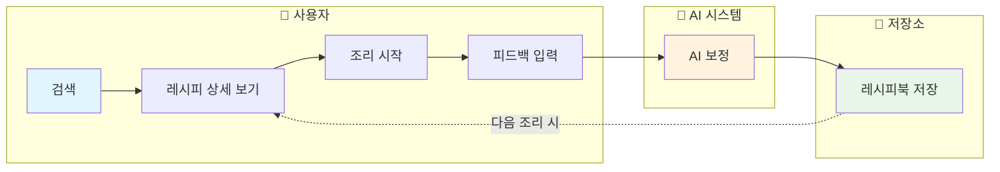
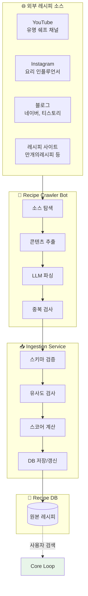
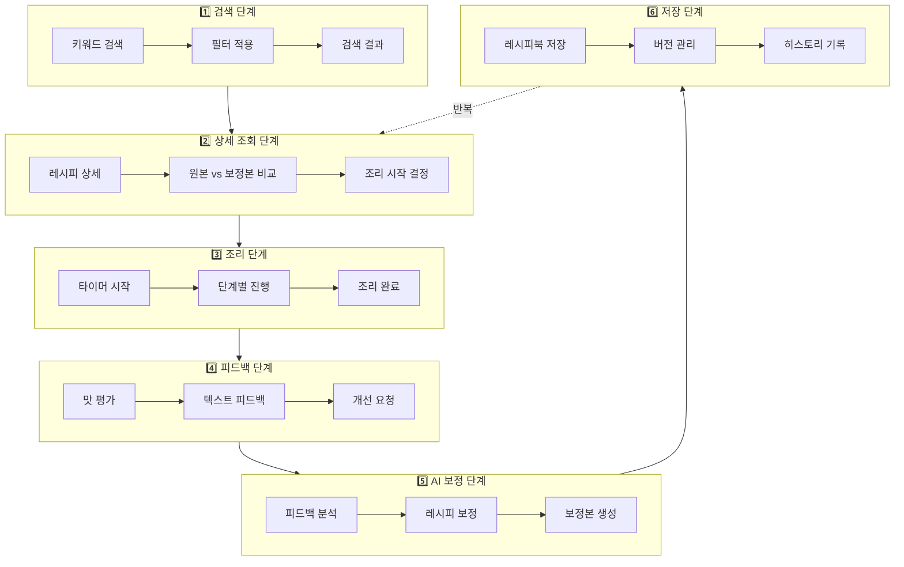
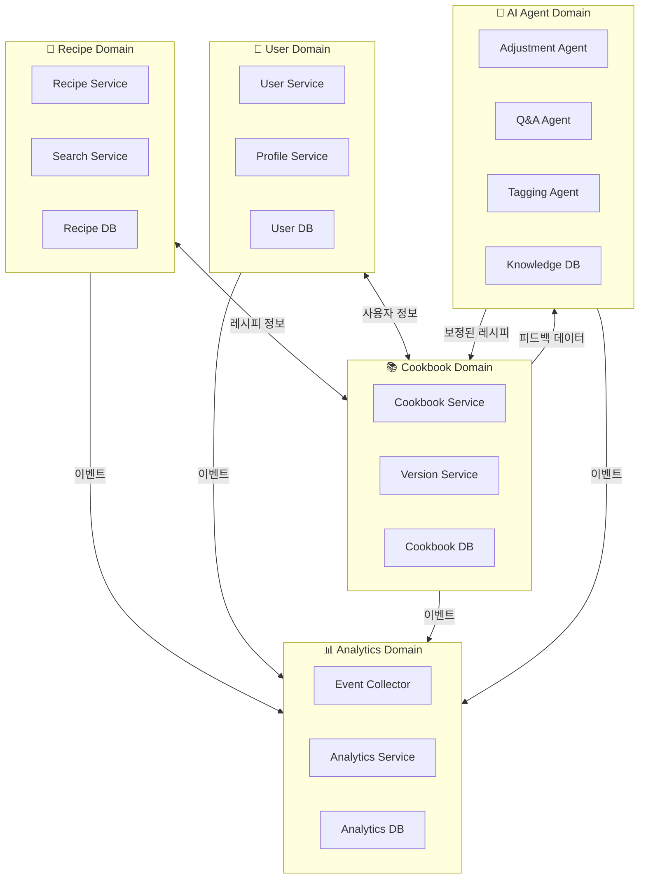
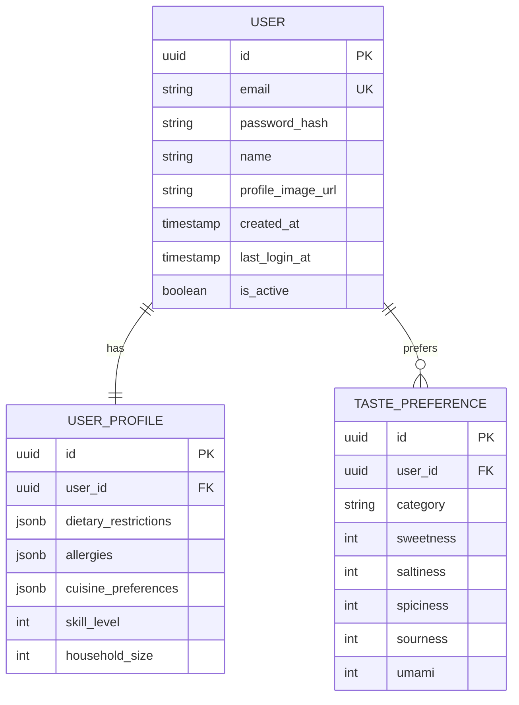
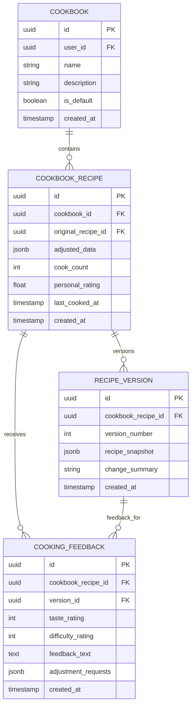
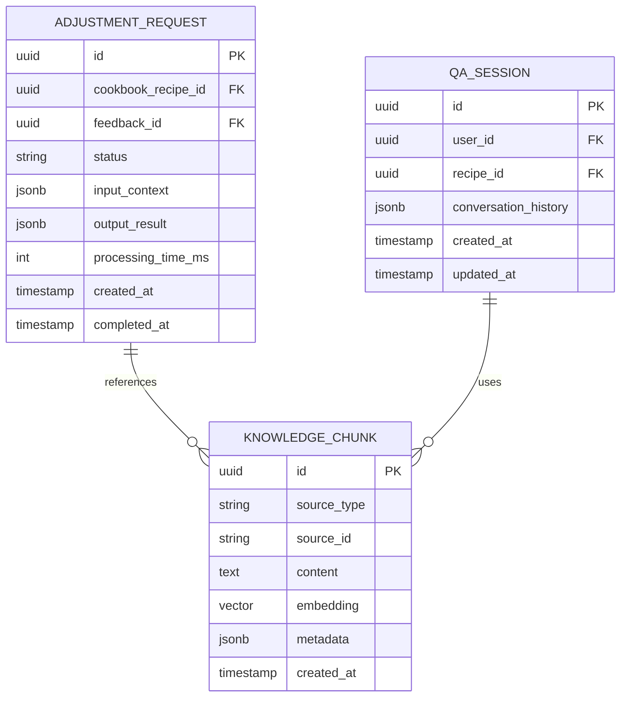
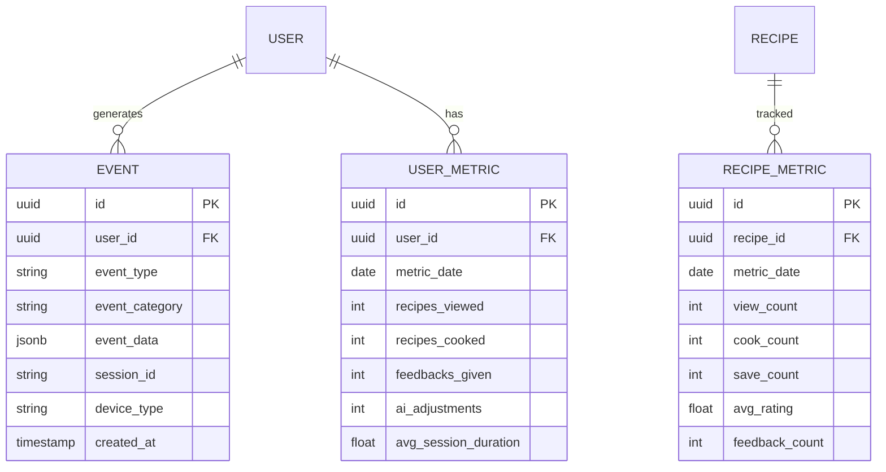
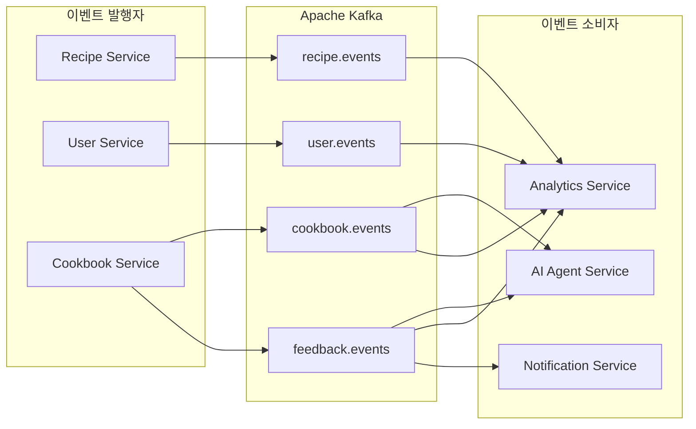

# 내시피(Naecipe) 도메인 분석

> 상위 문서: [5-1SERVICE_ARCHITECTURE.md](./5-1SERVICE_ARCHITECTURE.md)

---

## 1. 핵심 데이터 흐름 (Core Data Flow)

내시피 서비스의 핵심은 **Core Loop**이다. 사용자가 레시피를 검색하고, 조리하고, 피드백을 남기면 AI가 개인화된 레시피를 제공하는 선순환 구조를 형성한다.

### 1.1 Core Loop 다이어그램



### 1.2 원본 레시피 수집 플로우

Core Loop가 작동하기 위해서는 사용자가 검색할 수 있는 **원본 레시피 데이터베이스**가 구축되어 있어야 한다. 이 데이터는 외부 플랫폼에서 크롤링하여 수집된다.



### 1.3 상세 데이터 흐름



---

## 2. 도메인 경계 식별

### 2.1 Bounded Context Map



### 2.2 도메인별 책임

| 도메인 | 핵심 책임 | 주요 엔티티 |
|--------|----------|------------|
| **Recipe** | 외부 레시피 수집, 검색, 정규화, 스코어링 | Recipe, RecipeSource, Ingredient, Step, Tag |
| **Recipe Ingestion** | 크롤링 데이터 수신, 중복 검사, 점수 갱신 | RecipeSource, ScoreHistory |
| **User** | 회원 관리, 인증, 프로필 | User, Profile, Preference |
| **Cookbook** | 개인 레시피북, 버전 관리 | Cookbook, CookbookRecipe, Version, Feedback |
| **AI Agent** | 레시피 보정, Q&A, 자동 태깅, 크롤링 | AdjustmentRequest, KnowledgeBase, Embedding |
| **Analytics** | 사용자 행동 분석, 통계 | Event, Session, Metric |

---

## 3. 도메인 상세 정의

### 3.1 Recipe Domain

**목적:** 외부 레시피를 수집하고 정규화하여 검색 가능한 형태로 제공

```mermaid
erDiagram
    RECIPE {
        uuid id PK
        string title
        string author_name
        string author_channel
        string source_url
        string source_platform
        text description
        int cooking_time_minutes
        int servings
        string difficulty
        decimal quality_score
        decimal popularity_score
        decimal exposure_score
        string content_hash
        boolean is_verified
        timestamp created_at
        timestamp updated_at
    }

    RECIPE_SOURCE {
        uuid id PK
        uuid recipe_id FK
        string platform
        string source_url UK
        string original_title
        bigint platform_view_count
        int platform_like_count
        int platform_comment_count
        jsonb raw_data
        timestamp first_discovered_at
        timestamp last_updated_at
    }

    INGREDIENT {
        uuid id PK
        uuid recipe_id FK
        string name
        string amount
        string unit
        int order_index
        boolean is_optional
    }

    COOKING_STEP {
        uuid id PK
        uuid recipe_id FK
        int step_number
        text instruction
        int duration_seconds
        string step_type
    }

    TAG {
        uuid id PK
        string name
        string category
    }

    RECIPE_TAG {
        uuid recipe_id FK
        uuid tag_id FK
    }

    RECIPE ||--o{ RECIPE_SOURCE : crawled_from
    RECIPE ||--o{ INGREDIENT : contains
    RECIPE ||--o{ COOKING_STEP : has
    RECIPE ||--o{ RECIPE_TAG : tagged_with
    TAG ||--o{ RECIPE_TAG : applied_to
```



**핵심 기능:**
- **외부 레시피 수집**: Crawler Bot이 유명 쉐프/인플루언서 레시피를 크롤링
- **중복 검사**: 제목+저자 해시 및 콘텐츠 유사도(임베딩)로 중복 판단
- **스코어링**: 인기도, 품질, 신선도 기반 노출 점수 산정
- **전문 검색**: Elasticsearch 연동
- **태그 기반 필터링**
- **인기도/평점 기반 정렬**

**데이터 수집 흐름:**
1. Crawler Bot이 YouTube, Instagram, 블로그 등에서 레시피 콘텐츠 발견
2. LLM이 비정형 콘텐츠를 구조화된 레시피 형태로 파싱
3. Ingestion Service가 중복 검사 수행 (제목+저자 / 콘텐츠 유사도)
4. 신규 레시피면 저장, 기존이면 노출 점수 갱신

### 3.2 User Domain

**목적:** 사용자 계정 관리, 인증/인가, 개인 설정



**핵심 기능:**
- OAuth 2.0 소셜 로그인 (Google, Kakao, Naver)
- 세션 관리 (JWT + Redis)
- 취향 프로필 관리
- 알레르기/식이 제한 설정

### 3.3 Cookbook Domain

**목적:** 개인 레시피북 관리, 버전 이력, 피드백 수집



**핵심 기능:**
- 레시피북 CRUD
- 레시피 버전 관리 (최대 10개 버전 유지)
- 조리 피드백 수집
- 조리 이력 관리

### 3.4 AI Agent Domain

**목적:** 피드백 기반 레시피 보정, Q&A 응답, 자동 태깅



**핵심 기능:**
- Adjustment Agent: 피드백 기반 레시피 자동 보정
- Q&A Agent: 조리 중 질문 응답
- Tagging Agent: 레시피 자동 분류
- RAG 기반 지식 검색

### 3.5 Analytics Domain

**목적:** 사용자 행동 추적, 서비스 메트릭, 비즈니스 인사이트



**핵심 기능:**
- 실시간 이벤트 수집 (Kafka)
- 일별/주별/월별 집계
- 사용자 세그먼트 분석
- A/B 테스트 지원

---

## 4. 도메인 간 통신 패턴

### 4.1 동기 통신 (Sync)

| 호출자 | 피호출자 | 방식 | 용도 |
|--------|---------|------|------|
| Gateway | Recipe Service | REST | 레시피 검색/조회 |
| Gateway | User Service | REST | 인증/사용자 조회 |
| Gateway | Cookbook Service | REST | 레시피북 CRUD |
| Cookbook Service | Recipe Service | gRPC | 원본 레시피 조회 |
| AI Service | Knowledge DB | gRPC | 벡터 검색 |

### 4.2 비동기 통신 (Async)



---

## 5. 도메인 이벤트 정의

### 5.1 주요 도메인 이벤트

| 이벤트 | 발행 도메인 | 소비 도메인 | 설명 |
|--------|-----------|-----------|------|
| `RecipeViewed` | Recipe | Analytics | 레시피 상세 조회 |
| `RecipeSaved` | Cookbook | Analytics | 레시피북에 저장 |
| `CookingStarted` | Cookbook | Analytics | 조리 시작 |
| `CookingCompleted` | Cookbook | Analytics, AI | 조리 완료 |
| `FeedbackSubmitted` | Cookbook | AI, Analytics | 피드백 제출 |
| `AdjustmentRequested` | Cookbook | AI | AI 보정 요청 |
| `AdjustmentCompleted` | AI | Cookbook, Analytics | AI 보정 완료 |
| `UserRegistered` | User | Analytics | 회원 가입 |
| `UserPreferenceUpdated` | User | AI | 취향 설정 변경 |

### 5.2 이벤트 스키마 예시

```typescript
// FeedbackSubmitted 이벤트
interface FeedbackSubmittedEvent {
  eventId: string;
  eventType: 'FeedbackSubmitted';
  timestamp: string;
  version: '1.0';

  payload: {
    userId: string;
    cookbookRecipeId: string;
    versionId: string;
    feedback: {
      tasteRating: number;      // 1-5
      difficultyRating: number; // 1-5
      feedbackText: string;
      adjustmentRequests: {
        category: 'taste' | 'portion' | 'difficulty' | 'ingredient';
        description: string;
      }[];
    };
  };

  metadata: {
    correlationId: string;
    causationId: string;
    userId: string;
  };
}
```

---

## 변경 이력

| 버전 | 날짜 | 변경 내용 |
|-----|------|----------|
| v1.0 | 2025.11.30 | 초기 문서 작성 |

---

> **다음 문서:** [5-1-2_SYSTEM.md](./5-1-2_SYSTEM.md) - 시스템 아키텍처
