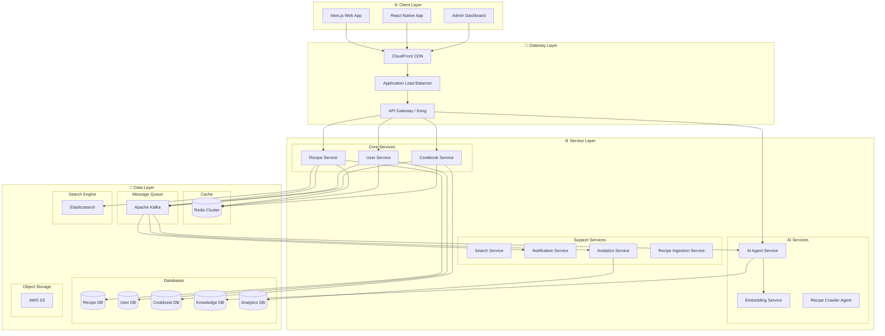
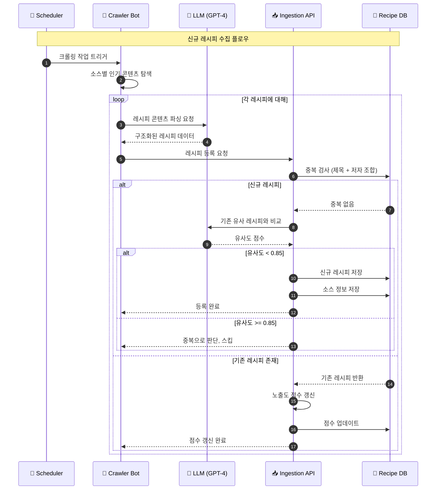
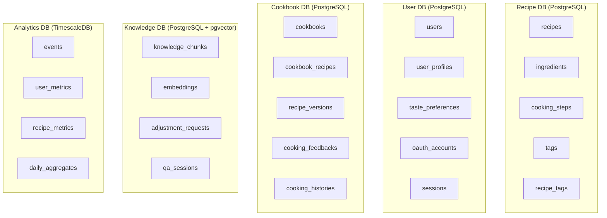
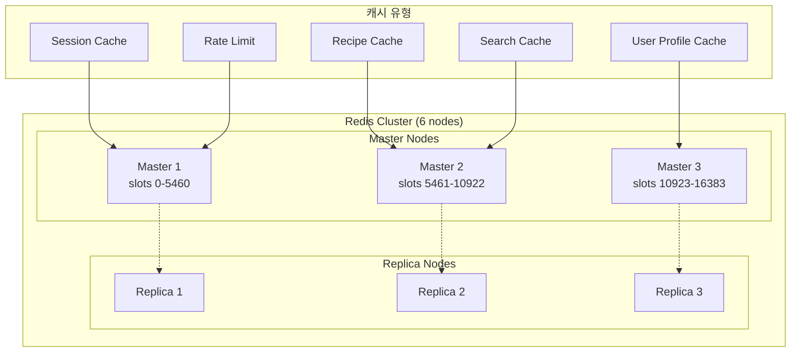
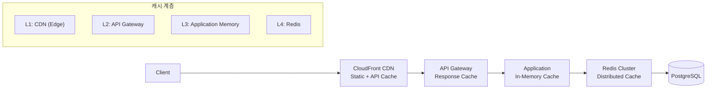
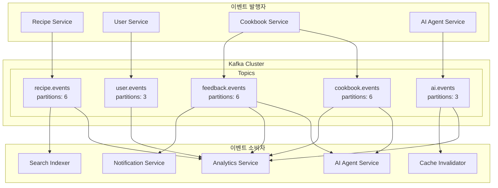

# 내시피(Naecipe) 시스템 아키텍처

> 상위 문서: [5-1SERVICE_ARCHITECTURE.md](./5-1SERVICE_ARCHITECTURE.md)

---

## 1. 전체 시스템 아키텍처

### 1.1 4계층 아키텍처 개요



### 1.2 서비스 목록

| 서비스 | 기술 스택 | 역할 | 포트 |
|--------|----------|------|------|
| **API Gateway** | Kong | 인증, 라우팅, Rate Limiting | 8000 |
| **Recipe Service** | FastAPI | 레시피 CRUD, 검색 | 8001 |
| **User Service** | FastAPI | 인증, 사용자 관리 | 8002 |
| **Cookbook Service** | FastAPI | 레시피북, 피드백 | 8003 |
| **AI Agent Service** | FastAPI | LangGraph 기반 AI 처리 | 8004 |
| **Embedding Service** | FastAPI | 벡터 임베딩 생성 | 8005 |
| **Search Service** | FastAPI | Elasticsearch 연동 | 8006 |
| **Notification Service** | FastAPI | 푸시, 이메일 발송 | 8007 |
| **Analytics Service** | FastAPI | 이벤트 집계, 통계 | 8008 |
| **Recipe Ingestion Service** | FastAPI | 크롤링 레시피 수신, 중복 검사, DB 저장 | 8009 |
| **Recipe Crawler Agent** | Python (LangGraph) | 외부 레시피 크롤링, LLM 기반 판단 | Local/Bot |

---

## 1.3 원본 레시피 수집 파이프라인

### 1.3.1 전체 아키텍처

```mermaid
flowchart TB
    subgraph ExternalSources["🌐 External Sources"]
        YT[YouTube<br/>유명 쉐프 채널]
        IG[Instagram<br/>요리 인플루언서]
        BLOG[Blog<br/>네이버, 티스토리]
        RECIPE_SITES[레시피 사이트<br/>만개의레시피, 해먹남녀]
    end

    subgraph CrawlerBot["🤖 Recipe Crawler Bot (Local/Server)"]
        SCHEDULER[Scheduler<br/>크롤링 스케줄러]
        CRAWLER_AGENT[Crawler Agent<br/>LangGraph 기반]

        subgraph AgentTasks["에이전트 작업"]
            DISCOVER[소스 탐색<br/>인기 콘텐츠 발견]
            EXTRACT[레시피 추출<br/>LLM 파싱]
            NORMALIZE[데이터 정규화<br/>표준 포맷 변환]
            DEDUP[중복 검사<br/>유사도 판단]
        end

        SCHEDULER --> CRAWLER_AGENT
        CRAWLER_AGENT --> DISCOVER
        DISCOVER --> EXTRACT
        EXTRACT --> NORMALIZE
        NORMALIZE --> DEDUP
    end

    subgraph IngestionService["📥 Recipe Ingestion Service"]
        API[Ingestion API<br/>레시피 수신]
        VALIDATOR[Validator<br/>스키마 검증]
        DEDUP_CHECK[Deduplication<br/>DB 중복 확인]
        SCORER[Scorer<br/>노출도/품질 점수]
        WRITER[DB Writer<br/>저장/업데이트]
    end

    subgraph RecipeDB["💾 Recipe DB"]
        RECIPES[(recipes)]
        SOURCES[(recipe_sources)]
        SCORES[(recipe_scores)]
    end

    ExternalSources --> SCHEDULER
    DEDUP --> API
    API --> VALIDATOR
    VALIDATOR --> DEDUP_CHECK
    DEDUP_CHECK --> SCORER
    SCORER --> WRITER
    WRITER --> RecipeDB
```



### 1.3.2 크롤링 워크플로우



### 1.3.3 중복 판단 로직

| 판단 기준 | 방식 | 임계값 |
|----------|------|--------|
| **정확 매칭** | 제목 + 저자명 해시 | 100% 일치 시 중복 |
| **유사도 검사** | 재료 + 조리법 임베딩 코사인 유사도 | >= 0.85 시 중복 |
| **소스 URL** | 동일 URL 존재 여부 | URL 일치 시 중복 |

### 1.3.4 스코어링 시스템

```python
# 레시피 품질/노출도 스코어 계산
class RecipeScorer:
    def calculate_score(self, recipe: dict, source_metrics: dict) -> float:
        """
        종합 점수 = (인기도 * 0.4) + (품질 * 0.3) + (신선도 * 0.2) + (소스 신뢰도 * 0.1)
        """
        popularity = self._calc_popularity(source_metrics)
        quality = self._calc_quality(recipe)
        freshness = self._calc_freshness(recipe['created_at'])
        source_trust = self._get_source_trust(recipe['source_platform'])

        return (
            popularity * 0.4 +
            quality * 0.3 +
            freshness * 0.2 +
            source_trust * 0.1
        )

    def _calc_popularity(self, metrics: dict) -> float:
        """소스 플랫폼에서의 인기도 (조회수, 좋아요, 댓글 등)"""
        views = min(metrics.get('view_count', 0) / 1_000_000, 1.0)
        likes = min(metrics.get('like_count', 0) / 100_000, 1.0)
        comments = min(metrics.get('comment_count', 0) / 10_000, 1.0)
        return (views * 0.5 + likes * 0.3 + comments * 0.2)

    def _calc_quality(self, recipe: dict) -> float:
        """레시피 완성도 (재료, 단계, 이미지 존재 여부)"""
        has_ingredients = len(recipe.get('ingredients', [])) >= 3
        has_steps = len(recipe.get('steps', [])) >= 3
        has_image = bool(recipe.get('thumbnail_url'))
        has_time = bool(recipe.get('cooking_time_minutes'))

        return sum([has_ingredients, has_steps, has_image, has_time]) / 4
```

---

## 2. Database 상세 설계

### 2.1 데이터베이스 분리 전략

도메인별로 물리적 데이터베이스를 분리하여 독립적인 확장성과 장애 격리를 보장한다.



### 2.2 Recipe DB 스키마

```sql
-- Recipe DB Schema

CREATE TABLE recipes (
    id UUID PRIMARY KEY DEFAULT gen_random_uuid(),
    title VARCHAR(200) NOT NULL,
    author_name VARCHAR(100),                -- 원작자 (쉐프/인플루언서 이름)
    author_channel VARCHAR(200),             -- 채널명 (유튜브 채널, 인스타 계정 등)
    source_url TEXT,
    source_platform VARCHAR(50),             -- youtube, instagram, blog, recipe_site
    description TEXT,
    cooking_time_minutes INTEGER,
    servings INTEGER DEFAULT 2,
    difficulty VARCHAR(20) CHECK (difficulty IN ('easy', 'medium', 'hard')),
    normalized_data JSONB,
    thumbnail_url TEXT,
    video_url TEXT,                          -- 영상 레시피인 경우 비디오 URL

    -- 내부 스코어링
    quality_score DECIMAL(3,2) DEFAULT 0,    -- 레시피 품질 점수 (0~1)
    popularity_score DECIMAL(3,2) DEFAULT 0, -- 인기도 점수 (0~1)
    exposure_score DECIMAL(3,2) DEFAULT 0,   -- 노출 우선순위 점수 (0~1)

    -- 사용자 통계
    view_count INTEGER DEFAULT 0,
    save_count INTEGER DEFAULT 0,
    cook_count INTEGER DEFAULT 0,
    avg_rating DECIMAL(2,1) DEFAULT 0,

    -- 중복 검사용 해시
    content_hash VARCHAR(64),                -- 재료+조리법 기반 해시 (중복 검사용)

    is_active BOOLEAN DEFAULT true,
    is_verified BOOLEAN DEFAULT false,       -- 관리자 검수 완료 여부
    created_at TIMESTAMPTZ DEFAULT NOW(),
    updated_at TIMESTAMPTZ DEFAULT NOW(),
    last_crawled_at TIMESTAMPTZ              -- 마지막 크롤링 시점
);

-- 레시피 소스 정보 (크롤링 이력 관리)
CREATE TABLE recipe_sources (
    id UUID PRIMARY KEY DEFAULT gen_random_uuid(),
    recipe_id UUID REFERENCES recipes(id) ON DELETE CASCADE,
    platform VARCHAR(50) NOT NULL,           -- youtube, instagram, naver_blog, etc.
    source_url TEXT NOT NULL UNIQUE,
    original_title VARCHAR(300),
    original_author VARCHAR(100),

    -- 플랫폼별 메트릭스
    platform_view_count BIGINT DEFAULT 0,
    platform_like_count INTEGER DEFAULT 0,
    platform_comment_count INTEGER DEFAULT 0,
    platform_share_count INTEGER DEFAULT 0,

    -- 크롤링 정보
    first_discovered_at TIMESTAMPTZ DEFAULT NOW(),
    last_updated_at TIMESTAMPTZ DEFAULT NOW(),
    crawl_count INTEGER DEFAULT 1,
    raw_data JSONB                           -- 원본 크롤링 데이터 보존

);

-- 레시피 스코어 히스토리 (점수 변화 추적)
CREATE TABLE recipe_score_history (
    id UUID PRIMARY KEY DEFAULT gen_random_uuid(),
    recipe_id UUID REFERENCES recipes(id) ON DELETE CASCADE,
    quality_score DECIMAL(3,2),
    popularity_score DECIMAL(3,2),
    exposure_score DECIMAL(3,2),
    score_reason TEXT,                       -- 점수 변경 사유
    recorded_at TIMESTAMPTZ DEFAULT NOW()
);

CREATE TABLE ingredients (
    id UUID PRIMARY KEY DEFAULT gen_random_uuid(),
    recipe_id UUID REFERENCES recipes(id) ON DELETE CASCADE,
    name VARCHAR(100) NOT NULL,
    amount VARCHAR(50),
    unit VARCHAR(30),
    order_index INTEGER NOT NULL,
    is_optional BOOLEAN DEFAULT false,
    substitutes JSONB DEFAULT '[]'
);

CREATE TABLE cooking_steps (
    id UUID PRIMARY KEY DEFAULT gen_random_uuid(),
    recipe_id UUID REFERENCES recipes(id) ON DELETE CASCADE,
    step_number INTEGER NOT NULL,
    instruction TEXT NOT NULL,
    duration_seconds INTEGER,
    step_type VARCHAR(30) DEFAULT 'cooking',
    tips TEXT,
    image_url TEXT
);

CREATE TABLE tags (
    id UUID PRIMARY KEY DEFAULT gen_random_uuid(),
    name VARCHAR(50) NOT NULL UNIQUE,
    category VARCHAR(30), -- cuisine, diet, meal_type, etc.
    usage_count INTEGER DEFAULT 0
);

CREATE TABLE recipe_tags (
    recipe_id UUID REFERENCES recipes(id) ON DELETE CASCADE,
    tag_id UUID REFERENCES tags(id) ON DELETE CASCADE,
    PRIMARY KEY (recipe_id, tag_id)
);

-- Indexes
CREATE INDEX idx_recipes_title ON recipes USING gin(to_tsvector('korean', title));
CREATE INDEX idx_recipes_author ON recipes(author_name);
CREATE INDEX idx_recipes_source_platform ON recipes(source_platform);
CREATE INDEX idx_recipes_difficulty ON recipes(difficulty);
CREATE INDEX idx_recipes_cooking_time ON recipes(cooking_time_minutes);
CREATE INDEX idx_recipes_exposure_score ON recipes(exposure_score DESC);
CREATE INDEX idx_recipes_content_hash ON recipes(content_hash);
CREATE INDEX idx_recipes_author_title ON recipes(author_name, title);  -- 중복 검사용

CREATE INDEX idx_recipe_sources_url ON recipe_sources(source_url);
CREATE INDEX idx_recipe_sources_recipe ON recipe_sources(recipe_id);
CREATE INDEX idx_recipe_sources_platform ON recipe_sources(platform);

CREATE INDEX idx_ingredients_recipe_id ON ingredients(recipe_id);
CREATE INDEX idx_cooking_steps_recipe_id ON cooking_steps(recipe_id);
CREATE INDEX idx_tags_category ON tags(category);
```

### 2.3 User DB 스키마

```sql
-- User DB Schema

CREATE TABLE users (
    id UUID PRIMARY KEY DEFAULT gen_random_uuid(),
    email VARCHAR(255) UNIQUE NOT NULL,
    password_hash VARCHAR(255),
    name VARCHAR(100) NOT NULL,
    profile_image_url TEXT,
    role VARCHAR(20) DEFAULT 'user' CHECK (role IN ('user', 'admin', 'moderator')),
    is_active BOOLEAN DEFAULT true,
    email_verified BOOLEAN DEFAULT false,
    created_at TIMESTAMPTZ DEFAULT NOW(),
    last_login_at TIMESTAMPTZ,
    updated_at TIMESTAMPTZ DEFAULT NOW()
);

CREATE TABLE oauth_accounts (
    id UUID PRIMARY KEY DEFAULT gen_random_uuid(),
    user_id UUID REFERENCES users(id) ON DELETE CASCADE,
    provider VARCHAR(30) NOT NULL, -- google, kakao, naver
    provider_account_id VARCHAR(255) NOT NULL,
    access_token TEXT,
    refresh_token TEXT,
    expires_at TIMESTAMPTZ,
    created_at TIMESTAMPTZ DEFAULT NOW(),
    UNIQUE (provider, provider_account_id)
);

CREATE TABLE user_profiles (
    id UUID PRIMARY KEY DEFAULT gen_random_uuid(),
    user_id UUID UNIQUE REFERENCES users(id) ON DELETE CASCADE,
    dietary_restrictions JSONB DEFAULT '[]', -- vegetarian, vegan, halal, etc.
    allergies JSONB DEFAULT '[]',
    cuisine_preferences JSONB DEFAULT '[]', -- korean, japanese, western, etc.
    skill_level INTEGER DEFAULT 2 CHECK (skill_level BETWEEN 1 AND 5),
    household_size INTEGER DEFAULT 2,
    cooking_frequency VARCHAR(20) DEFAULT 'weekly',
    updated_at TIMESTAMPTZ DEFAULT NOW()
);

CREATE TABLE taste_preferences (
    id UUID PRIMARY KEY DEFAULT gen_random_uuid(),
    user_id UUID REFERENCES users(id) ON DELETE CASCADE,
    category VARCHAR(50) NOT NULL, -- overall, korean, chinese, etc.
    sweetness INTEGER DEFAULT 3 CHECK (sweetness BETWEEN 1 AND 5),
    saltiness INTEGER DEFAULT 3 CHECK (saltiness BETWEEN 1 AND 5),
    spiciness INTEGER DEFAULT 3 CHECK (spiciness BETWEEN 1 AND 5),
    sourness INTEGER DEFAULT 3 CHECK (sourness BETWEEN 1 AND 5),
    umami INTEGER DEFAULT 3 CHECK (umami BETWEEN 1 AND 5),
    updated_at TIMESTAMPTZ DEFAULT NOW(),
    UNIQUE (user_id, category)
);

-- Indexes
CREATE INDEX idx_users_email ON users(email);
CREATE INDEX idx_oauth_accounts_provider ON oauth_accounts(provider, provider_account_id);
CREATE INDEX idx_user_profiles_user_id ON user_profiles(user_id);
```

### 2.4 Cookbook DB 스키마

```sql
-- Cookbook DB Schema

CREATE TABLE cookbooks (
    id UUID PRIMARY KEY DEFAULT gen_random_uuid(),
    user_id UUID NOT NULL, -- FK to User DB (cross-DB reference)
    name VARCHAR(100) NOT NULL,
    description TEXT,
    is_default BOOLEAN DEFAULT false,
    recipe_count INTEGER DEFAULT 0,
    created_at TIMESTAMPTZ DEFAULT NOW(),
    updated_at TIMESTAMPTZ DEFAULT NOW()
);

CREATE TABLE cookbook_recipes (
    id UUID PRIMARY KEY DEFAULT gen_random_uuid(),
    cookbook_id UUID REFERENCES cookbooks(id) ON DELETE CASCADE,
    original_recipe_id UUID NOT NULL, -- FK to Recipe DB
    adjusted_data JSONB, -- 보정된 레시피 데이터
    current_version INTEGER DEFAULT 1,
    cook_count INTEGER DEFAULT 0,
    personal_rating DECIMAL(2,1),
    notes TEXT,
    last_cooked_at TIMESTAMPTZ,
    created_at TIMESTAMPTZ DEFAULT NOW(),
    updated_at TIMESTAMPTZ DEFAULT NOW()
);

CREATE TABLE recipe_versions (
    id UUID PRIMARY KEY DEFAULT gen_random_uuid(),
    cookbook_recipe_id UUID REFERENCES cookbook_recipes(id) ON DELETE CASCADE,
    version_number INTEGER NOT NULL,
    recipe_snapshot JSONB NOT NULL, -- 해당 버전의 전체 레시피
    change_summary TEXT,
    change_type VARCHAR(30), -- manual, ai_adjusted, reverted
    created_at TIMESTAMPTZ DEFAULT NOW(),
    UNIQUE (cookbook_recipe_id, version_number)
);

CREATE TABLE cooking_feedbacks (
    id UUID PRIMARY KEY DEFAULT gen_random_uuid(),
    cookbook_recipe_id UUID REFERENCES cookbook_recipes(id) ON DELETE CASCADE,
    version_id UUID REFERENCES recipe_versions(id),
    taste_rating INTEGER CHECK (taste_rating BETWEEN 1 AND 5),
    difficulty_rating INTEGER CHECK (difficulty_rating BETWEEN 1 AND 5),
    feedback_text TEXT,
    adjustment_requests JSONB DEFAULT '[]',
    photos JSONB DEFAULT '[]',
    cooking_duration_minutes INTEGER,
    created_at TIMESTAMPTZ DEFAULT NOW()
);

CREATE TABLE cooking_histories (
    id UUID PRIMARY KEY DEFAULT gen_random_uuid(),
    cookbook_recipe_id UUID REFERENCES cookbook_recipes(id) ON DELETE CASCADE,
    version_id UUID REFERENCES recipe_versions(id),
    started_at TIMESTAMPTZ NOT NULL,
    completed_at TIMESTAMPTZ,
    status VARCHAR(20) DEFAULT 'in_progress',
    notes TEXT
);

-- Indexes
CREATE INDEX idx_cookbooks_user_id ON cookbooks(user_id);
CREATE INDEX idx_cookbook_recipes_cookbook_id ON cookbook_recipes(cookbook_id);
CREATE INDEX idx_cookbook_recipes_original ON cookbook_recipes(original_recipe_id);
CREATE INDEX idx_recipe_versions_cookbook_recipe ON recipe_versions(cookbook_recipe_id);
CREATE INDEX idx_cooking_feedbacks_cookbook_recipe ON cooking_feedbacks(cookbook_recipe_id);
CREATE INDEX idx_cooking_histories_cookbook_recipe ON cooking_histories(cookbook_recipe_id);
```

### 2.5 Knowledge DB 스키마 (pgvector)

```sql
-- Knowledge DB Schema with pgvector

CREATE EXTENSION IF NOT EXISTS vector;

CREATE TABLE knowledge_chunks (
    id UUID PRIMARY KEY DEFAULT gen_random_uuid(),
    source_type VARCHAR(30) NOT NULL, -- recipe, cooking_tip, ingredient_info
    source_id VARCHAR(255),
    content TEXT NOT NULL,
    embedding vector(1536), -- OpenAI ada-002 dimension
    metadata JSONB DEFAULT '{}',
    token_count INTEGER,
    created_at TIMESTAMPTZ DEFAULT NOW(),
    updated_at TIMESTAMPTZ DEFAULT NOW()
);

CREATE TABLE adjustment_requests (
    id UUID PRIMARY KEY DEFAULT gen_random_uuid(),
    cookbook_recipe_id UUID NOT NULL,
    feedback_id UUID NOT NULL,
    status VARCHAR(20) DEFAULT 'pending', -- pending, processing, completed, failed
    input_context JSONB NOT NULL, -- 원본 레시피 + 피드백 + 사용자 취향
    output_result JSONB, -- 보정된 레시피
    agent_logs JSONB DEFAULT '[]',
    processing_time_ms INTEGER,
    error_message TEXT,
    retry_count INTEGER DEFAULT 0,
    created_at TIMESTAMPTZ DEFAULT NOW(),
    completed_at TIMESTAMPTZ
);

CREATE TABLE qa_sessions (
    id UUID PRIMARY KEY DEFAULT gen_random_uuid(),
    user_id UUID NOT NULL,
    recipe_id UUID,
    cookbook_recipe_id UUID,
    conversation_history JSONB DEFAULT '[]',
    context_used JSONB DEFAULT '[]',
    session_type VARCHAR(30) DEFAULT 'cooking_qa',
    is_active BOOLEAN DEFAULT true,
    created_at TIMESTAMPTZ DEFAULT NOW(),
    updated_at TIMESTAMPTZ DEFAULT NOW()
);

-- Vector search index (IVFFlat for better performance)
CREATE INDEX idx_knowledge_chunks_embedding ON knowledge_chunks
    USING ivfflat (embedding vector_cosine_ops) WITH (lists = 100);

CREATE INDEX idx_knowledge_chunks_source ON knowledge_chunks(source_type, source_id);
CREATE INDEX idx_adjustment_requests_status ON adjustment_requests(status);
CREATE INDEX idx_adjustment_requests_cookbook ON adjustment_requests(cookbook_recipe_id);
CREATE INDEX idx_qa_sessions_user ON qa_sessions(user_id);
```

### 2.6 Analytics DB 스키마 (TimescaleDB)

```sql
-- Analytics DB Schema with TimescaleDB

CREATE EXTENSION IF NOT EXISTS timescaledb;

CREATE TABLE events (
    id UUID DEFAULT gen_random_uuid(),
    user_id UUID,
    event_type VARCHAR(50) NOT NULL,
    event_category VARCHAR(30) NOT NULL,
    event_data JSONB DEFAULT '{}',
    session_id VARCHAR(100),
    device_type VARCHAR(20),
    platform VARCHAR(20),
    app_version VARCHAR(20),
    ip_address INET,
    user_agent TEXT,
    created_at TIMESTAMPTZ NOT NULL DEFAULT NOW()
);

-- Convert to hypertable for time-series optimization
SELECT create_hypertable('events', 'created_at');

CREATE TABLE user_metrics (
    user_id UUID NOT NULL,
    metric_date DATE NOT NULL,
    recipes_viewed INTEGER DEFAULT 0,
    recipes_saved INTEGER DEFAULT 0,
    recipes_cooked INTEGER DEFAULT 0,
    feedbacks_given INTEGER DEFAULT 0,
    ai_adjustments_requested INTEGER DEFAULT 0,
    ai_adjustments_applied INTEGER DEFAULT 0,
    qa_questions_asked INTEGER DEFAULT 0,
    session_count INTEGER DEFAULT 0,
    total_session_duration_seconds INTEGER DEFAULT 0,
    PRIMARY KEY (user_id, metric_date)
);

CREATE TABLE recipe_metrics (
    recipe_id UUID NOT NULL,
    metric_date DATE NOT NULL,
    view_count INTEGER DEFAULT 0,
    save_count INTEGER DEFAULT 0,
    cook_count INTEGER DEFAULT 0,
    feedback_count INTEGER DEFAULT 0,
    avg_taste_rating DECIMAL(3,2),
    avg_difficulty_rating DECIMAL(3,2),
    search_impression_count INTEGER DEFAULT 0,
    search_click_count INTEGER DEFAULT 0,
    PRIMARY KEY (recipe_id, metric_date)
);

-- Continuous aggregates for daily rollups
CREATE MATERIALIZED VIEW daily_event_summary
WITH (timescaledb.continuous) AS
SELECT
    time_bucket('1 day', created_at) AS bucket,
    event_category,
    event_type,
    COUNT(*) as event_count,
    COUNT(DISTINCT user_id) as unique_users,
    COUNT(DISTINCT session_id) as unique_sessions
FROM events
GROUP BY bucket, event_category, event_type;

-- Indexes
CREATE INDEX idx_events_user ON events(user_id, created_at DESC);
CREATE INDEX idx_events_type ON events(event_type, created_at DESC);
CREATE INDEX idx_events_session ON events(session_id);
```

---

## 3. 캐시 전략 상세

### 3.1 Redis 클러스터 구조



### 3.2 캐시 키 설계

| 캐시 유형 | 키 패턴 | TTL | 설명 |
|----------|--------|-----|------|
| **세션** | `session:{sessionId}` | 24h | 사용자 세션 데이터 |
| **레시피 상세** | `recipe:{recipeId}` | 1h | 레시피 전체 데이터 |
| **레시피 목록** | `recipes:list:{hash}` | 5m | 검색/필터 결과 |
| **사용자 프로필** | `user:profile:{userId}` | 30m | 프로필 + 취향 |
| **레시피북** | `cookbook:{cookbookId}` | 15m | 레시피북 목록 |
| **검색 자동완성** | `search:ac:{prefix}` | 1h | 자동완성 결과 |
| **인기 레시피** | `recipes:popular:{category}` | 10m | 카테고리별 인기 |
| **Rate Limit** | `ratelimit:{userId}:{endpoint}` | 1m | API 호출 제한 |

### 3.3 캐시 무효화 전략

```mermaid
flowchart TB
    subgraph Events["이벤트 발생"]
        E1[레시피 수정]
        E2[피드백 제출]
        E3[AI 보정 완료]
        E4[프로필 변경]
    end

    subgraph InvalidationService["Cache Invalidation Service"]
        IS1[이벤트 수신]
        IS2[관련 키 식별]
        IS3[캐시 삭제]
    end

    subgraph CacheKeys["무효화 대상"]
        CK1[recipe:{id}]
        CK2[recipes:list:*]
        CK3[cookbook:{id}]
        CK4[user:profile:{id}]
    end

    E1 --> IS1
    E2 --> IS1
    E3 --> IS1
    E4 --> IS1

    IS1 --> IS2
    IS2 --> IS3

    IS3 --> CK1
    IS3 --> CK2
    IS3 --> CK3
    IS3 --> CK4
```

### 3.4 캐시 패턴

```python
# Cache-Aside Pattern Implementation

import json
from typing import Optional
from redis.asyncio import Redis
from app.models.recipe import Recipe
from app.repositories.recipe_repository import RecipeRepository

class RecipeCacheService:
    CACHE_PREFIX = "recipe:"
    DEFAULT_TTL = 3600  # 1 hour

    def __init__(self, redis: Redis, recipe_repository: RecipeRepository):
        self.redis = redis
        self.recipe_repository = recipe_repository

    async def get_recipe(self, recipe_id: str) -> Optional[Recipe]:
        cache_key = f"{self.CACHE_PREFIX}{recipe_id}"

        # 1. Try cache first
        cached = await self.redis.get(cache_key)
        if cached:
            return Recipe.model_validate_json(cached)

        # 2. Cache miss - fetch from DB
        recipe = await self.recipe_repository.find_by_id(recipe_id)
        if not recipe:
            return None

        # 3. Store in cache
        await self.redis.setex(
            cache_key,
            self.DEFAULT_TTL,
            recipe.model_dump_json()
        )

        return recipe

    async def invalidate_recipe(self, recipe_id: str) -> None:
        patterns = [
            f"{self.CACHE_PREFIX}{recipe_id}",
            "recipes:list:*",  # Invalidate all list caches
            "recipes:popular:*"
        ]

        for pattern in patterns:
            if "*" in pattern:
                keys = await self.redis.keys(pattern)
                if keys:
                    await self.redis.delete(*keys)
            else:
                await self.redis.delete(pattern)
```

### 3.5 다층 캐시 아키텍처



| 계층 | 위치 | 용도 | TTL |
|-----|------|------|-----|
| **L1** | CloudFront | 정적 자산, 인기 API 응답 | 1h~24h |
| **L2** | API Gateway | 자주 호출되는 GET 요청 | 1m~5m |
| **L3** | Application | Hot data (LRU) | 5m |
| **L4** | Redis | 세션, 사용자 데이터 | 15m~24h |

---

## 4. 서비스 간 통신

### 4.1 동기 통신 (gRPC)

```protobuf
// recipe_service.proto

syntax = "proto3";

package naecipe.recipe;

service RecipeService {
  rpc GetRecipe(GetRecipeRequest) returns (Recipe);
  rpc GetRecipes(GetRecipesRequest) returns (GetRecipesResponse);
  rpc SearchRecipes(SearchRequest) returns (SearchResponse);
}

message Recipe {
  string id = 1;
  string title = 2;
  string description = 3;
  int32 cooking_time_minutes = 4;
  int32 servings = 5;
  string difficulty = 6;
  repeated Ingredient ingredients = 7;
  repeated CookingStep steps = 8;
  repeated string tags = 9;
}

message GetRecipeRequest {
  string recipe_id = 1;
  bool include_steps = 2;
}

message GetRecipesRequest {
  repeated string recipe_ids = 1;
}

message GetRecipesResponse {
  repeated Recipe recipes = 1;
}

message SearchRequest {
  string query = 1;
  repeated string tags = 2;
  string difficulty = 3;
  int32 max_cooking_time = 4;
  int32 page = 5;
  int32 page_size = 6;
}

message SearchResponse {
  repeated Recipe recipes = 1;
  int32 total_count = 2;
  int32 page = 3;
  bool has_more = 4;
}
```

### 4.2 비동기 통신 (Kafka)



---

## 변경 이력

| 버전 | 날짜 | 변경 내용 |
|-----|------|----------|
| v1.0 | 2025.11.30 | 초기 문서 작성 |

---

> **이전 문서:** [5-1-1_DOMAIN.md](./5-1-1_DOMAIN.md) - 도메인 분석
> **다음 문서:** [5-1-3_AI_AGENT.md](./5-1-3_AI_AGENT.md) - AI 에이전트
