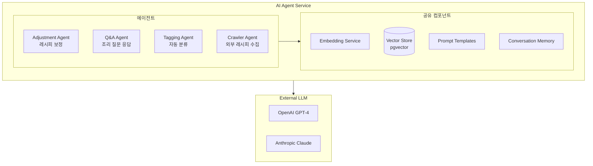
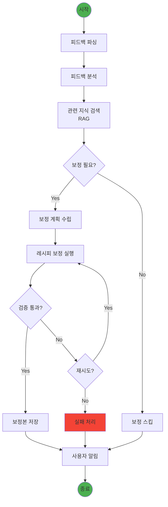
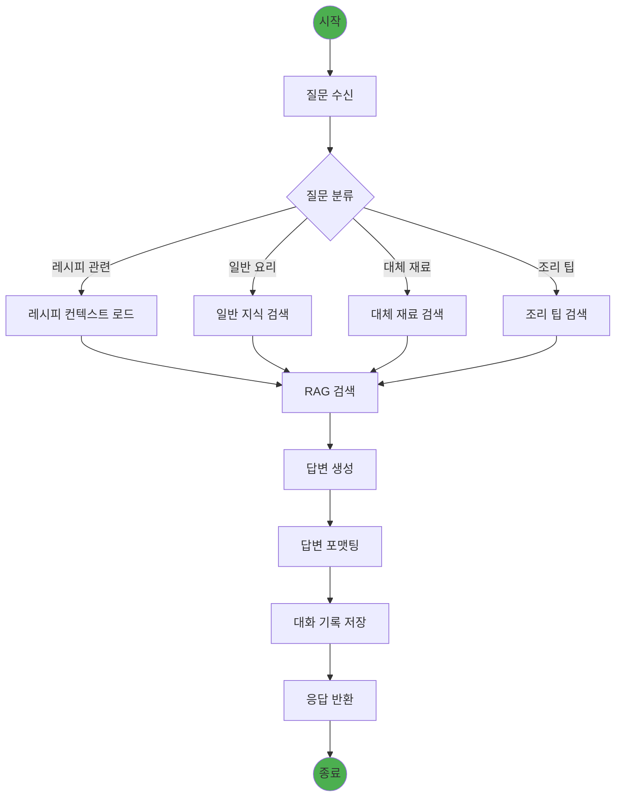
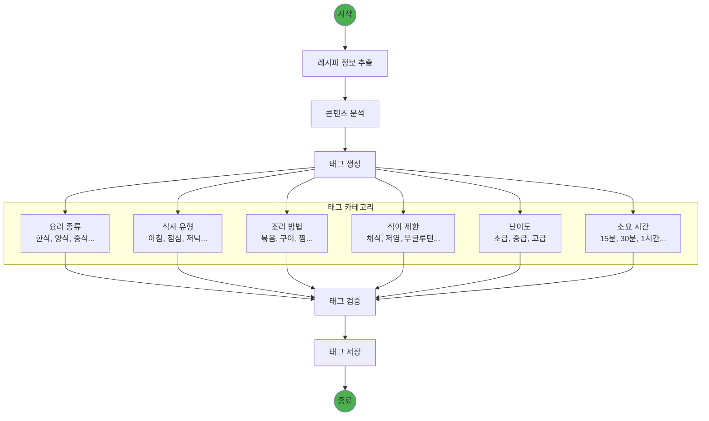
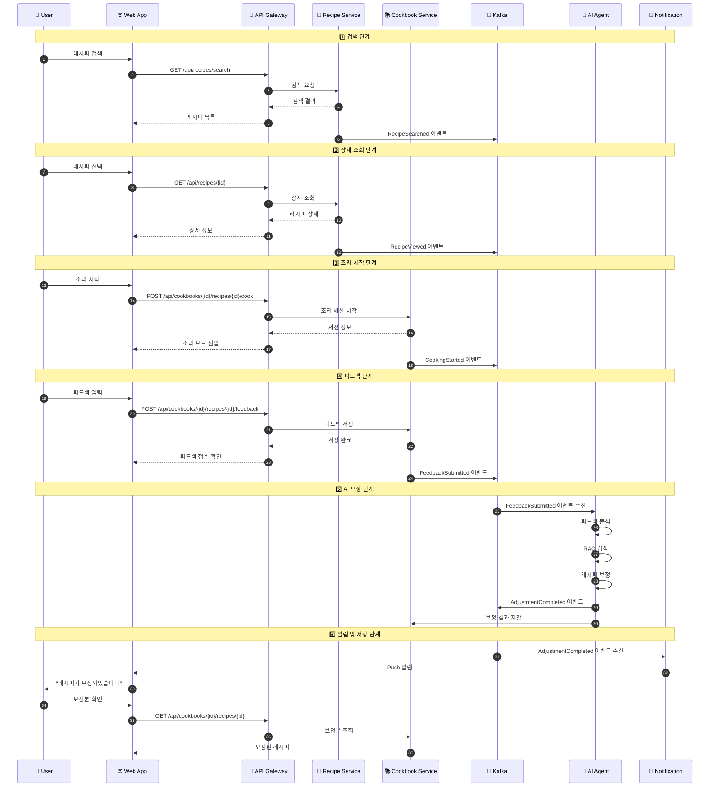
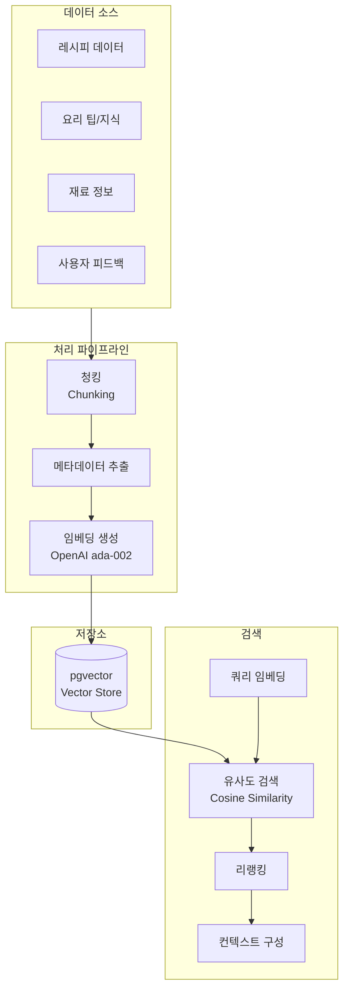

# 내시피(Naecipe) AI 에이전트 아키텍처

> 상위 문서: [5-1SERVICE_ARCHITECTURE.md](./5-1SERVICE_ARCHITECTURE.md)

---

## 1. AI Agent 서비스 개요

### 1.1 에이전트 유형

내시피 서비스는 4가지 핵심 AI 에이전트를 운영한다.



| 에이전트 | 역할 | 트리거 | 응답 시간 목표 |
|---------|------|--------|---------------|
| **Adjustment Agent** | 피드백 기반 레시피 보정 | FeedbackSubmitted 이벤트 | < 10초 |
| **Q&A Agent** | 조리 중 질문 응답 | 사용자 직접 질문 | < 3초 |
| **Tagging Agent** | 레시피 자동 분류 | 새 레시피 등록 | < 5초 |
| **Crawler Agent** | 외부 레시피 크롤링 및 정규화 | 스케줄러 / 수동 트리거 | 레시피당 < 30초 |

---

## 2. Adjustment Agent 상세

### 2.1 LangGraph 워크플로우



### 2.2 Adjustment Agent 구현

```python
# adjustment_agent.py

from langgraph.graph import StateGraph, END
from langchain_openai import ChatOpenAI
from langchain_anthropic import ChatAnthropic
from pydantic import BaseModel
from typing import List, Optional, Literal
import json

class FeedbackData(BaseModel):
    taste_rating: int
    difficulty_rating: int
    feedback_text: str
    adjustment_requests: List[dict]

class AdjustmentState(BaseModel):
    # Input
    recipe_id: str
    original_recipe: dict
    feedback: FeedbackData
    user_preferences: dict

    # Processing
    parsed_feedback: Optional[dict] = None
    retrieved_knowledge: Optional[List[dict]] = None
    adjustment_plan: Optional[dict] = None

    # Output
    adjusted_recipe: Optional[dict] = None
    change_summary: Optional[str] = None
    status: Literal["pending", "processing", "completed", "failed"] = "pending"
    error_message: Optional[str] = None

class AdjustmentAgent:
    def __init__(self):
        self.llm = ChatOpenAI(model="gpt-4-turbo-preview", temperature=0.3)
        self.fallback_llm = ChatAnthropic(model="claude-3-sonnet")
        self.graph = self._build_graph()

    def _build_graph(self) -> StateGraph:
        workflow = StateGraph(AdjustmentState)

        # Add nodes
        workflow.add_node("parse_feedback", self.parse_feedback)
        workflow.add_node("analyze_feedback", self.analyze_feedback)
        workflow.add_node("retrieve_knowledge", self.retrieve_knowledge)
        workflow.add_node("plan_adjustment", self.plan_adjustment)
        workflow.add_node("execute_adjustment", self.execute_adjustment)
        workflow.add_node("validate_result", self.validate_result)
        workflow.add_node("save_result", self.save_result)

        # Add edges
        workflow.set_entry_point("parse_feedback")
        workflow.add_edge("parse_feedback", "analyze_feedback")
        workflow.add_edge("analyze_feedback", "retrieve_knowledge")
        workflow.add_edge("retrieve_knowledge", "plan_adjustment")
        workflow.add_conditional_edges(
            "plan_adjustment",
            self.should_adjust,
            {
                "adjust": "execute_adjustment",
                "skip": "save_result"
            }
        )
        workflow.add_edge("execute_adjustment", "validate_result")
        workflow.add_conditional_edges(
            "validate_result",
            self.is_valid,
            {
                "valid": "save_result",
                "invalid": "execute_adjustment",
                "fail": END
            }
        )
        workflow.add_edge("save_result", END)

        return workflow.compile()

    async def parse_feedback(self, state: AdjustmentState) -> dict:
        """피드백 텍스트를 구조화된 형태로 파싱"""
        prompt = f"""
        사용자 피드백을 분석하여 구조화된 형태로 반환하세요.

        피드백: {state.feedback.feedback_text}
        맛 평점: {state.feedback.taste_rating}/5
        난이도 평점: {state.feedback.difficulty_rating}/5
        요청사항: {json.dumps(state.feedback.adjustment_requests, ensure_ascii=False)}

        다음 카테고리로 분류하세요:
        - taste_issues: 맛 관련 문제 (너무 짜다, 싱겁다, 맵다 등)
        - portion_issues: 양 관련 문제 (너무 많다, 적다)
        - difficulty_issues: 난이도 관련 (너무 어렵다, 시간이 오래 걸린다)
        - ingredient_issues: 재료 관련 (대체 재료 필요, 재료 빼고 싶다)
        - positive_feedback: 긍정적 피드백

        JSON 형식으로 반환하세요.
        """

        response = await self.llm.ainvoke(prompt)
        parsed = json.loads(response.content)

        return {"parsed_feedback": parsed}

    async def retrieve_knowledge(self, state: AdjustmentState) -> dict:
        """관련 요리 지식 검색 (RAG)"""
        # Vector search for relevant cooking knowledge
        query = f"{state.original_recipe['title']} {state.feedback.feedback_text}"

        chunks = await self.vector_store.similarity_search(
            query=query,
            k=5,
            filter={"source_type": ["cooking_tip", "ingredient_info"]}
        )

        return {"retrieved_knowledge": [c.to_dict() for c in chunks]}

    async def execute_adjustment(self, state: AdjustmentState) -> dict:
        """레시피 보정 실행"""
        prompt = f"""
        당신은 전문 요리사입니다. 사용자의 피드백을 반영하여 레시피를 보정하세요.

        ## 원본 레시피
        {json.dumps(state.original_recipe, ensure_ascii=False, indent=2)}

        ## 사용자 피드백 분석
        {json.dumps(state.parsed_feedback, ensure_ascii=False, indent=2)}

        ## 사용자 취향
        {json.dumps(state.user_preferences, ensure_ascii=False, indent=2)}

        ## 보정 계획
        {json.dumps(state.adjustment_plan, ensure_ascii=False, indent=2)}

        ## 참고 지식
        {json.dumps(state.retrieved_knowledge, ensure_ascii=False, indent=2)}

        ## 보정 규칙
        1. 원본 레시피의 구조를 유지하면서 필요한 부분만 수정
        2. 변경 사항은 명확하게 표시
        3. 실현 가능한 범위 내에서만 수정
        4. 사용자 취향(맛 선호도, 알레르기 등)을 반드시 고려

        보정된 레시피를 JSON 형식으로 반환하세요.
        변경된 부분에는 "adjusted": true 플래그를 추가하세요.
        """

        try:
            response = await self.llm.ainvoke(prompt)
            adjusted = json.loads(response.content)
            return {"adjusted_recipe": adjusted, "status": "processing"}
        except Exception as e:
            # Fallback to Claude
            response = await self.fallback_llm.ainvoke(prompt)
            adjusted = json.loads(response.content)
            return {"adjusted_recipe": adjusted, "status": "processing"}

    def should_adjust(self, state: AdjustmentState) -> str:
        """보정 필요 여부 판단"""
        if not state.adjustment_plan or not state.adjustment_plan.get("adjustments"):
            return "skip"
        return "adjust"

    def is_valid(self, state: AdjustmentState) -> str:
        """보정 결과 검증"""
        if not state.adjusted_recipe:
            return "fail"

        # Validate structure
        required_fields = ["title", "ingredients", "steps"]
        for field in required_fields:
            if field not in state.adjusted_recipe:
                return "invalid"

        return "valid"

    async def run(self, input_data: dict) -> AdjustmentState:
        """에이전트 실행"""
        initial_state = AdjustmentState(**input_data)
        final_state = await self.graph.ainvoke(initial_state)
        return final_state
```

---

## 3. Q&A Agent 상세

### 3.1 Q&A Agent 워크플로우



### 3.2 Q&A Agent 구현

```python
# qa_agent.py

from langgraph.graph import StateGraph, END
from langchain_openai import ChatOpenAI
from pydantic import BaseModel
from typing import List, Optional, Literal

class QAState(BaseModel):
    # Input
    user_id: str
    session_id: str
    question: str
    recipe_context: Optional[dict] = None  # 현재 조리 중인 레시피

    # Processing
    question_type: Optional[str] = None
    retrieved_chunks: Optional[List[dict]] = None
    conversation_history: List[dict] = []

    # Output
    answer: Optional[str] = None
    sources: Optional[List[str]] = None
    follow_up_suggestions: Optional[List[str]] = None

class QAAgent:
    def __init__(self):
        self.llm = ChatOpenAI(model="gpt-4-turbo-preview", temperature=0.5)
        self.graph = self._build_graph()

    def _build_graph(self) -> StateGraph:
        workflow = StateGraph(QAState)

        workflow.add_node("classify_question", self.classify_question)
        workflow.add_node("retrieve_context", self.retrieve_context)
        workflow.add_node("generate_answer", self.generate_answer)
        workflow.add_node("format_response", self.format_response)

        workflow.set_entry_point("classify_question")
        workflow.add_edge("classify_question", "retrieve_context")
        workflow.add_edge("retrieve_context", "generate_answer")
        workflow.add_edge("generate_answer", "format_response")
        workflow.add_edge("format_response", END)

        return workflow.compile()

    async def classify_question(self, state: QAState) -> dict:
        """질문 유형 분류"""
        prompt = f"""
        다음 요리 관련 질문의 유형을 분류하세요.

        질문: {state.question}

        유형:
        - recipe_specific: 현재 레시피에 대한 구체적 질문
        - technique: 조리 기술/방법 질문
        - substitute: 재료 대체 질문
        - timing: 조리 시간/타이밍 질문
        - troubleshooting: 문제 해결 질문
        - general: 일반 요리 지식

        유형만 반환하세요.
        """

        response = await self.llm.ainvoke(prompt)
        return {"question_type": response.content.strip()}

    async def retrieve_context(self, state: QAState) -> dict:
        """관련 지식 검색"""
        # Build search query based on question type
        if state.recipe_context:
            query = f"{state.recipe_context['title']} {state.question}"
        else:
            query = state.question

        # Filter based on question type
        filters = {
            "technique": ["cooking_technique", "cooking_tip"],
            "substitute": ["ingredient_substitute", "ingredient_info"],
            "timing": ["cooking_tip", "recipe"],
            "troubleshooting": ["cooking_tip", "troubleshooting"],
        }

        source_filter = filters.get(state.question_type, None)

        chunks = await self.vector_store.similarity_search(
            query=query,
            k=5,
            filter={"source_type": source_filter} if source_filter else None
        )

        return {"retrieved_chunks": [c.to_dict() for c in chunks]}

    async def generate_answer(self, state: QAState) -> dict:
        """답변 생성"""
        # Build conversation context
        history = "\n".join([
            f"{'User' if m['role'] == 'user' else 'Assistant'}: {m['content']}"
            for m in state.conversation_history[-5:]  # Last 5 messages
        ])

        prompt = f"""
        당신은 친절하고 전문적인 요리 어시스턴트입니다.

        ## 대화 기록
        {history}

        ## 현재 질문
        {state.question}

        ## 현재 조리 중인 레시피
        {json.dumps(state.recipe_context, ensure_ascii=False) if state.recipe_context else "없음"}

        ## 관련 지식
        {json.dumps(state.retrieved_chunks, ensure_ascii=False)}

        ## 답변 지침
        1. 간결하고 실용적인 답변 제공
        2. 안전 관련 주의사항이 있으면 반드시 언급
        3. 가능하면 구체적인 팁 포함
        4. 불확실한 정보는 그렇다고 명시

        답변을 작성하세요.
        """

        response = await self.llm.ainvoke(prompt)

        # Generate follow-up suggestions
        suggestions_prompt = f"""
        위 답변 후 사용자가 궁금해할 수 있는 후속 질문 3개를 제안하세요.
        짧은 질문 형태로 리스트로 반환하세요.
        """

        suggestions_response = await self.llm.ainvoke(suggestions_prompt)
        suggestions = suggestions_response.content.strip().split("\n")

        return {
            "answer": response.content,
            "follow_up_suggestions": suggestions[:3]
        }

    async def run(self, input_data: dict) -> QAState:
        initial_state = QAState(**input_data)
        final_state = await self.graph.ainvoke(initial_state)
        return final_state
```

---

## 4. Tagging Agent 상세

### 4.1 Tagging Agent 워크플로우



---

## 5. Recipe Crawler Agent 상세

### 5.1 개요

Recipe Crawler Agent는 외부 플랫폼(YouTube, Instagram, 블로그, 레시피 사이트)에서 유명 쉐프/인플루언서의 레시피를 수집하고, LLM을 활용하여 구조화된 형태로 변환하는 에이전트이다.

**운영 방식:**
- 로컬 환경 또는 별도 서버에서 Bot으로 실행
- 스케줄러 기반 자동 실행 + 수동 트리거 지원
- Ingestion API를 통해 백엔드 서비스와 통신

### 5.2 Crawler Agent 워크플로우

```mermaid
flowchart TB
    START((시작)) --> SCHEDULE[스케줄링/트리거]

    SCHEDULE --> SELECT_SOURCE[소스 선택<br/>YouTube/Instagram/Blog]

    SELECT_SOURCE --> DISCOVER[인기 콘텐츠 발견<br/>API/크롤링]

    DISCOVER --> FILTER{레시피<br/>콘텐츠?}

    FILTER -->|No| SKIP[스킵]
    FILTER -->|Yes| EXTRACT[콘텐츠 추출]

    EXTRACT --> PARSE[LLM 파싱<br/>레시피 구조화]

    PARSE --> NORMALIZE[데이터 정규화<br/>표준 포맷 변환]

    NORMALIZE --> CHECK_DUP{중복 검사<br/>(로컬 캐시)}

    CHECK_DUP -->|중복| UPDATE_SCORE[점수 갱신 요청]
    CHECK_DUP -->|신규| VALIDATE[데이터 검증]

    VALIDATE --> SUBMIT[Ingestion API 제출]

    SUBMIT --> API_RESPONSE{API 응답}

    API_RESPONSE -->|성공| LOG_SUCCESS[성공 로그]
    API_RESPONSE -->|중복 판정| LOG_DUP[중복 로그]
    API_RESPONSE -->|실패| RETRY{재시도?}

    RETRY -->|Yes| SUBMIT
    RETRY -->|No| LOG_FAIL[실패 로그]

    UPDATE_SCORE --> LOG_SUCCESS
    SKIP --> NEXT
    LOG_SUCCESS --> NEXT
    LOG_DUP --> NEXT
    LOG_FAIL --> NEXT

    NEXT{다음<br/>콘텐츠?}
    NEXT -->|Yes| DISCOVER
    NEXT -->|No| END((종료))

    style START fill:#4caf50
    style END fill:#4caf50
    style LOG_FAIL fill:#f44336
```

### 5.3 Crawler Agent 구현

```python
# crawler_agent.py

from langgraph.graph import StateGraph, END
from langchain_openai import ChatOpenAI
from pydantic import BaseModel
from typing import List, Optional, Literal
from enum import Enum
import hashlib
import httpx

class SourcePlatform(str, Enum):
    YOUTUBE = "youtube"
    INSTAGRAM = "instagram"
    NAVER_BLOG = "naver_blog"
    TISTORY = "tistory"
    RECIPE_SITE = "recipe_site"

class CrawledContent(BaseModel):
    url: str
    platform: SourcePlatform
    title: str
    author_name: str
    author_channel: str
    raw_content: str
    thumbnail_url: Optional[str] = None
    video_url: Optional[str] = None
    metrics: dict = {}  # view_count, like_count, etc.

class ParsedRecipe(BaseModel):
    title: str
    description: str
    author_name: str
    author_channel: str
    ingredients: List[dict]
    steps: List[dict]
    cooking_time_minutes: Optional[int] = None
    servings: Optional[int] = None
    difficulty: Optional[str] = None
    tags: List[str] = []

class CrawlerState(BaseModel):
    # Input
    platform: SourcePlatform
    target_channels: List[str] = []  # 특정 채널만 크롤링할 경우

    # Processing
    discovered_contents: List[CrawledContent] = []
    current_content: Optional[CrawledContent] = None
    parsed_recipe: Optional[ParsedRecipe] = None
    content_hash: Optional[str] = None

    # Output
    processed_count: int = 0
    success_count: int = 0
    duplicate_count: int = 0
    failed_count: int = 0
    results: List[dict] = []

class RecipeCrawlerAgent:
    def __init__(self, ingestion_api_url: str):
        self.llm = ChatOpenAI(model="gpt-4-turbo-preview", temperature=0.2)
        self.ingestion_api_url = ingestion_api_url
        self.graph = self._build_graph()

        # 플랫폼별 크롤러
        self.crawlers = {
            SourcePlatform.YOUTUBE: YouTubeCrawler(),
            SourcePlatform.INSTAGRAM: InstagramCrawler(),
            SourcePlatform.NAVER_BLOG: NaverBlogCrawler(),
        }

    def _build_graph(self) -> StateGraph:
        workflow = StateGraph(CrawlerState)

        workflow.add_node("discover_content", self.discover_content)
        workflow.add_node("extract_content", self.extract_content)
        workflow.add_node("parse_recipe", self.parse_recipe)
        workflow.add_node("check_duplicate", self.check_duplicate)
        workflow.add_node("submit_to_api", self.submit_to_api)
        workflow.add_node("update_score", self.update_score)

        workflow.set_entry_point("discover_content")
        workflow.add_edge("discover_content", "extract_content")
        workflow.add_edge("extract_content", "parse_recipe")
        workflow.add_edge("parse_recipe", "check_duplicate")

        workflow.add_conditional_edges(
            "check_duplicate",
            self.route_after_duplicate_check,
            {
                "new": "submit_to_api",
                "duplicate": "update_score",
                "skip": END
            }
        )

        workflow.add_edge("submit_to_api", END)
        workflow.add_edge("update_score", END)

        return workflow.compile()

    async def parse_recipe(self, state: CrawlerState) -> dict:
        """LLM을 사용하여 원본 콘텐츠에서 레시피 정보 추출"""
        content = state.current_content

        prompt = f"""
        다음 요리 콘텐츠에서 레시피 정보를 추출하세요.

        ## 원본 콘텐츠
        제목: {content.title}
        저자: {content.author_name}
        플랫폼: {content.platform}

        내용:
        {content.raw_content[:4000]}  # 토큰 제한

        ## 추출할 정보
        1. 요리 제목 (원본과 다를 수 있음, 실제 요리 이름)
        2. 요리 설명 (1-2문장)
        3. 재료 목록 (이름, 양, 단위로 구분)
        4. 조리 단계 (순서, 설명, 예상 소요시간)
        5. 총 조리 시간 (분)
        6. 인분
        7. 난이도 (easy/medium/hard)
        8. 태그 (한식, 양식, 반찬, 메인요리 등)

        ## 규칙
        - 재료는 정확한 양과 단위로 분리
        - 조리 단계는 명확하고 실행 가능하게
        - 불명확한 정보는 null 반환
        - 레시피가 아닌 콘텐츠는 is_recipe: false 반환

        JSON 형식으로 반환하세요.
        """

        response = await self.llm.ainvoke(prompt)
        parsed = json.loads(response.content)

        if not parsed.get('is_recipe', True):
            return {"parsed_recipe": None}

        recipe = ParsedRecipe(
            title=parsed['title'],
            description=parsed.get('description', ''),
            author_name=content.author_name,
            author_channel=content.author_channel,
            ingredients=parsed.get('ingredients', []),
            steps=parsed.get('steps', []),
            cooking_time_minutes=parsed.get('cooking_time_minutes'),
            servings=parsed.get('servings'),
            difficulty=parsed.get('difficulty'),
            tags=parsed.get('tags', [])
        )

        # 콘텐츠 해시 생성 (중복 검사용)
        hash_content = f"{recipe.title}|{recipe.author_name}|{json.dumps(recipe.ingredients)}"
        content_hash = hashlib.sha256(hash_content.encode()).hexdigest()[:32]

        return {
            "parsed_recipe": recipe,
            "content_hash": content_hash
        }

    async def check_duplicate(self, state: CrawlerState) -> dict:
        """Ingestion API에 중복 검사 요청"""
        if not state.parsed_recipe:
            return {"is_duplicate": None}

        async with httpx.AsyncClient() as client:
            response = await client.post(
                f"{self.ingestion_api_url}/check-duplicate",
                json={
                    "title": state.parsed_recipe.title,
                    "author_name": state.parsed_recipe.author_name,
                    "content_hash": state.content_hash,
                    "source_url": state.current_content.url
                }
            )

        result = response.json()
        return {
            "is_duplicate": result.get('is_duplicate', False),
            "existing_recipe_id": result.get('recipe_id')
        }

    def route_after_duplicate_check(self, state: CrawlerState) -> str:
        """중복 검사 결과에 따른 라우팅"""
        if not state.parsed_recipe:
            return "skip"
        if hasattr(state, 'is_duplicate') and state.is_duplicate:
            return "duplicate"
        return "new"

    async def submit_to_api(self, state: CrawlerState) -> dict:
        """신규 레시피를 Ingestion API에 제출"""
        recipe = state.parsed_recipe
        content = state.current_content

        payload = {
            "title": recipe.title,
            "description": recipe.description,
            "author_name": recipe.author_name,
            "author_channel": recipe.author_channel,
            "source_url": content.url,
            "source_platform": content.platform.value,
            "ingredients": recipe.ingredients,
            "steps": recipe.steps,
            "cooking_time_minutes": recipe.cooking_time_minutes,
            "servings": recipe.servings,
            "difficulty": recipe.difficulty,
            "tags": recipe.tags,
            "thumbnail_url": content.thumbnail_url,
            "video_url": content.video_url,
            "content_hash": state.content_hash,
            "source_metrics": content.metrics
        }

        async with httpx.AsyncClient() as client:
            response = await client.post(
                f"{self.ingestion_api_url}/recipes",
                json=payload
            )

        if response.status_code == 201:
            return {
                "success_count": state.success_count + 1,
                "results": state.results + [{"status": "created", "url": content.url}]
            }
        elif response.status_code == 409:  # Conflict - 중복
            return {
                "duplicate_count": state.duplicate_count + 1,
                "results": state.results + [{"status": "duplicate", "url": content.url}]
            }
        else:
            return {
                "failed_count": state.failed_count + 1,
                "results": state.results + [{"status": "failed", "url": content.url}]
            }

    async def update_score(self, state: CrawlerState) -> dict:
        """기존 레시피의 노출도/인기도 점수 갱신"""
        content = state.current_content

        async with httpx.AsyncClient() as client:
            await client.patch(
                f"{self.ingestion_api_url}/recipes/{state.existing_recipe_id}/scores",
                json={
                    "source_metrics": content.metrics,
                    "source_url": content.url
                }
            )

        return {
            "duplicate_count": state.duplicate_count + 1,
            "results": state.results + [{"status": "score_updated", "url": content.url}]
        }

    async def run(self, platform: SourcePlatform, channels: List[str] = None) -> CrawlerState:
        """크롤러 에이전트 실행"""
        initial_state = CrawlerState(
            platform=platform,
            target_channels=channels or []
        )
        final_state = await self.graph.ainvoke(initial_state)
        return final_state
```

### 5.4 플랫폼별 크롤러 구현

```python
# crawlers/youtube_crawler.py

from googleapiclient.discovery import build
from typing import List
import re

class YouTubeCrawler:
    """YouTube 레시피 채널 크롤러"""

    # 유명 요리 채널 목록
    TARGET_CHANNELS = [
        "백종원의 요리비책",
        "쿠킹 로그",
        "만개의레시피",
        "슈가보울",
        # ... 더 많은 채널
    ]

    def __init__(self):
        self.youtube = build('youtube', 'v3', developerKey=YOUTUBE_API_KEY)

    async def discover_popular_videos(
        self,
        channel_ids: List[str] = None,
        max_results: int = 50
    ) -> List[dict]:
        """인기 레시피 영상 발견"""
        videos = []

        for channel_id in (channel_ids or self.TARGET_CHANNELS):
            # 채널의 최근 인기 영상 조회
            request = self.youtube.search().list(
                part="snippet",
                channelId=channel_id,
                order="viewCount",
                maxResults=max_results,
                type="video",
                publishedAfter="2024-01-01T00:00:00Z"
            )
            response = request.execute()

            for item in response.get('items', []):
                video_id = item['id']['videoId']
                snippet = item['snippet']

                # 영상 통계 조회
                stats = self._get_video_stats(video_id)

                videos.append({
                    'url': f"https://youtube.com/watch?v={video_id}",
                    'title': snippet['title'],
                    'author_name': snippet['channelTitle'],
                    'author_channel': f"youtube.com/channel/{snippet['channelId']}",
                    'description': snippet['description'],
                    'thumbnail_url': snippet['thumbnails']['high']['url'],
                    'video_url': f"https://youtube.com/watch?v={video_id}",
                    'metrics': {
                        'view_count': int(stats.get('viewCount', 0)),
                        'like_count': int(stats.get('likeCount', 0)),
                        'comment_count': int(stats.get('commentCount', 0))
                    }
                })

        return videos

    async def extract_recipe_content(self, video_url: str) -> str:
        """영상에서 레시피 콘텐츠 추출 (자막 + 설명)"""
        video_id = self._extract_video_id(video_url)

        # 자막 가져오기
        captions = await self._get_captions(video_id)

        # 영상 설명 가져오기
        description = await self._get_video_description(video_id)

        return f"""
        [영상 설명]
        {description}

        [자막 내용]
        {captions}
        """
```

### 5.5 크롤링 스케줄러

```python
# scheduler/crawl_scheduler.py

from apscheduler.schedulers.asyncio import AsyncIOScheduler
from apscheduler.triggers.cron import CronTrigger
import logging

logger = logging.getLogger(__name__)

class CrawlScheduler:
    """레시피 크롤링 스케줄러"""

    def __init__(self, crawler_agent: RecipeCrawlerAgent):
        self.agent = crawler_agent
        self.scheduler = AsyncIOScheduler()

    def setup_schedules(self):
        """크롤링 스케줄 설정"""

        # YouTube: 매일 새벽 2시
        self.scheduler.add_job(
            self._crawl_youtube,
            CronTrigger(hour=2, minute=0),
            id='youtube_daily',
            name='YouTube Daily Crawl'
        )

        # Instagram: 매일 새벽 3시
        self.scheduler.add_job(
            self._crawl_instagram,
            CronTrigger(hour=3, minute=0),
            id='instagram_daily',
            name='Instagram Daily Crawl'
        )

        # 블로그: 매일 새벽 4시
        self.scheduler.add_job(
            self._crawl_blogs,
            CronTrigger(hour=4, minute=0),
            id='blog_daily',
            name='Blog Daily Crawl'
        )

        # 점수 갱신: 매주 일요일 새벽 5시
        self.scheduler.add_job(
            self._refresh_scores,
            CronTrigger(day_of_week='sun', hour=5, minute=0),
            id='score_refresh_weekly',
            name='Weekly Score Refresh'
        )

    async def _crawl_youtube(self):
        logger.info("Starting YouTube crawl...")
        result = await self.agent.run(SourcePlatform.YOUTUBE)
        logger.info(f"YouTube crawl complete: {result.success_count} new, {result.duplicate_count} duplicates")

    async def _crawl_instagram(self):
        logger.info("Starting Instagram crawl...")
        result = await self.agent.run(SourcePlatform.INSTAGRAM)
        logger.info(f"Instagram crawl complete: {result.success_count} new, {result.duplicate_count} duplicates")

    async def _crawl_blogs(self):
        logger.info("Starting blog crawl...")
        for platform in [SourcePlatform.NAVER_BLOG, SourcePlatform.TISTORY]:
            result = await self.agent.run(platform)
            logger.info(f"{platform} crawl complete: {result.success_count} new")

    def start(self):
        self.scheduler.start()
        logger.info("Crawl scheduler started")

    def stop(self):
        self.scheduler.shutdown()
        logger.info("Crawl scheduler stopped")
```

### 5.6 크롤러 봇 실행

```python
# main.py - Crawler Bot Entry Point

import asyncio
import argparse
from crawler_agent import RecipeCrawlerAgent, SourcePlatform
from scheduler.crawl_scheduler import CrawlScheduler

async def main():
    parser = argparse.ArgumentParser(description='Recipe Crawler Bot')
    parser.add_argument('--mode', choices=['schedule', 'once'], default='schedule')
    parser.add_argument('--platform', choices=['youtube', 'instagram', 'blog', 'all'])
    parser.add_argument('--channels', nargs='*', help='Target channels to crawl')
    args = parser.parse_args()

    agent = RecipeCrawlerAgent(
        ingestion_api_url="https://api.naecipe.com/v1/ingestion"
    )

    if args.mode == 'schedule':
        # 스케줄러 모드: 지속적으로 실행
        scheduler = CrawlScheduler(agent)
        scheduler.setup_schedules()
        scheduler.start()

        try:
            while True:
                await asyncio.sleep(3600)
        except KeyboardInterrupt:
            scheduler.stop()

    else:
        # 1회 실행 모드
        platform_map = {
            'youtube': SourcePlatform.YOUTUBE,
            'instagram': SourcePlatform.INSTAGRAM,
            'blog': SourcePlatform.NAVER_BLOG,
        }

        if args.platform == 'all':
            for platform in platform_map.values():
                result = await agent.run(platform, args.channels)
                print(f"{platform}: {result.success_count} created, {result.duplicate_count} duplicates")
        else:
            platform = platform_map[args.platform]
            result = await agent.run(platform, args.channels)
            print(f"Result: {result.success_count} created, {result.duplicate_count} duplicates")

if __name__ == "__main__":
    asyncio.run(main())
```

---

## 6. 이벤트 흐름 상세

### 6.1 Core Loop 이벤트 시퀀스



### 6.2 이벤트 스키마

```typescript
// 이벤트 기본 구조
interface BaseEvent {
  eventId: string;        // UUID
  eventType: string;      // 이벤트 유형
  timestamp: string;      // ISO 8601
  version: string;        // 스키마 버전

  payload: object;        // 이벤트 데이터

  metadata: {
    correlationId: string;  // 요청 추적 ID
    causationId: string;    // 원인 이벤트 ID
    userId?: string;        // 사용자 ID
    sessionId?: string;     // 세션 ID
  };
}

// 피드백 제출 이벤트
interface FeedbackSubmittedEvent extends BaseEvent {
  eventType: 'FeedbackSubmitted';

  payload: {
    cookbookRecipeId: string;
    versionId: string;
    feedback: {
      tasteRating: number;
      difficultyRating: number;
      feedbackText: string;
      adjustmentRequests: Array<{
        category: 'taste' | 'portion' | 'difficulty' | 'ingredient';
        description: string;
      }>;
    };
    cookingDurationMinutes: number;
  };
}

// AI 보정 완료 이벤트
interface AdjustmentCompletedEvent extends BaseEvent {
  eventType: 'AdjustmentCompleted';

  payload: {
    adjustmentRequestId: string;
    cookbookRecipeId: string;
    newVersionId: string;
    changeSummary: string;
    adjustmentDetails: {
      ingredientChanges: Array<{
        type: 'modified' | 'added' | 'removed';
        name: string;
        originalValue?: string;
        newValue?: string;
      }>;
      stepChanges: Array<{
        stepNumber: number;
        changeType: 'modified' | 'added' | 'removed';
        description: string;
      }>;
    };
    processingTimeMs: number;
    modelUsed: string;
  };
}

// 조리 완료 이벤트
interface CookingCompletedEvent extends BaseEvent {
  eventType: 'CookingCompleted';

  payload: {
    cookbookRecipeId: string;
    versionId: string;
    actualDurationMinutes: number;
    completedSteps: number;
    totalSteps: number;
  };
}
```

---

## 6. 벡터 검색 (RAG) 아키텍처

### 6.1 임베딩 파이프라인



### 6.2 청킹 전략

```python
# chunking_strategy.py

from langchain.text_splitter import RecursiveCharacterTextSplitter
from typing import List, Dict

class RecipeChunker:
    """레시피 데이터 청킹 전략"""

    def __init__(self):
        self.text_splitter = RecursiveCharacterTextSplitter(
            chunk_size=500,
            chunk_overlap=50,
            separators=["\n\n", "\n", ". ", " "]
        )

    def chunk_recipe(self, recipe: Dict) -> List[Dict]:
        """레시피를 검색 가능한 청크로 분리"""
        chunks = []

        # 1. 레시피 개요 청크
        overview_chunk = {
            "source_type": "recipe_overview",
            "source_id": recipe["id"],
            "content": f"""
                레시피: {recipe["title"]}
                설명: {recipe["description"]}
                난이도: {recipe["difficulty"]}
                소요시간: {recipe["cooking_time_minutes"]}분
                인분: {recipe["servings"]}인분
            """,
            "metadata": {
                "recipe_id": recipe["id"],
                "title": recipe["title"],
                "chunk_type": "overview"
            }
        }
        chunks.append(overview_chunk)

        # 2. 재료 청크
        ingredients_text = "\n".join([
            f"- {ing['name']}: {ing['amount']} {ing['unit']}"
            for ing in recipe["ingredients"]
        ])
        ingredients_chunk = {
            "source_type": "recipe_ingredients",
            "source_id": recipe["id"],
            "content": f"레시피 '{recipe['title']}'의 재료:\n{ingredients_text}",
            "metadata": {
                "recipe_id": recipe["id"],
                "title": recipe["title"],
                "chunk_type": "ingredients"
            }
        }
        chunks.append(ingredients_chunk)

        # 3. 조리 단계 청크 (2-3단계씩 그룹)
        steps = recipe["steps"]
        for i in range(0, len(steps), 2):
            step_group = steps[i:i+2]
            steps_text = "\n".join([
                f"{s['step_number']}. {s['instruction']}"
                for s in step_group
            ])
            step_chunk = {
                "source_type": "recipe_steps",
                "source_id": recipe["id"],
                "content": f"레시피 '{recipe['title']}' 조리 단계:\n{steps_text}",
                "metadata": {
                    "recipe_id": recipe["id"],
                    "title": recipe["title"],
                    "chunk_type": "steps",
                    "step_range": f"{step_group[0]['step_number']}-{step_group[-1]['step_number']}"
                }
            }
            chunks.append(step_chunk)

        return chunks
```

---

## 7. LLM 연동 및 장애 대응

### 7.1 LLM 연동 설정

```python
# llm_config.py

from langchain_openai import ChatOpenAI
from langchain_anthropic import ChatAnthropic
from tenacity import retry, stop_after_attempt, wait_exponential

class LLMManager:
    """LLM 연동 관리"""

    def __init__(self):
        self.primary = ChatOpenAI(
            model="gpt-4-turbo-preview",
            temperature=0.3,
            max_tokens=2000,
            request_timeout=30
        )

        self.fallback = ChatAnthropic(
            model="claude-3-sonnet-20240229",
            temperature=0.3,
            max_tokens=2000
        )

        self.fast = ChatOpenAI(
            model="gpt-3.5-turbo",
            temperature=0.3,
            max_tokens=1000,
            request_timeout=10
        )

    @retry(
        stop=stop_after_attempt(3),
        wait=wait_exponential(multiplier=1, min=1, max=10)
    )
    async def invoke_with_fallback(self, prompt: str) -> str:
        """Primary LLM 호출, 실패 시 Fallback"""
        try:
            response = await self.primary.ainvoke(prompt)
            return response.content
        except Exception as e:
            # Log primary failure
            logger.warning(f"Primary LLM failed: {e}")

            try:
                response = await self.fallback.ainvoke(prompt)
                return response.content
            except Exception as fallback_error:
                logger.error(f"Fallback LLM also failed: {fallback_error}")
                raise
```

### 7.2 비용 관리

| 모델 | 용도 | Input Cost | Output Cost | 일 예상 호출 | 월 예상 비용 |
|------|------|-----------|-------------|-------------|-------------|
| GPT-4 Turbo | Adjustment, Q&A | $10/1M | $30/1M | 5,000 | ~$1,500 |
| Claude 3 Sonnet | Fallback | $3/1M | $15/1M | 500 | ~$100 |
| GPT-3.5 Turbo | 분류, 태깅 | $0.5/1M | $1.5/1M | 20,000 | ~$50 |
| ada-002 | Embedding | $0.1/1M | - | 50,000 | ~$5 |

---

## 변경 이력

| 버전 | 날짜 | 변경 내용 |
|-----|------|----------|
| v1.0 | 2025.11.30 | 초기 문서 작성 |

---

> **이전 문서:** [5-1-2_SYSTEM.md](./5-1-2_SYSTEM.md) - 시스템 아키텍처
> **다음 문서:** [5-1-4_API.md](./5-1-4_API.md) - API 설계
