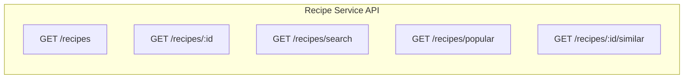
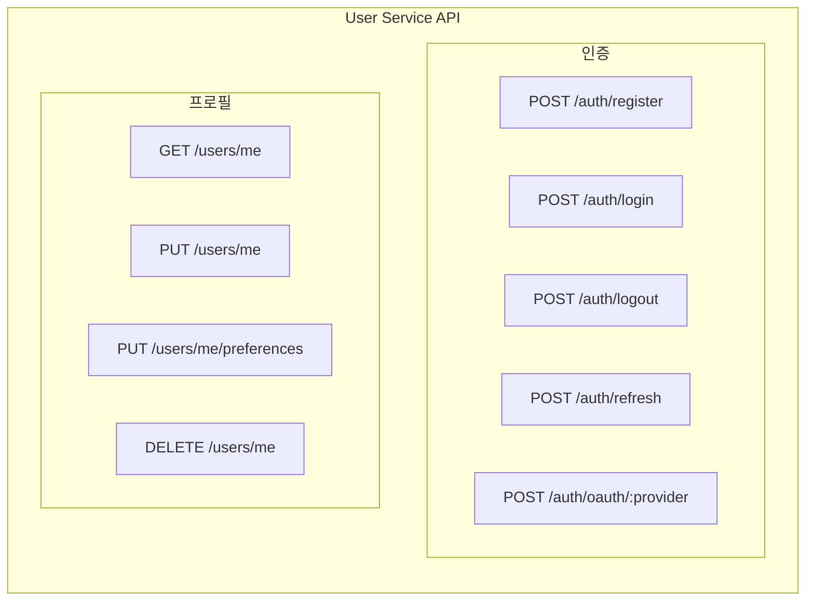
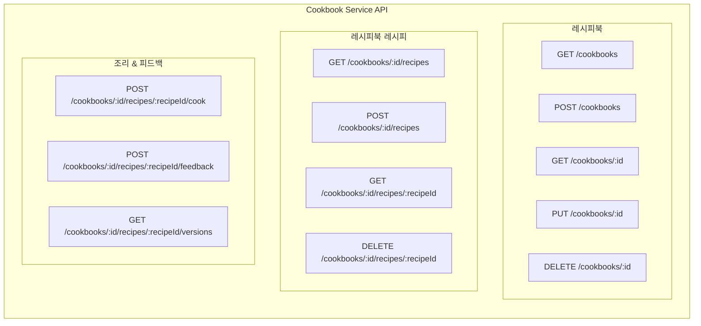
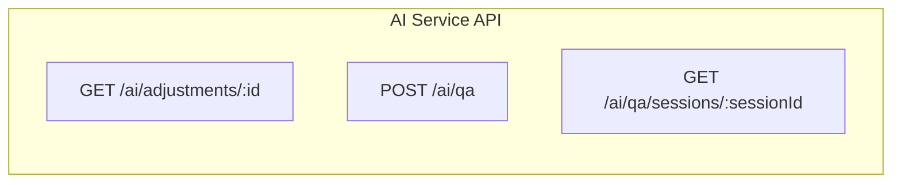
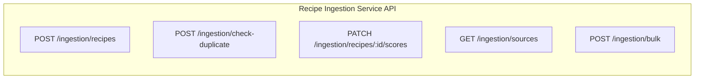
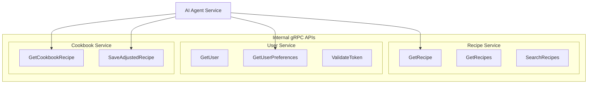
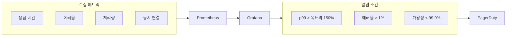

# 내시피(Naecipe) API 설계

> 상위 문서: [5-1SERVICE_ARCHITECTURE.md](./5-1SERVICE_ARCHITECTURE.md)

---

## 1. API 설계 원칙

### 1.1 기본 원칙

| 원칙 | 설명 |
|------|------|
| **RESTful** | 리소스 중심 설계, HTTP 메서드 의미 준수 |
| **버전 관리** | URL 경로에 버전 포함 (`/api/v1/`) |
| **일관된 응답** | 모든 API가 동일한 응답 구조 사용 |
| **에러 표준화** | RFC 7807 Problem Details 형식 |
| **페이지네이션** | Cursor 기반 페이지네이션 |
| **Rate Limiting** | 사용자/IP 기반 요청 제한 |

### 1.2 응답 형식

```python
# 응답 스키마 (Pydantic)

from typing import TypeVar, Generic, Optional, List
from pydantic import BaseModel
from datetime import datetime

T = TypeVar('T')

class PageMeta(BaseModel):
    cursor: Optional[str] = None
    has_more: bool
    total_count: Optional[int] = None

class ResponseMeta(BaseModel):
    page: Optional[PageMeta] = None
    request_id: str
    timestamp: datetime

# 성공 응답
class SuccessResponse(BaseModel, Generic[T]):
    success: bool = True
    data: T
    meta: Optional[ResponseMeta] = None

# 필드별 에러
class FieldError(BaseModel):
    field: str
    message: str
    code: str

# 에러 상세 (RFC 7807)
class ErrorDetail(BaseModel):
    type: str           # 에러 유형 URI
    title: str          # 짧은 에러 제목
    status: int         # HTTP 상태 코드
    detail: str         # 상세 설명
    instance: str       # 발생 위치
    errors: Optional[List[FieldError]] = None  # 필드별 에러 (validation)

class ErrorMeta(BaseModel):
    request_id: str
    timestamp: datetime

# 에러 응답
class ErrorResponse(BaseModel):
    success: bool = False
    error: ErrorDetail
    meta: ErrorMeta
```

### 1.3 HTTP 상태 코드

| 코드 | 용도 |
|------|------|
| `200 OK` | 성공적인 GET, PUT, PATCH |
| `201 Created` | 성공적인 POST (리소스 생성) |
| `204 No Content` | 성공적인 DELETE |
| `400 Bad Request` | 잘못된 요청 (validation 실패) |
| `401 Unauthorized` | 인증 필요 |
| `403 Forbidden` | 권한 없음 |
| `404 Not Found` | 리소스 없음 |
| `409 Conflict` | 리소스 충돌 |
| `422 Unprocessable Entity` | 비즈니스 로직 에러 |
| `429 Too Many Requests` | Rate Limit 초과 |
| `500 Internal Server Error` | 서버 에러 |

---

## 2. Recipe Service API

### 2.1 엔드포인트 목록



### 2.2 상세 API 명세

#### 레시피 검색
```yaml
GET /api/v1/recipes/search
Summary: 레시피 검색
Tags: [Recipe]

Parameters:
  - name: q
    in: query
    required: true
    schema:
      type: string
    description: 검색 키워드

  - name: tags
    in: query
    schema:
      type: array
      items:
        type: string
    description: 태그 필터 (복수 선택 가능)

  - name: difficulty
    in: query
    schema:
      type: string
      enum: [easy, medium, hard]
    description: 난이도 필터

  - name: maxCookingTime
    in: query
    schema:
      type: integer
    description: 최대 조리 시간 (분)

  - name: cursor
    in: query
    schema:
      type: string
    description: 페이지네이션 커서

  - name: limit
    in: query
    schema:
      type: integer
      default: 20
      maximum: 50
    description: 페이지 크기

Response 200:
  {
    "success": true,
    "data": [
      {
        "id": "uuid",
        "title": "김치찌개",
        "thumbnailUrl": "https://...",
        "cookingTimeMinutes": 30,
        "difficulty": "easy",
        "servings": 2,
        "avgRating": 4.5,
        "saveCount": 1234,
        "tags": ["한식", "찌개", "매운"]
      }
    ],
    "meta": {
      "page": {
        "cursor": "eyJpZCI6...",
        "hasMore": true,
        "totalCount": 156
      }
    }
  }
```

#### 레시피 상세 조회
```yaml
GET /api/v1/recipes/:id
Summary: 레시피 상세 조회
Tags: [Recipe]

Parameters:
  - name: id
    in: path
    required: true
    schema:
      type: string
      format: uuid
    description: 레시피 ID

Response 200:
  {
    "success": true,
    "data": {
      "id": "uuid",
      "title": "김치찌개",
      "description": "얼큰한 김치찌개...",
      "sourceUrl": "https://...",
      "sourcePlatform": "만개의레시피",
      "thumbnailUrl": "https://...",
      "cookingTimeMinutes": 30,
      "difficulty": "easy",
      "servings": 2,
      "ingredients": [
        {
          "id": "uuid",
          "name": "김치",
          "amount": "300",
          "unit": "g",
          "isOptional": false,
          "substitutes": ["묵은지"]
        }
      ],
      "steps": [
        {
          "id": "uuid",
          "stepNumber": 1,
          "instruction": "김치를 먹기 좋은 크기로 썰어주세요.",
          "durationSeconds": 180,
          "tips": "김치는 잘 익은 것을 사용하세요.",
          "imageUrl": "https://..."
        }
      ],
      "tags": ["한식", "찌개", "매운"],
      "avgRating": 4.5,
      "viewCount": 5678,
      "saveCount": 1234,
      "createdAt": "2025-01-01T00:00:00Z"
    }
  }
```

---

## 3. User Service API

### 3.1 엔드포인트 목록



### 3.2 상세 API 명세

#### 회원가입
```yaml
POST /api/v1/auth/register
Summary: 이메일 회원가입
Tags: [Auth]

Request Body:
  {
    "email": "user@example.com",
    "password": "securePassword123!",
    "name": "홍길동",
    "agreedTerms": true,
    "agreedPrivacy": true,
    "agreedMarketing": false
  }

Response 201:
  {
    "success": true,
    "data": {
      "user": {
        "id": "uuid",
        "email": "user@example.com",
        "name": "홍길동"
      },
      "accessToken": "eyJhbGciOiJIUzI1NiIs...",
      "refreshToken": "eyJhbGciOiJIUzI1NiIs...",
      "expiresIn": 3600
    }
  }

Response 400:
  {
    "success": false,
    "error": {
      "type": "/errors/validation",
      "title": "Validation Error",
      "status": 400,
      "detail": "입력값이 올바르지 않습니다.",
      "errors": [
        {
          "field": "password",
          "message": "비밀번호는 8자 이상이어야 합니다.",
          "code": "PASSWORD_TOO_SHORT"
        }
      ]
    }
  }
```

#### OAuth 로그인
```yaml
POST /api/v1/auth/oauth/:provider
Summary: OAuth 소셜 로그인
Tags: [Auth]

Parameters:
  - name: provider
    in: path
    required: true
    schema:
      type: string
      enum: [google, kakao, naver]

Request Body:
  {
    "code": "oauth_authorization_code",
    "redirectUri": "https://app.naecipe.com/auth/callback"
  }

Response 200:
  {
    "success": true,
    "data": {
      "user": {
        "id": "uuid",
        "email": "user@gmail.com",
        "name": "홍길동",
        "profileImageUrl": "https://..."
      },
      "accessToken": "eyJhbGciOiJIUzI1NiIs...",
      "refreshToken": "eyJhbGciOiJIUzI1NiIs...",
      "expiresIn": 3600,
      "isNewUser": false
    }
  }
```

#### 취향 설정 업데이트
```yaml
PUT /api/v1/users/me/preferences
Summary: 사용자 취향 설정 업데이트
Tags: [User]
Security: Bearer Token

Request Body:
  {
    "dietaryRestrictions": ["vegetarian"],
    "allergies": ["peanut", "shellfish"],
    "cuisinePreferences": ["korean", "japanese"],
    "skillLevel": 3,
    "householdSize": 2,
    "tastePreferences": {
      "overall": {
        "sweetness": 3,
        "saltiness": 3,
        "spiciness": 4,
        "sourness": 2
      },
      "korean": {
        "spiciness": 5
      }
    }
  }

Response 200:
  {
    "success": true,
    "data": {
      "message": "취향 설정이 업데이트되었습니다."
    }
  }
```

---

## 4. Cookbook Service API

### 4.1 엔드포인트 목록



### 4.2 상세 API 명세

#### 레시피 저장
```yaml
POST /api/v1/cookbooks/:cookbookId/recipes
Summary: 레시피를 레시피북에 저장
Tags: [Cookbook]
Security: Bearer Token

Parameters:
  - name: cookbookId
    in: path
    required: true
    schema:
      type: string
      format: uuid

Request Body:
  {
    "recipeId": "uuid",
    "notes": "처음 시도해봄"
  }

Response 201:
  {
    "success": true,
    "data": {
      "id": "uuid",
      "cookbookId": "uuid",
      "originalRecipeId": "uuid",
      "currentVersion": 1,
      "createdAt": "2025-01-01T00:00:00Z"
    }
  }
```

#### 피드백 제출
```yaml
POST /api/v1/cookbooks/:cookbookId/recipes/:recipeId/feedback
Summary: 조리 후 피드백 제출 및 AI 보정 요청
Tags: [Cookbook, AI]
Security: Bearer Token

Request Body:
  {
    "tasteRating": 4,
    "difficultyRating": 3,
    "feedbackText": "전반적으로 맛있었지만 약간 짰어요. 다음엔 소금을 줄여야겠어요.",
    "adjustmentRequests": [
      {
        "category": "taste",
        "description": "소금 양을 줄여주세요"
      },
      {
        "category": "portion",
        "description": "2인분이 너무 많았어요"
      }
    ],
    "cookingDurationMinutes": 35,
    "photos": ["https://..."]
  }

Response 202:
  {
    "success": true,
    "data": {
      "feedbackId": "uuid",
      "adjustmentRequestId": "uuid",
      "status": "processing",
      "message": "피드백이 접수되었습니다. AI가 레시피를 분석 중입니다.",
      "estimatedCompletionSeconds": 10
    }
  }
```

#### 버전 히스토리 조회
```yaml
GET /api/v1/cookbooks/:cookbookId/recipes/:recipeId/versions
Summary: 레시피 버전 히스토리 조회
Tags: [Cookbook]
Security: Bearer Token

Response 200:
  {
    "success": true,
    "data": [
      {
        "id": "uuid",
        "versionNumber": 3,
        "changeSummary": "소금 양 20% 감소, 2인분 → 1.5인분 조정",
        "changeType": "ai_adjusted",
        "createdAt": "2025-01-03T00:00:00Z"
      },
      {
        "id": "uuid",
        "versionNumber": 2,
        "changeSummary": "매운맛 강화 (고추가루 증량)",
        "changeType": "ai_adjusted",
        "createdAt": "2025-01-02T00:00:00Z"
      },
      {
        "id": "uuid",
        "versionNumber": 1,
        "changeSummary": "원본 레시피",
        "changeType": "original",
        "createdAt": "2025-01-01T00:00:00Z"
      }
    ]
  }
```

---

## 5. AI Service API

### 5.1 엔드포인트 목록



### 5.2 상세 API 명세

#### AI 보정 상태 조회
```yaml
GET /api/v1/ai/adjustments/:id
Summary: AI 보정 요청 상태 조회
Tags: [AI]
Security: Bearer Token

Response 200 (processing):
  {
    "success": true,
    "data": {
      "id": "uuid",
      "status": "processing",
      "progress": 60,
      "currentStep": "레시피 보정 중",
      "createdAt": "2025-01-01T00:00:00Z"
    }
  }

Response 200 (completed):
  {
    "success": true,
    "data": {
      "id": "uuid",
      "status": "completed",
      "newVersionId": "uuid",
      "changeSummary": "소금 양을 1큰술에서 2/3큰술로 줄이고, 2인분을 1.5인분으로 조정했습니다.",
      "adjustmentDetails": {
        "ingredientChanges": [
          {
            "type": "modified",
            "name": "소금",
            "originalValue": "1큰술",
            "newValue": "2/3큰술"
          }
        ],
        "portionChange": {
          "original": 2,
          "new": 1.5
        }
      },
      "processingTimeMs": 8500,
      "completedAt": "2025-01-01T00:00:10Z"
    }
  }
```

#### Q&A 질문
```yaml
POST /api/v1/ai/qa
Summary: 조리 중 AI에게 질문
Tags: [AI]
Security: Bearer Token

Request Body:
  {
    "question": "고추가루가 없는데 다른 걸로 대체할 수 있을까요?",
    "recipeId": "uuid",
    "cookbookRecipeId": "uuid",
    "sessionId": "uuid"
  }

Response 200:
  {
    "success": true,
    "data": {
      "answer": "고추가루 대신 고춧잎, 청양고추 다진 것, 또는 파프리카 가루를 사용할 수 있어요. 매운맛을 원하시면 청양고추를, 색만 원하시면 파프리카 가루를 추천드려요!",
      "sources": [
        {
          "type": "cooking_tip",
          "title": "고추가루 대체 재료 가이드"
        }
      ],
      "followUpSuggestions": [
        "청양고추는 몇 개 넣으면 될까요?",
        "파프리카 가루 양은 어느 정도가 좋을까요?",
        "매운맛 없이 만들 수 있을까요?"
      ],
      "sessionId": "uuid"
    }
  }
```

---

## 6. Recipe Ingestion Service API

### 6.1 개요

Recipe Ingestion Service는 Crawler Bot으로부터 크롤링된 레시피 데이터를 수신하고, 중복 검사 후 Recipe DB에 저장하는 내부 서비스이다.

> **주의**: 이 API는 외부에 노출되지 않으며, Crawler Bot과 내부 관리 도구에서만 사용된다.

### 6.2 엔드포인트 목록



### 6.3 상세 API 명세

#### 중복 검사
```yaml
POST /api/v1/ingestion/check-duplicate
Summary: 레시피 중복 여부 확인
Tags: [Ingestion, Internal]
Security: Internal API Key

Request Body:
  {
    "title": "샘킴의 김치볶음밥",
    "authorName": "샘킴",
    "contentHash": "abc123def456...",
    "sourceUrl": "https://youtube.com/watch?v=..."
  }

Response 200 (중복 없음):
  {
    "success": true,
    "data": {
      "isDuplicate": false,
      "similarRecipes": [
        {
          "id": "uuid",
          "title": "김치볶음밥",
          "authorName": "백종원",
          "similarity": 0.72
        }
      ]
    }
  }

Response 200 (중복):
  {
    "success": true,
    "data": {
      "isDuplicate": true,
      "existingRecipeId": "uuid",
      "matchType": "exact_url",
      "message": "동일한 소스 URL이 이미 등록되어 있습니다."
    }
  }
```

#### 레시피 등록
```yaml
POST /api/v1/ingestion/recipes
Summary: 크롤링된 레시피 등록
Tags: [Ingestion, Internal]
Security: Internal API Key

Request Body:
  {
    "title": "샘킴의 김치볶음밥",
    "description": "간단하고 맛있는 김치볶음밥",
    "authorName": "샘킴",
    "authorChannel": "youtube.com/c/샘킴",
    "sourceUrl": "https://youtube.com/watch?v=...",
    "sourcePlatform": "youtube",
    "ingredients": [
      {
        "name": "밥",
        "amount": "1",
        "unit": "공기",
        "isOptional": false
      },
      {
        "name": "김치",
        "amount": "100",
        "unit": "g",
        "isOptional": false
      }
    ],
    "steps": [
      {
        "stepNumber": 1,
        "instruction": "팬에 기름을 두르고 김치를 볶습니다.",
        "durationSeconds": 120
      }
    ],
    "cookingTimeMinutes": 15,
    "servings": 1,
    "difficulty": "easy",
    "tags": ["한식", "볶음밥", "간단요리"],
    "thumbnailUrl": "https://...",
    "videoUrl": "https://youtube.com/watch?v=...",
    "contentHash": "abc123def456...",
    "sourceMetrics": {
      "viewCount": 1500000,
      "likeCount": 45000,
      "commentCount": 3200
    }
  }

Response 201:
  {
    "success": true,
    "data": {
      "id": "uuid",
      "title": "샘킴의 김치볶음밥",
      "qualityScore": 0.85,
      "popularityScore": 0.78,
      "exposureScore": 0.82,
      "createdAt": "2025-01-01T00:00:00Z"
    }
  }

Response 409 (중복):
  {
    "success": false,
    "error": {
      "type": "/errors/duplicate-recipe",
      "title": "Duplicate Recipe",
      "status": 409,
      "detail": "이미 등록된 레시피입니다.",
      "existingRecipeId": "uuid"
    }
  }
```

#### 점수 갱신
```yaml
PATCH /api/v1/ingestion/recipes/:id/scores
Summary: 기존 레시피의 노출도/인기도 점수 갱신
Tags: [Ingestion, Internal]
Security: Internal API Key

Parameters:
  - name: id
    in: path
    required: true
    schema:
      type: string
      format: uuid
    description: 레시피 ID

Request Body:
  {
    "sourceUrl": "https://youtube.com/watch?v=...",
    "sourceMetrics": {
      "viewCount": 2000000,
      "likeCount": 60000,
      "commentCount": 4500
    }
  }

Response 200:
  {
    "success": true,
    "data": {
      "id": "uuid",
      "previousScores": {
        "popularityScore": 0.78,
        "exposureScore": 0.82
      },
      "newScores": {
        "popularityScore": 0.85,
        "exposureScore": 0.88
      },
      "updatedAt": "2025-01-02T00:00:00Z"
    }
  }
```

#### 벌크 등록
```yaml
POST /api/v1/ingestion/bulk
Summary: 여러 레시피 일괄 등록
Tags: [Ingestion, Internal]
Security: Internal API Key

Request Body:
  {
    "recipes": [
      { /* 레시피 1 */ },
      { /* 레시피 2 */ },
      { /* 레시피 3 */ }
    ],
    "skipDuplicates": true
  }

Response 200:
  {
    "success": true,
    "data": {
      "total": 3,
      "created": 2,
      "duplicates": 1,
      "failed": 0,
      "results": [
        { "sourceUrl": "...", "status": "created", "recipeId": "uuid" },
        { "sourceUrl": "...", "status": "duplicate", "existingRecipeId": "uuid" },
        { "sourceUrl": "...", "status": "created", "recipeId": "uuid" }
      ]
    }
  }
```

#### 소스 목록 조회
```yaml
GET /api/v1/ingestion/sources
Summary: 등록된 소스 플랫폼별 통계
Tags: [Ingestion, Internal]
Security: Internal API Key

Response 200:
  {
    "success": true,
    "data": {
      "platforms": [
        {
          "platform": "youtube",
          "totalRecipes": 5420,
          "lastCrawledAt": "2025-01-01T02:30:00Z",
          "topChannels": [
            { "channel": "백종원의 요리비책", "count": 420 },
            { "channel": "쿠킹 로그", "count": 310 }
          ]
        },
        {
          "platform": "instagram",
          "totalRecipes": 2100,
          "lastCrawledAt": "2025-01-01T03:15:00Z"
        }
      ],
      "totalRecipes": 12500,
      "lastUpdatedAt": "2025-01-01T04:00:00Z"
    }
  }
```

### 6.4 Rate Limiting

| 엔드포인트 | 제한 | 윈도우 | 비고 |
|-----------|------|--------|------|
| **중복 검사** | 100 req | 1분 | Crawler Bot용 |
| **레시피 등록** | 50 req | 1분 | |
| **벌크 등록** | 10 req | 1분 | 배치당 최대 100개 |
| **점수 갱신** | 200 req | 1분 | |

---

## 7. 서비스 간 통신

### 7.1 내부 gRPC API



### 7.2 gRPC 서비스 정의

```protobuf
// user_service.proto

syntax = "proto3";

package naecipe.user;

service UserService {
  rpc GetUser(GetUserRequest) returns (User);
  rpc GetUserPreferences(GetPreferencesRequest) returns (UserPreferences);
  rpc ValidateToken(ValidateTokenRequest) returns (ValidateTokenResponse);
}

message User {
  string id = 1;
  string email = 2;
  string name = 3;
  string profile_image_url = 4;
  string role = 5;
}

message UserPreferences {
  string user_id = 1;
  repeated string dietary_restrictions = 2;
  repeated string allergies = 3;
  repeated string cuisine_preferences = 4;
  int32 skill_level = 5;
  int32 household_size = 6;
  map<string, TastePreference> taste_preferences = 7;
}

message TastePreference {
  int32 sweetness = 1;
  int32 saltiness = 2;
  int32 spiciness = 3;
  int32 sourness = 4;
}

message GetUserRequest {
  string user_id = 1;
}

message GetPreferencesRequest {
  string user_id = 1;
}

message ValidateTokenRequest {
  string token = 1;
}

message ValidateTokenResponse {
  bool valid = 1;
  string user_id = 2;
  string role = 3;
  int64 expires_at = 4;
}
```

---

## 8. Rate Limiting

### 8.1 Rate Limit 정책

| 엔드포인트 그룹 | 제한 | 윈도우 |
|----------------|------|--------|
| **인증 API** | 10 req | 1분 |
| **검색 API** | 60 req | 1분 |
| **일반 읽기** | 200 req | 1분 |
| **쓰기 API** | 30 req | 1분 |
| **AI API** | 20 req | 1분 |

### 8.2 Rate Limit 응답

```yaml
Response 429:
  Headers:
    X-RateLimit-Limit: 60
    X-RateLimit-Remaining: 0
    X-RateLimit-Reset: 1704067260
    Retry-After: 45

  Body:
    {
      "success": false,
      "error": {
        "type": "/errors/rate-limit-exceeded",
        "title": "Rate Limit Exceeded",
        "status": 429,
        "detail": "요청 한도를 초과했습니다. 45초 후에 다시 시도해주세요.",
        "instance": "/api/v1/recipes/search"
      }
    }
```

---

## 9. 성능 요구사항

### 9.1 SLA 목표

| API 그룹 | 응답 시간 (p99) | 가용성 |
|---------|----------------|--------|
| **레시피 검색** | < 200ms | 99.9% |
| **레시피 상세** | < 100ms | 99.9% |
| **인증** | < 150ms | 99.99% |
| **레시피북 CRUD** | < 150ms | 99.9% |
| **AI 보정** | < 10s | 99.5% |
| **AI Q&A** | < 3s | 99.5% |

### 9.2 성능 모니터링



---

## 변경 이력

| 버전 | 날짜 | 변경 내용 |
|-----|------|----------|
| v1.0 | 2025.11.30 | 초기 문서 작성 |

---

> **이전 문서:** [5-1-3_AI_AGENT.md](./5-1-3_AI_AGENT.md) - AI 에이전트
> **다음 문서:** [5-1-5_FRONTEND.md](./5-1-5_FRONTEND.md) - 프론트엔드
