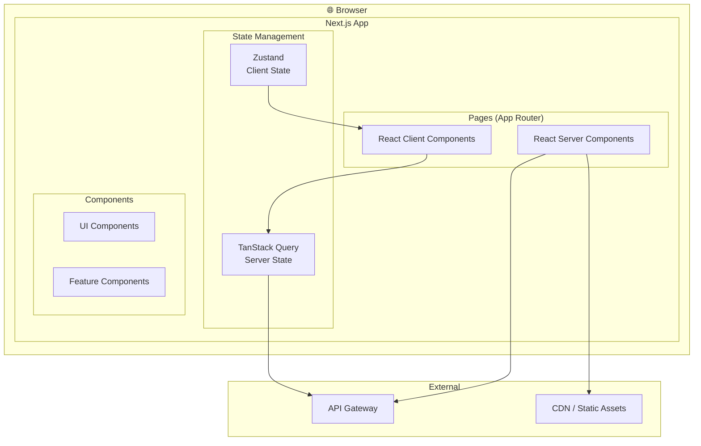
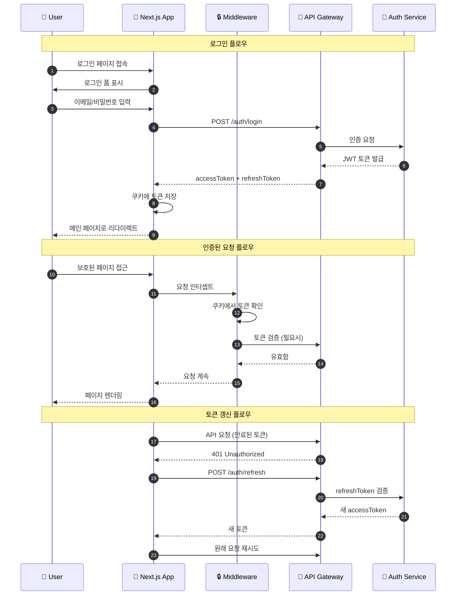

# 내시피(Naecipe) 프론트엔드 아키텍처

> 상위 문서: [5-1SERVICE_ARCHITECTURE.md](./5-1SERVICE_ARCHITECTURE.md)

---

## 1. 프론트엔드 아키텍처 개요

### 1.1 기술 스택

| 영역 | 기술 | 버전 | 선택 이유 |
|------|------|------|----------|
| **프레임워크** | Next.js | 14.x | App Router, RSC, 최적화 |
| **언어** | TypeScript | 5.x | 타입 안전성 |
| **스타일링** | Tailwind CSS | 3.x | 유틸리티 기반, DX |
| **상태 관리** | Zustand | 4.x | 경량, 심플 |
| **서버 상태** | TanStack Query | 5.x | 캐싱, 동기화 |
| **폼 관리** | React Hook Form | 7.x | 성능, 유효성 검사 |
| **UI 컴포넌트** | Radix UI | - | 접근성, 커스터마이징 |
| **아이콘** | Lucide React | - | 일관성, 경량 |
| **테스트** | Vitest + Testing Library | - | 속도, React 통합 |

### 1.2 디렉토리 구조

```
src/
├── app/                          # Next.js App Router
│   ├── (auth)/                   # 인증 관련 라우트 그룹
│   │   ├── login/
│   │   ├── register/
│   │   └── oauth/
│   ├── (main)/                   # 메인 앱 라우트 그룹
│   │   ├── recipes/
│   │   │   ├── [id]/
│   │   │   │   ├── page.tsx      # 레시피 상세
│   │   │   │   └── cook/         # 조리 모드
│   │   │   └── search/
│   │   ├── cookbooks/
│   │   │   ├── [id]/
│   │   │   └── page.tsx
│   │   └── profile/
│   ├── api/                      # API Routes (BFF)
│   ├── layout.tsx
│   └── page.tsx
├── components/
│   ├── ui/                       # 기본 UI 컴포넌트
│   │   ├── button.tsx
│   │   ├── input.tsx
│   │   ├── modal.tsx
│   │   └── ...
│   ├── features/                 # 기능별 컴포넌트
│   │   ├── recipe/
│   │   │   ├── RecipeCard.tsx
│   │   │   ├── RecipeDetail.tsx
│   │   │   ├── IngredientList.tsx
│   │   │   └── StepGuide.tsx
│   │   ├── cookbook/
│   │   ├── cooking/
│   │   │   ├── CookingMode.tsx
│   │   │   ├── Timer.tsx
│   │   │   └── StepProgress.tsx
│   │   ├── feedback/
│   │   │   ├── FeedbackForm.tsx
│   │   │   └── RatingInput.tsx
│   │   └── ai/
│   │       ├── QAChat.tsx
│   │       └── AdjustmentStatus.tsx
│   └── layout/
│       ├── Header.tsx
│       ├── Footer.tsx
│       ├── Navigation.tsx
│       └── Sidebar.tsx
├── hooks/                        # 커스텀 훅
│   ├── useRecipes.ts
│   ├── useCookbook.ts
│   ├── useAuth.ts
│   ├── useCooking.ts
│   └── useAI.ts
├── lib/                          # 유틸리티
│   ├── api/
│   │   ├── client.ts             # API 클라이언트
│   │   ├── recipes.ts
│   │   ├── cookbooks.ts
│   │   └── ai.ts
│   ├── utils/
│   └── constants/
├── stores/                       # Zustand 스토어
│   ├── authStore.ts
│   ├── cookingStore.ts
│   └── uiStore.ts
├── types/                        # TypeScript 타입
│   ├── recipe.ts
│   ├── user.ts
│   ├── cookbook.ts
│   └── api.ts
└── styles/
    └── globals.css
```

### 1.3 아키텍처 다이어그램



---

## 2. 핵심 컴포넌트

### 2.1 조리 모드 컴포넌트

```tsx
// components/features/cooking/CookingMode.tsx

'use client';

import { useState, useEffect, useCallback } from 'react';
import { useCookingStore } from '@/stores/cookingStore';
import { useAIChat } from '@/hooks/useAI';
import { Timer } from './Timer';
import { StepProgress } from './StepProgress';
import { QAChat } from '../ai/QAChat';
import { Button } from '@/components/ui/button';

interface CookingModeProps {
  cookbookRecipeId: string;
  recipe: Recipe;
}

export function CookingMode({ cookbookRecipeId, recipe }: CookingModeProps) {
  const {
    currentStep,
    isActive,
    startCooking,
    nextStep,
    prevStep,
    completeCooking,
  } = useCookingStore();

  const [showQA, setShowQA] = useState(false);
  const currentStepData = recipe.steps[currentStep - 1];

  // 화면 꺼짐 방지
  useEffect(() => {
    let wakeLock: WakeLockSentinel | null = null;

    const requestWakeLock = async () => {
      try {
        wakeLock = await navigator.wakeLock.request('screen');
      } catch (err) {
        console.error('Wake Lock 요청 실패:', err);
      }
    };

    if (isActive) {
      requestWakeLock();
    }

    return () => {
      wakeLock?.release();
    };
  }, [isActive]);

  const handleStart = useCallback(() => {
    startCooking(cookbookRecipeId, recipe.id);
  }, [cookbookRecipeId, recipe.id, startCooking]);

  const handleComplete = useCallback(() => {
    completeCooking();
    // 피드백 페이지로 이동
  }, [completeCooking]);

  if (!isActive) {
    return (
      <div className="flex flex-col items-center justify-center min-h-[60vh] gap-6">
        <h2 className="text-2xl font-bold">조리를 시작하시겠습니까?</h2>
        <p className="text-gray-600">
          총 {recipe.steps.length}단계 · 약 {recipe.cookingTimeMinutes}분
        </p>
        <Button size="lg" onClick={handleStart}>
          조리 시작
        </Button>
      </div>
    );
  }

  return (
    <div className="flex flex-col h-[calc(100vh-64px)]">
      {/* 진행률 */}
      <StepProgress
        current={currentStep}
        total={recipe.steps.length}
      />

      {/* 현재 단계 */}
      <div className="flex-1 p-6 overflow-y-auto">
        <div className="max-w-2xl mx-auto">
          <span className="text-sm text-gray-500">
            Step {currentStep} / {recipe.steps.length}
          </span>

          <h3 className="text-xl font-semibold mt-2 mb-4">
            {currentStepData.instruction}
          </h3>

          {currentStepData.imageUrl && (
            
          )}

          {currentStepData.tips && (
            <div className="bg-yellow-50 p-4 rounded-lg">
              <p className="text-sm text-yellow-800">
                💡 {currentStepData.tips}
              </p>
            </div>
          )}

          {/* 타이머 */}
          {currentStepData.durationSeconds && (
            <Timer
              duration={currentStepData.durationSeconds}
              onComplete={() => {/* 알림 */}}
            />
          )}
        </div>
      </div>

      {/* 네비게이션 */}
      <div className="border-t p-4">
        <div className="flex justify-between items-center max-w-2xl mx-auto">
          <Button
            variant="outline"
            onClick={prevStep}
            disabled={currentStep === 1}
          >
            이전
          </Button>

          <Button
            variant="ghost"
            onClick={() => setShowQA(true)}
          >
            🤖 AI에게 질문
          </Button>

          {currentStep === recipe.steps.length ? (
            <Button onClick={handleComplete}>
              조리 완료
            </Button>
          ) : (
            <Button onClick={nextStep}>
              다음
            </Button>
          )}
        </div>
      </div>

      {/* AI Q&A 모달 */}
      {showQA && (
        <QAChat
          recipeId={recipe.id}
          cookbookRecipeId={cookbookRecipeId}
          onClose={() => setShowQA(false)}
        />
      )}
    </div>
  );
}
```

### 2.2 피드백 폼 컴포넌트

```tsx
// components/features/feedback/FeedbackForm.tsx

'use client';

import { useForm, Controller } from 'react-hook-form';
import { zodResolver } from '@hookform/resolvers/zod';
import { z } from 'zod';
import { useMutation } from '@tanstack/react-query';
import { submitFeedback } from '@/lib/api/cookbooks';
import { RatingInput } from './RatingInput';
import { Button } from '@/components/ui/button';
import { Textarea } from '@/components/ui/textarea';
import { toast } from '@/components/ui/toast';

const feedbackSchema = z.object({
  tasteRating: z.number().min(1).max(5),
  difficultyRating: z.number().min(1).max(5),
  feedbackText: z.string().max(1000).optional(),
  adjustmentRequests: z.array(z.object({
    category: z.enum(['taste', 'portion', 'difficulty', 'ingredient']),
    description: z.string().max(200),
  })).optional(),
});

type FeedbackFormData = z.infer<typeof feedbackSchema>;

interface FeedbackFormProps {
  cookbookId: string;
  recipeId: string;
  onSuccess: (adjustmentRequestId: string) => void;
}

export function FeedbackForm({
  cookbookId,
  recipeId,
  onSuccess,
}: FeedbackFormProps) {
  const {
    control,
    register,
    handleSubmit,
    formState: { errors, isSubmitting },
  } = useForm<FeedbackFormData>({
    resolver: zodResolver(feedbackSchema),
    defaultValues: {
      tasteRating: 3,
      difficultyRating: 3,
      adjustmentRequests: [],
    },
  });

  const mutation = useMutation({
    mutationFn: (data: FeedbackFormData) =>
      submitFeedback(cookbookId, recipeId, data),
    onSuccess: (response) => {
      toast.success('피드백이 제출되었습니다');
      onSuccess(response.adjustmentRequestId);
    },
    onError: (error) => {
      toast.error('피드백 제출에 실패했습니다');
    },
  });

  const onSubmit = (data: FeedbackFormData) => {
    mutation.mutate(data);
  };

  return (
    <form onSubmit={handleSubmit(onSubmit)} className="space-y-6">
      {/* 맛 평가 */}
      <div>
        <label className="block text-sm font-medium mb-2">
          맛은 어떠셨나요?
        </label>
        <Controller
          name="tasteRating"
          control={control}
          render={({ field }) => (
            <RatingInput
              value={field.value}
              onChange={field.onChange}
              labels={['별로예요', '아쉬워요', '보통이에요', '맛있어요', '최고예요']}
            />
          )}
        />
      </div>

      {/* 난이도 평가 */}
      <div>
        <label className="block text-sm font-medium mb-2">
          난이도는 어떠셨나요?
        </label>
        <Controller
          name="difficultyRating"
          control={control}
          render={({ field }) => (
            <RatingInput
              value={field.value}
              onChange={field.onChange}
              labels={['너무 어려워요', '어려워요', '적당해요', '쉬워요', '아주 쉬워요']}
            />
          )}
        />
      </div>

      {/* 텍스트 피드백 */}
      <div>
        <label className="block text-sm font-medium mb-2">
          추가 피드백 (선택)
        </label>
        <Textarea
          {...register('feedbackText')}
          placeholder="조리하면서 느낀 점이나 개선하고 싶은 부분을 알려주세요"
          rows={4}
        />
      </div>

      {/* AI 보정 요청 */}
      <AdjustmentRequestInput
        control={control}
        name="adjustmentRequests"
      />

      <Button
        type="submit"
        className="w-full"
        disabled={isSubmitting || mutation.isPending}
      >
        {mutation.isPending ? 'AI가 분석 중...' : '피드백 제출하기'}
      </Button>
    </form>
  );
}
```

---

## 3. 인증 및 인가

### 3.1 인증 흐름



### 3.2 Next.js Middleware

```typescript
// middleware.ts

import { NextResponse } from 'next/server';
import type { NextRequest } from 'next/server';
import { verifyToken } from '@/lib/auth';

const publicPaths = [
  '/',
  '/login',
  '/register',
  '/oauth',
  '/recipes', // 레시피 목록은 공개
  '/recipes/search',
];

const authOnlyPaths = [
  '/cookbooks',
  '/profile',
];

export async function middleware(request: NextRequest) {
  const { pathname } = request.nextUrl;

  // 정적 파일은 통과
  if (
    pathname.startsWith('/_next') ||
    pathname.startsWith('/api') ||
    pathname.includes('.')
  ) {
    return NextResponse.next();
  }

  const accessToken = request.cookies.get('access_token')?.value;

  // 공개 경로는 통과
  const isPublicPath = publicPaths.some(
    (path) => pathname === path || pathname.startsWith(`${path}/`)
  );

  // 인증 필요 경로 체크
  const isAuthRequired = authOnlyPaths.some(
    (path) => pathname === path || pathname.startsWith(`${path}/`)
  );

  if (isAuthRequired && !accessToken) {
    const loginUrl = new URL('/login', request.url);
    loginUrl.searchParams.set('redirect', pathname);
    return NextResponse.redirect(loginUrl);
  }

  // 토큰 검증
  if (accessToken) {
    try {
      const payload = await verifyToken(accessToken);

      // 요청 헤더에 사용자 정보 추가
      const requestHeaders = new Headers(request.headers);
      requestHeaders.set('x-user-id', payload.userId);
      requestHeaders.set('x-user-role', payload.role);

      return NextResponse.next({
        request: { headers: requestHeaders },
      });
    } catch (error) {
      // 토큰 만료 시 리프레시 시도
      const refreshToken = request.cookies.get('refresh_token')?.value;

      if (refreshToken && isAuthRequired) {
        // 클라이언트에서 리프레시 처리하도록 플래그 설정
        const response = NextResponse.next();
        response.headers.set('x-token-expired', 'true');
        return response;
      }

      if (isAuthRequired) {
        return NextResponse.redirect(new URL('/login', request.url));
      }
    }
  }

  return NextResponse.next();
}

export const config = {
  matcher: ['/((?!_next/static|_next/image|favicon.ico).*)'],
};
```

### 3.3 Auth Store (Zustand)

```typescript
// stores/authStore.ts

import { create } from 'zustand';
import { persist, createJSONStorage } from 'zustand/middleware';
import { User } from '@/types/user';
import { login, logout, refreshToken, getCurrentUser } from '@/lib/api/auth';

interface AuthState {
  user: User | null;
  isAuthenticated: boolean;
  isLoading: boolean;

  // Actions
  login: (email: string, password: string) => Promise<void>;
  loginWithOAuth: (provider: string, code: string) => Promise<void>;
  logout: () => Promise<void>;
  refreshSession: () => Promise<void>;
  checkAuth: () => Promise<void>;
}

export const useAuthStore = create<AuthState>()(
  persist(
    (set, get) => ({
      user: null,
      isAuthenticated: false,
      isLoading: true,

      login: async (email, password) => {
        const { user, accessToken, refreshToken } = await login(email, password);

        // 쿠키에 토큰 저장 (httpOnly는 서버에서 설정)
        document.cookie = `access_token=${accessToken}; path=/; max-age=3600`;
        document.cookie = `refresh_token=${refreshToken}; path=/; max-age=604800`;

        set({ user, isAuthenticated: true });
      },

      loginWithOAuth: async (provider, code) => {
        const response = await fetch(`/api/auth/oauth/${provider}`, {
          method: 'POST',
          headers: { 'Content-Type': 'application/json' },
          body: JSON.stringify({ code }),
        });

        const { user, accessToken, refreshToken } = await response.json();

        document.cookie = `access_token=${accessToken}; path=/; max-age=3600`;
        document.cookie = `refresh_token=${refreshToken}; path=/; max-age=604800`;

        set({ user, isAuthenticated: true });
      },

      logout: async () => {
        try {
          await logout();
        } finally {
          document.cookie = 'access_token=; path=/; max-age=0';
          document.cookie = 'refresh_token=; path=/; max-age=0';
          set({ user: null, isAuthenticated: false });
        }
      },

      refreshSession: async () => {
        try {
          const { accessToken } = await refreshToken();
          document.cookie = `access_token=${accessToken}; path=/; max-age=3600`;
        } catch {
          get().logout();
        }
      },

      checkAuth: async () => {
        set({ isLoading: true });
        try {
          const user = await getCurrentUser();
          set({ user, isAuthenticated: true });
        } catch {
          set({ user: null, isAuthenticated: false });
        } finally {
          set({ isLoading: false });
        }
      },
    }),
    {
      name: 'auth-storage',
      storage: createJSONStorage(() => localStorage),
      partialize: (state) => ({ user: state.user }),
    }
  )
);
```

---

## 4. 에러 처리

### 4.1 에러 경계

```tsx
// app/error.tsx

'use client';

import { useEffect } from 'react';
import { Button } from '@/components/ui/button';
import { AlertTriangle } from 'lucide-react';

interface ErrorProps {
  error: Error & { digest?: string };
  reset: () => void;
}

export default function Error({ error, reset }: ErrorProps) {
  useEffect(() => {
    // 에러 로깅 서비스로 전송
    console.error('Application Error:', error);
  }, [error]);

  return (
    <div className="flex flex-col items-center justify-center min-h-[60vh] px-4">
      <AlertTriangle className="w-16 h-16 text-red-500 mb-4" />
      <h2 className="text-2xl font-bold mb-2">문제가 발생했습니다</h2>
      <p className="text-gray-600 text-center mb-6">
        죄송합니다. 예상치 못한 오류가 발생했습니다.
        <br />
        잠시 후 다시 시도해주세요.
      </p>
      <div className="flex gap-4">
        <Button onClick={reset}>다시 시도</Button>
        <Button variant="outline" onClick={() => window.location.href = '/'}>
          홈으로
        </Button>
      </div>
      {process.env.NODE_ENV === 'development' && (
        <pre className="mt-8 p-4 bg-gray-100 rounded text-sm overflow-auto max-w-full">
          {error.message}
        </pre>
      )}
    </div>
  );
}
```

### 4.2 API 에러 처리

```typescript
// lib/api/client.ts

import { toast } from '@/components/ui/toast';
import { useAuthStore } from '@/stores/authStore';

interface ApiError {
  type: string;
  title: string;
  status: number;
  detail: string;
  errors?: Array<{
    field: string;
    message: string;
    code: string;
  }>;
}

class ApiClient {
  private baseUrl: string;

  constructor() {
    this.baseUrl = process.env.NEXT_PUBLIC_API_URL || '';
  }

  private async handleResponse<T>(response: Response): Promise<T> {
    if (!response.ok) {
      const error: ApiError = await response.json().catch(() => ({
        type: '/errors/unknown',
        title: 'Unknown Error',
        status: response.status,
        detail: '알 수 없는 오류가 발생했습니다.',
      }));

      // 인증 에러 처리
      if (response.status === 401) {
        const refreshed = await this.tryRefreshToken();
        if (!refreshed) {
          useAuthStore.getState().logout();
          window.location.href = '/login';
        }
        throw new AuthError(error);
      }

      // Rate Limit 에러
      if (response.status === 429) {
        const retryAfter = response.headers.get('Retry-After');
        toast.error(`요청 한도 초과. ${retryAfter}초 후 다시 시도해주세요.`);
        throw new RateLimitError(error, parseInt(retryAfter || '60'));
      }

      // Validation 에러
      if (response.status === 400 && error.errors) {
        throw new ValidationError(error);
      }

      throw new ApiRequestError(error);
    }

    return response.json();
  }

  private async tryRefreshToken(): Promise<boolean> {
    try {
      await useAuthStore.getState().refreshSession();
      return true;
    } catch {
      return false;
    }
  }

  async get<T>(path: string, options?: RequestInit): Promise<T> {
    const response = await fetch(`${this.baseUrl}${path}`, {
      ...options,
      method: 'GET',
      credentials: 'include',
      headers: {
        'Content-Type': 'application/json',
        ...options?.headers,
      },
    });
    return this.handleResponse<T>(response);
  }

  async post<T>(path: string, body?: unknown, options?: RequestInit): Promise<T> {
    const response = await fetch(`${this.baseUrl}${path}`, {
      ...options,
      method: 'POST',
      credentials: 'include',
      headers: {
        'Content-Type': 'application/json',
        ...options?.headers,
      },
      body: body ? JSON.stringify(body) : undefined,
    });
    return this.handleResponse<T>(response);
  }

  // PUT, DELETE 등 유사하게 구현
}

// Custom Error Classes
class ApiRequestError extends Error {
  constructor(public apiError: ApiError) {
    super(apiError.detail);
    this.name = 'ApiRequestError';
  }
}

class AuthError extends ApiRequestError {
  constructor(apiError: ApiError) {
    super(apiError);
    this.name = 'AuthError';
  }
}

class ValidationError extends ApiRequestError {
  constructor(apiError: ApiError) {
    super(apiError);
    this.name = 'ValidationError';
  }

  getFieldErrors(): Record<string, string> {
    return (this.apiError.errors || []).reduce(
      (acc, err) => ({ ...acc, [err.field]: err.message }),
      {}
    );
  }
}

class RateLimitError extends ApiRequestError {
  constructor(apiError: ApiError, public retryAfter: number) {
    super(apiError);
    this.name = 'RateLimitError';
  }
}

export const apiClient = new ApiClient();
```

### 4.3 전역 에러 처리 훅

```typescript
// hooks/useApiError.ts

import { useCallback } from 'react';
import { toast } from '@/components/ui/toast';
import { useRouter } from 'next/navigation';

export function useApiError() {
  const router = useRouter();

  const handleError = useCallback((error: unknown) => {
    if (error instanceof AuthError) {
      toast.error('로그인이 필요합니다.');
      router.push('/login');
      return;
    }

    if (error instanceof ValidationError) {
      const errors = error.getFieldErrors();
      Object.values(errors).forEach((msg) => toast.error(msg));
      return;
    }

    if (error instanceof RateLimitError) {
      toast.error(`잠시 후 다시 시도해주세요. (${error.retryAfter}초)`);
      return;
    }

    if (error instanceof ApiRequestError) {
      toast.error(error.apiError.detail);
      return;
    }

    toast.error('알 수 없는 오류가 발생했습니다.');
  }, [router]);

  return { handleError };
}
```

---

## 5. 성능 최적화

### 5.1 이미지 최적화

```tsx
// components/ui/OptimizedImage.tsx

import Image from 'next/image';
import { useState } from 'react';
import { cn } from '@/lib/utils';

interface OptimizedImageProps {
  src: string;
  alt: string;
  width?: number;
  height?: number;
  className?: string;
  priority?: boolean;
}

export function OptimizedImage({
  src,
  alt,
  width,
  height,
  className,
  priority = false,
}: OptimizedImageProps) {
  const [isLoading, setIsLoading] = useState(true);

  return (
    <div className={cn('relative overflow-hidden', className)}>
      <Image
        src={src}
        alt={alt}
        width={width}
        height={height}
        priority={priority}
        className={cn(
          'duration-300 ease-in-out',
          isLoading ? 'scale-110 blur-lg' : 'scale-100 blur-0'
        )}
        onLoad={() => setIsLoading(false)}
        sizes="(max-width: 768px) 100vw, (max-width: 1200px) 50vw, 33vw"
      />
      {isLoading && (
        <div className="absolute inset-0 bg-gray-200 animate-pulse" />
      )}
    </div>
  );
}
```

### 5.2 컴포넌트 레이지 로딩

```tsx
// app/(main)/recipes/[id]/cook/page.tsx

import dynamic from 'next/dynamic';
import { Suspense } from 'react';
import { CookingModeSkeleton } from '@/components/features/cooking/CookingModeSkeleton';

// 조리 모드는 무거우므로 레이지 로딩
const CookingMode = dynamic(
  () => import('@/components/features/cooking/CookingMode'),
  {
    loading: () => <CookingModeSkeleton />,
    ssr: false, // 클라이언트에서만 렌더링
  }
);

// Q&A 채팅도 레이지 로딩
const QAChat = dynamic(
  () => import('@/components/features/ai/QAChat'),
  { ssr: false }
);

export default async function CookPage({
  params,
}: {
  params: { id: string };
}) {
  // 서버에서 레시피 데이터 fetch
  const recipe = await getRecipe(params.id);

  return (
    <Suspense fallback={<CookingModeSkeleton />}>
      <CookingMode
        cookbookRecipeId={params.id}
        recipe={recipe}
      />
    </Suspense>
  );
}
```

### 5.3 데이터 프리페칭

```tsx
// components/features/recipe/RecipeCard.tsx

'use client';

import Link from 'next/link';
import { useQueryClient } from '@tanstack/react-query';
import { getRecipeDetail } from '@/lib/api/recipes';

export function RecipeCard({ recipe }: { recipe: RecipeSummary }) {
  const queryClient = useQueryClient();

  // 마우스 호버 시 상세 데이터 프리페치
  const handleMouseEnter = () => {
    queryClient.prefetchQuery({
      queryKey: ['recipe', recipe.id],
      queryFn: () => getRecipeDetail(recipe.id),
      staleTime: 5 * 60 * 1000, // 5분
    });
  };

  return (
    <Link
      href={`/recipes/${recipe.id}`}
      onMouseEnter={handleMouseEnter}
      className="block"
    >
      {/* 카드 내용 */}
    </Link>
  );
}
```

---

## 6. 접근성 (A11y)

### 6.1 접근성 체크리스트

| 항목 | 구현 방법 |
|------|----------|
| **키보드 네비게이션** | 모든 인터랙티브 요소 Tab 접근 가능 |
| **스크린 리더** | 적절한 ARIA 레이블, 역할 |
| **색상 대비** | WCAG AA 기준 충족 (4.5:1) |
| **포커스 표시** | 명확한 포커스 링 |
| **모션 감소** | `prefers-reduced-motion` 대응 |
| **텍스트 크기** | 상대 단위(rem) 사용 |

### 6.2 접근성 컴포넌트 예시

```tsx
// components/ui/Modal.tsx

import * as Dialog from '@radix-ui/react-dialog';
import { X } from 'lucide-react';
import { cn } from '@/lib/utils';

interface ModalProps {
  open: boolean;
  onClose: () => void;
  title: string;
  description?: string;
  children: React.ReactNode;
}

export function Modal({
  open,
  onClose,
  title,
  description,
  children,
}: ModalProps) {
  return (
    <Dialog.Root open={open} onOpenChange={onClose}>
      <Dialog.Portal>
        <Dialog.Overlay
          className={cn(
            'fixed inset-0 bg-black/50',
            'data-[state=open]:animate-fade-in',
            'data-[state=closed]:animate-fade-out'
          )}
        />
        <Dialog.Content
          className={cn(
            'fixed top-1/2 left-1/2 -translate-x-1/2 -translate-y-1/2',
            'w-full max-w-md bg-white rounded-lg shadow-xl p-6',
            'focus:outline-none',
            'data-[state=open]:animate-slide-up'
          )}
          aria-describedby={description ? 'modal-description' : undefined}
        >
          <Dialog.Title className="text-lg font-semibold">
            {title}
          </Dialog.Title>

          {description && (
            <Dialog.Description
              id="modal-description"
              className="text-sm text-gray-500 mt-2"
            >
              {description}
            </Dialog.Description>
          )}

          <div className="mt-4">{children}</div>

          <Dialog.Close asChild>
            <button
              className={cn(
                'absolute top-4 right-4 p-1 rounded',
                'hover:bg-gray-100 focus:ring-2 focus:ring-primary'
              )}
              aria-label="닫기"
            >
              <X className="w-5 h-5" />
            </button>
          </Dialog.Close>
        </Dialog.Content>
      </Dialog.Portal>
    </Dialog.Root>
  );
}
```

---

## 변경 이력

| 버전 | 날짜 | 변경 내용 |
|-----|------|----------|
| v1.0 | 2025.11.30 | 초기 문서 작성 |

---

> **이전 문서:** [5-1-4_API.md](./5-1-4_API.md) - API 설계
> **다음 문서:** [5-1-6_INFRA.md](./5-1-6_INFRA.md) - 인프라 및 배포
