# 내시피(Naecipe) 인프라 및 배포

> 상위 문서: [5-1SERVICE_ARCHITECTURE.md](./5-1SERVICE_ARCHITECTURE.md)

---

## 1. 클라우드 인프라 개요

### 1.1 AWS 아키텍처


### 1.2 리소스 명세

| 서비스 | 스펙 | 수량 | 용도 |
|--------|------|------|------|
| **EKS** | 1.29 | 1 | Kubernetes 클러스터 |
| **EC2 (General)** | m6i.xlarge | 3-10 | 일반 워크로드 |
| **EC2 (AI)** | c6i.2xlarge | 2-5 | AI Agent 워크로드 |
| **RDS PostgreSQL** | db.r6g.xlarge | 5 | 도메인별 DB |
| **ElastiCache Redis** | r6g.large | 6 | 캐시 클러스터 |
| **MSK Kafka** | kafka.m5.large | 3 | 메시지 브로커 |
| **S3** | Standard | - | 정적 파일, 백업 |
| **CloudFront** | - | 1 | CDN |
| **EC2 (Crawler)** | t3.medium | 1-2 | Recipe Crawler Bot (스케줄 기반) |

---

## 2. Kubernetes 구성

### 2.1 네임스페이스 구조


### 2.2 Deployment 예시

```yaml
# deployments/recipe-service.yaml

apiVersion: apps/v1
kind: Deployment
metadata:
  name: recipe-service
  namespace: naecipe-prod
  labels:
    app: recipe-service
    version: v1
spec:
  replicas: 3
  strategy:
    type: RollingUpdate
    rollingUpdate:
      maxSurge: 1
      maxUnavailable: 0
  selector:
    matchLabels:
      app: recipe-service
  template:
    metadata:
      labels:
        app: recipe-service
        version: v1
      annotations:
        prometheus.io/scrape: "true"
        prometheus.io/port: "3001"
        prometheus.io/path: "/metrics"
    spec:
      serviceAccountName: recipe-service
      containers:
        - name: recipe-service
          image: 123456789.dkr.ecr.ap-northeast-2.amazonaws.com/naecipe/recipe-service:v1.2.3
          ports:
            - containerPort: 3001
              name: http
            - containerPort: 50051
              name: grpc
          env:
            - name: NODE_ENV
              value: "production"
            - name: DATABASE_URL
              valueFrom:
                secretKeyRef:
                  name: recipe-db-secret
                  key: url
            - name: REDIS_URL
              valueFrom:
                secretKeyRef:
                  name: redis-secret
                  key: url
          resources:
            requests:
              cpu: "500m"
              memory: "512Mi"
            limits:
              cpu: "1000m"
              memory: "1Gi"
          livenessProbe:
            httpGet:
              path: /health/live
              port: http
            initialDelaySeconds: 30
            periodSeconds: 10
          readinessProbe:
            httpGet:
              path: /health/ready
              port: http
            initialDelaySeconds: 5
            periodSeconds: 5
          volumeMounts:
            - name: config
              mountPath: /app/config
              readOnly: true
      volumes:
        - name: config
          configMap:
            name: recipe-service-config
      affinity:
        podAntiAffinity:
          preferredDuringSchedulingIgnoredDuringExecution:
            - weight: 100
              podAffinityTerm:
                labelSelector:
                  matchLabels:
                    app: recipe-service
                topologyKey: topology.kubernetes.io/zone

---
apiVersion: v1
kind: Service
metadata:
  name: recipe-service
  namespace: naecipe-prod
spec:
  selector:
    app: recipe-service
  ports:
    - name: http
      port: 80
      targetPort: 3001
    - name: grpc
      port: 50051
      targetPort: 50051
  type: ClusterIP
```

### 2.3 HPA (Horizontal Pod Autoscaler)

```yaml
# hpa/recipe-service-hpa.yaml

apiVersion: autoscaling/v2
kind: HorizontalPodAutoscaler
metadata:
  name: recipe-service-hpa
  namespace: naecipe-prod
spec:
  scaleTargetRef:
    apiVersion: apps/v1
    kind: Deployment
    name: recipe-service
  minReplicas: 3
  maxReplicas: 10
  metrics:
    - type: Resource
      resource:
        name: cpu
        target:
          type: Utilization
          averageUtilization: 70
    - type: Resource
      resource:
        name: memory
        target:
          type: Utilization
          averageUtilization: 80
    - type: Pods
      pods:
        metric:
          name: http_requests_per_second
        target:
          type: AverageValue
          averageValue: "1000"
  behavior:
    scaleUp:
      stabilizationWindowSeconds: 60
      policies:
        - type: Pods
          value: 2
          periodSeconds: 60
    scaleDown:
      stabilizationWindowSeconds: 300
      policies:
        - type: Percent
          value: 10
          periodSeconds: 60
```

### 2.4 리소스 관리

| 서비스 | CPU Request | CPU Limit | Memory Request | Memory Limit |
|--------|-------------|-----------|----------------|--------------|
| API Gateway | 500m | 1000m | 512Mi | 1Gi |
| Recipe Service | 500m | 1000m | 512Mi | 1Gi |
| User Service | 250m | 500m | 256Mi | 512Mi |
| Cookbook Service | 500m | 1000m | 512Mi | 1Gi |
| AI Agent Service | 1000m | 2000m | 1Gi | 2Gi |
| Search Service | 500m | 1000m | 1Gi | 2Gi |
| Ingestion Service | 250m | 500m | 256Mi | 512Mi |
| Recipe Crawler Bot | 500m | 1000m | 512Mi | 1Gi |

### 2.5 Recipe Crawler CronJob

```yaml
# cronjobs/recipe-crawler.yaml

apiVersion: batch/v1
kind: CronJob
metadata:
  name: recipe-crawler-youtube
  namespace: naecipe-crawler
spec:
  schedule: "0 2 * * *"  # 매일 새벽 2시
  concurrencyPolicy: Forbid
  successfulJobsHistoryLimit: 3
  failedJobsHistoryLimit: 3
  jobTemplate:
    spec:
      ttlSecondsAfterFinished: 86400  # 24시간 후 정리
      template:
        metadata:
          labels:
            app: recipe-crawler
            platform: youtube
        spec:
          restartPolicy: OnFailure
          serviceAccountName: recipe-crawler
          containers:
            - name: crawler
              image: 123456789.dkr.ecr.ap-northeast-2.amazonaws.com/naecipe/recipe-crawler:latest
              args:
                - "--platform=youtube"
                - "--mode=once"
                - "--max-recipes=100"
              env:
                - name: INGESTION_API_URL
                  value: "http://ingestion-service.naecipe-prod.svc.cluster.local:8009"
                - name: OPENAI_API_KEY
                  valueFrom:
                    secretKeyRef:
                      name: ai-secrets
                      key: openai-api-key
                - name: YOUTUBE_API_KEY
                  valueFrom:
                    secretKeyRef:
                      name: crawler-secrets
                      key: youtube-api-key
              resources:
                requests:
                  cpu: "500m"
                  memory: "512Mi"
                limits:
                  cpu: "1000m"
                  memory: "1Gi"

---
apiVersion: batch/v1
kind: CronJob
metadata:
  name: recipe-crawler-instagram
  namespace: naecipe-crawler
spec:
  schedule: "0 3 * * *"  # 매일 새벽 3시
  concurrencyPolicy: Forbid
  jobTemplate:
    spec:
      template:
        spec:
          restartPolicy: OnFailure
          serviceAccountName: recipe-crawler
          containers:
            - name: crawler
              image: 123456789.dkr.ecr.ap-northeast-2.amazonaws.com/naecipe/recipe-crawler:latest
              args:
                - "--platform=instagram"
                - "--mode=once"
              env:
                - name: INGESTION_API_URL
                  value: "http://ingestion-service.naecipe-prod.svc.cluster.local:8009"
                - name: INSTAGRAM_ACCESS_TOKEN
                  valueFrom:
                    secretKeyRef:
                      name: crawler-secrets
                      key: instagram-token
              resources:
                requests:
                  cpu: "500m"
                  memory: "512Mi"
                limits:
                  cpu: "1000m"
                  memory: "1Gi"

---
apiVersion: batch/v1
kind: CronJob
metadata:
  name: recipe-score-refresh
  namespace: naecipe-crawler
spec:
  schedule: "0 5 * * 0"  # 매주 일요일 새벽 5시
  concurrencyPolicy: Forbid
  jobTemplate:
    spec:
      template:
        spec:
          restartPolicy: OnFailure
          containers:
            - name: score-refresher
              image: 123456789.dkr.ecr.ap-northeast-2.amazonaws.com/naecipe/recipe-crawler:latest
              args:
                - "--mode=refresh-scores"
                - "--batch-size=500"
              env:
                - name: INGESTION_API_URL
                  value: "http://ingestion-service.naecipe-prod.svc.cluster.local:8009"
```

---

## 3. CI/CD 파이프라인

### 3.1 파이프라인 개요

```mermaid
flowchart LR
    subgraph Development["개발"]
        DEV[개발자]
        GIT[GitHub]
    end

    subgraph CI["CI (GitHub Actions)"]
        TEST[테스트]
        BUILD[빌드]
        SCAN[보안 스캔]
        PUSH[이미지 푸시]
    end

    subgraph CD["CD (ArgoCD)"]
        SYNC[GitOps Sync]
        DEPLOY[배포]
        VERIFY[검증]
    end

    subgraph Environments["환경"]
        STAGING[Staging]
        PROD[Production]
    end

    DEV -->|Push| GIT
    GIT -->|Trigger| TEST
    TEST --> BUILD
    BUILD --> SCAN
    SCAN --> PUSH
    PUSH -->|Update manifest| GIT
    GIT -->|Watch| SYNC
    SYNC --> DEPLOY
    DEPLOY --> VERIFY
    VERIFY --> STAGING
    STAGING -->|Approval| PROD
```



### 3.2 GitHub Actions Workflow

```yaml
# .github/workflows/ci.yaml

name: CI Pipeline

on:
  push:
    branches: [main, develop]
    paths:
      - 'services/**'
      - '.github/workflows/**'
  pull_request:
    branches: [main]

env:
  AWS_REGION: ap-northeast-2
  ECR_REGISTRY: 123456789.dkr.ecr.ap-northeast-2.amazonaws.com

jobs:
  detect-changes:
    runs-on: ubuntu-latest
    outputs:
      services: ${{ steps.filter.outputs.changes }}
    steps:
      - uses: actions/checkout@v4
      - uses: dorny/paths-filter@v2
        id: filter
        with:
          filters: |
            recipe-service:
              - 'services/recipe-service/**'
            user-service:
              - 'services/user-service/**'
            cookbook-service:
              - 'services/cookbook-service/**'
            ai-agent-service:
              - 'services/ai-agent-service/**'

  test:
    needs: detect-changes
    runs-on: ubuntu-latest
    strategy:
      matrix:
        service: ${{ fromJson(needs.detect-changes.outputs.services) }}
    steps:
      - uses: actions/checkout@v4

      - name: Setup Python
        uses: actions/setup-python@v5
        with:
          python-version: '3.11'
          cache: 'pip'

      - name: Install dependencies
        run: |
          pip install -r requirements.txt
          pip install -r requirements-dev.txt
        working-directory: services/${{ matrix.service }}

      - name: Run tests
        run: pytest --cov=app --cov-report=xml
        working-directory: services/${{ matrix.service }}

      - name: Upload coverage
        uses: codecov/codecov-action@v3
        with:
          files: services/${{ matrix.service }}/coverage.xml
          flags: ${{ matrix.service }}

  build-and-push:
    needs: [detect-changes, test]
    runs-on: ubuntu-latest
    if: github.event_name == 'push'
    strategy:
      matrix:
        service: ${{ fromJson(needs.detect-changes.outputs.services) }}
    steps:
      - uses: actions/checkout@v4

      - name: Configure AWS credentials
        uses: aws-actions/configure-aws-credentials@v4
        with:
          role-to-assume: arn:aws:iam::123456789:role/github-actions-role
          aws-region: ${{ env.AWS_REGION }}

      - name: Login to Amazon ECR
        uses: aws-actions/amazon-ecr-login@v2

      - name: Set up Docker Buildx
        uses: docker/setup-buildx-action@v3

      - name: Build and push
        uses: docker/build-push-action@v5
        with:
          context: services/${{ matrix.service }}
          push: true
          tags: |
            ${{ env.ECR_REGISTRY }}/naecipe/${{ matrix.service }}:${{ github.sha }}
            ${{ env.ECR_REGISTRY }}/naecipe/${{ matrix.service }}:latest
          cache-from: type=gha
          cache-to: type=gha,mode=max

  security-scan:
    needs: build-and-push
    runs-on: ubuntu-latest
    strategy:
      matrix:
        service: ${{ fromJson(needs.detect-changes.outputs.services) }}
    steps:
      - name: Run Trivy vulnerability scanner
        uses: aquasecurity/trivy-action@master
        with:
          image-ref: ${{ env.ECR_REGISTRY }}/naecipe/${{ matrix.service }}:${{ github.sha }}
          format: 'sarif'
          output: 'trivy-results.sarif'
          severity: 'CRITICAL,HIGH'

      - name: Upload Trivy scan results
        uses: github/codeql-action/upload-sarif@v2
        with:
          sarif_file: 'trivy-results.sarif'

  update-manifests:
    needs: [build-and-push, security-scan]
    runs-on: ubuntu-latest
    steps:
      - uses: actions/checkout@v4
        with:
          repository: naecipe/k8s-manifests
          token: ${{ secrets.MANIFEST_REPO_TOKEN }}

      - name: Update image tags
        run: |
          for service in ${{ join(fromJson(needs.detect-changes.outputs.services), ' ') }}; do
            yq e ".spec.template.spec.containers[0].image = \"${{ env.ECR_REGISTRY }}/naecipe/${service}:${{ github.sha }}\"" \
              -i environments/staging/deployments/${service}.yaml
          done

      - name: Commit and push
        run: |
          git config user.name "GitHub Actions"
          git config user.email "actions@github.com"
          git add .
          git commit -m "chore: update image tags to ${{ github.sha }}"
          git push
```

### 3.3 ArgoCD Application

```yaml
# argocd/applications/naecipe-staging.yaml

apiVersion: argoproj.io/v1alpha1
kind: Application
metadata:
  name: naecipe-staging
  namespace: argocd
  finalizers:
    - resources-finalizer.argocd.argoproj.io
spec:
  project: naecipe
  source:
    repoURL: https://github.com/naecipe/k8s-manifests
    targetRevision: main
    path: environments/staging
  destination:
    server: https://kubernetes.default.svc
    namespace: naecipe-staging
  syncPolicy:
    automated:
      prune: true
      selfHeal: true
    syncOptions:
      - CreateNamespace=true
      - PrunePropagationPolicy=foreground
    retry:
      limit: 5
      backoff:
        duration: 5s
        factor: 2
        maxDuration: 3m
  ignoreDifferences:
    - group: apps
      kind: Deployment
      jsonPointers:
        - /spec/replicas
```

---

## 4. 모니터링

### 4.1 모니터링 스택


### 4.2 핵심 메트릭

| 카테고리 | 메트릭 | 설명 | 알림 임계값 |
|---------|--------|------|------------|
| **가용성** | `up` | 서비스 상태 | 0 = Critical |
| **지연 시간** | `http_request_duration_seconds` | API 응답 시간 | p99 > 1s |
| **에러율** | `http_requests_total{status=~"5.."}` | 5xx 에러 비율 | > 1% |
| **처리량** | `http_requests_total` | 초당 요청 수 | - |
| **포화도** | `container_cpu_usage_seconds_total` | CPU 사용률 | > 80% |
| **포화도** | `container_memory_usage_bytes` | 메모리 사용률 | > 85% |

### 4.3 Prometheus Alerting Rules

```yaml
# prometheus/rules/naecipe-alerts.yaml

groups:
  - name: naecipe-sla
    rules:
      - alert: HighErrorRate
        expr: |
          sum(rate(http_requests_total{status=~"5.."}[5m])) by (service)
          /
          sum(rate(http_requests_total[5m])) by (service)
          > 0.01
        for: 5m
        labels:
          severity: critical
        annotations:
          summary: "High error rate on {{ $labels.service }}"
          description: "Error rate is {{ $value | humanizePercentage }} (threshold: 1%)"

      - alert: HighLatency
        expr: |
          histogram_quantile(0.99,
            sum(rate(http_request_duration_seconds_bucket[5m])) by (le, service)
          ) > 1
        for: 5m
        labels:
          severity: warning
        annotations:
          summary: "High latency on {{ $labels.service }}"
          description: "p99 latency is {{ $value | humanizeDuration }}"

      - alert: PodNotReady
        expr: |
          kube_pod_status_ready{condition="true", namespace="naecipe-prod"} == 0
        for: 5m
        labels:
          severity: critical
        annotations:
          summary: "Pod not ready: {{ $labels.pod }}"

      - alert: PodCrashLooping
        expr: |
          increase(kube_pod_container_status_restarts_total{namespace="naecipe-prod"}[1h]) > 3
        labels:
          severity: critical
        annotations:
          summary: "Pod crash looping: {{ $labels.pod }}"

      - alert: HighMemoryUsage
        expr: |
          container_memory_usage_bytes{namespace="naecipe-prod"}
          /
          container_spec_memory_limit_bytes{namespace="naecipe-prod"}
          > 0.85
        for: 10m
        labels:
          severity: warning
        annotations:
          summary: "High memory usage on {{ $labels.pod }}"
          description: "Memory usage is {{ $value | humanizePercentage }}"
```

### 4.4 Grafana 대시보드

```json
// grafana/dashboards/service-overview.json (일부)

{
  "title": "Naecipe Service Overview",
  "panels": [
    {
      "title": "Request Rate",
      "type": "timeseries",
      "targets": [
        {
          "expr": "sum(rate(http_requests_total{namespace=\"naecipe-prod\"}[5m])) by (service)",
          "legendFormat": "{{ service }}"
        }
      ]
    },
    {
      "title": "Error Rate",
      "type": "timeseries",
      "targets": [
        {
          "expr": "sum(rate(http_requests_total{status=~\"5..\", namespace=\"naecipe-prod\"}[5m])) by (service) / sum(rate(http_requests_total{namespace=\"naecipe-prod\"}[5m])) by (service) * 100",
          "legendFormat": "{{ service }}"
        }
      ],
      "fieldConfig": {
        "defaults": {
          "unit": "percent",
          "thresholds": {
            "steps": [
              { "value": 0, "color": "green" },
              { "value": 1, "color": "yellow" },
              { "value": 5, "color": "red" }
            ]
          }
        }
      }
    },
    {
      "title": "Latency (p99)",
      "type": "timeseries",
      "targets": [
        {
          "expr": "histogram_quantile(0.99, sum(rate(http_request_duration_seconds_bucket{namespace=\"naecipe-prod\"}[5m])) by (le, service))",
          "legendFormat": "{{ service }}"
        }
      ],
      "fieldConfig": {
        "defaults": {
          "unit": "s"
        }
      }
    }
  ]
}
```

---

## 5. 로깅

### 5.1 로깅 아키텍처


### 5.2 로그 포맷

```json
{
  "timestamp": "2025-01-01T12:00:00.000Z",
  "level": "info",
  "service": "recipe-service",
  "traceId": "abc123",
  "spanId": "def456",
  "userId": "user-uuid",
  "method": "GET",
  "path": "/api/v1/recipes/search",
  "statusCode": 200,
  "responseTime": 45,
  "message": "Request completed",
  "context": {
    "query": "김치찌개",
    "resultCount": 25
  }
}
```

---

## 6. 시크릿 관리

### 6.1 AWS Secrets Manager 연동

```yaml
# external-secrets/recipe-db-secret.yaml

apiVersion: external-secrets.io/v1beta1
kind: ExternalSecret
metadata:
  name: recipe-db-secret
  namespace: naecipe-prod
spec:
  refreshInterval: 1h
  secretStoreRef:
    name: aws-secrets-manager
    kind: ClusterSecretStore
  target:
    name: recipe-db-secret
    creationPolicy: Owner
  data:
    - secretKey: url
      remoteRef:
        key: naecipe/prod/recipe-db
        property: connection_string
    - secretKey: username
      remoteRef:
        key: naecipe/prod/recipe-db
        property: username
    - secretKey: password
      remoteRef:
        key: naecipe/prod/recipe-db
        property: password
```

---

## 변경 이력

| 버전 | 날짜 | 변경 내용 |
|-----|------|----------|
| v1.0 | 2025.11.30 | 초기 문서 작성 |

---

> **이전 문서:** [5-1-5_FRONTEND.md](./5-1-5_FRONTEND.md) - 프론트엔드
> **다음 문서:** [5-1-7_SECURITY.md](./5-1-7_SECURITY.md) - 보안 및 품질
