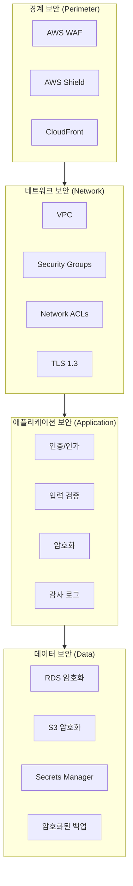
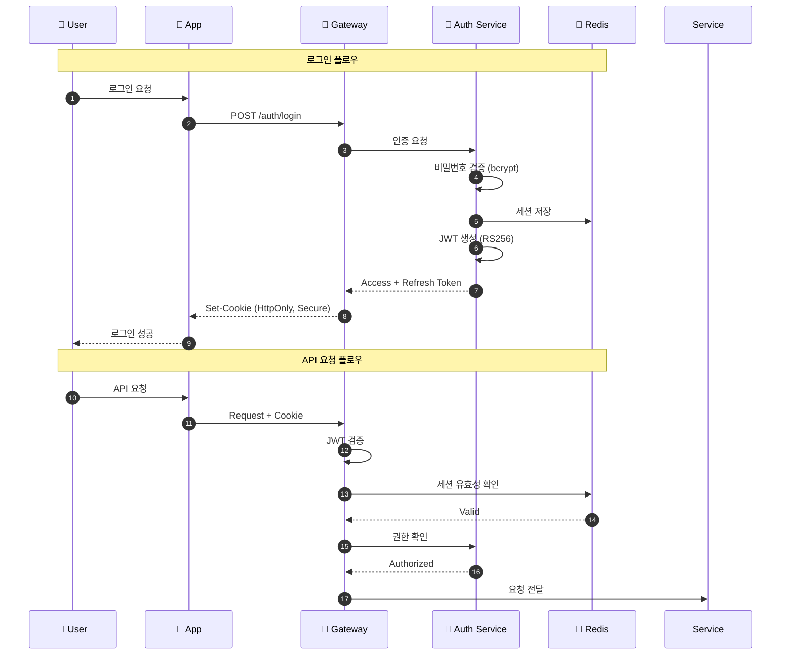
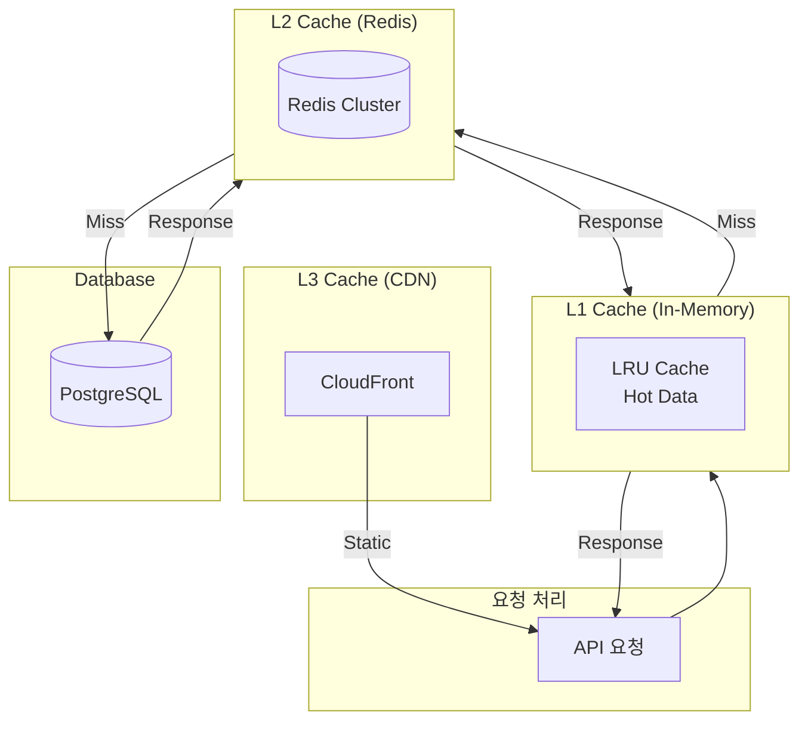
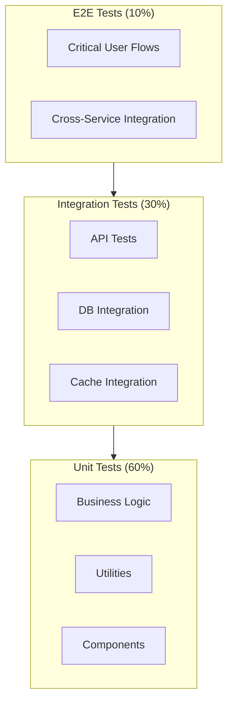
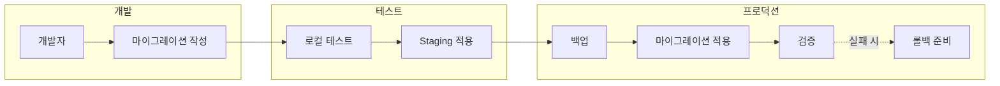
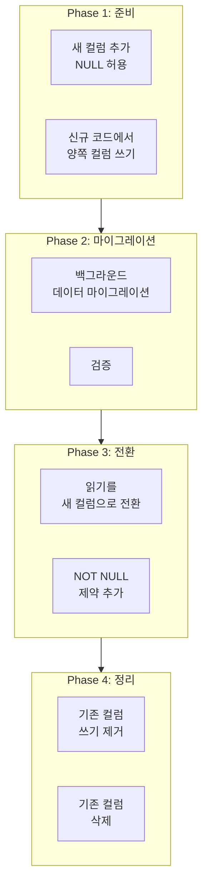
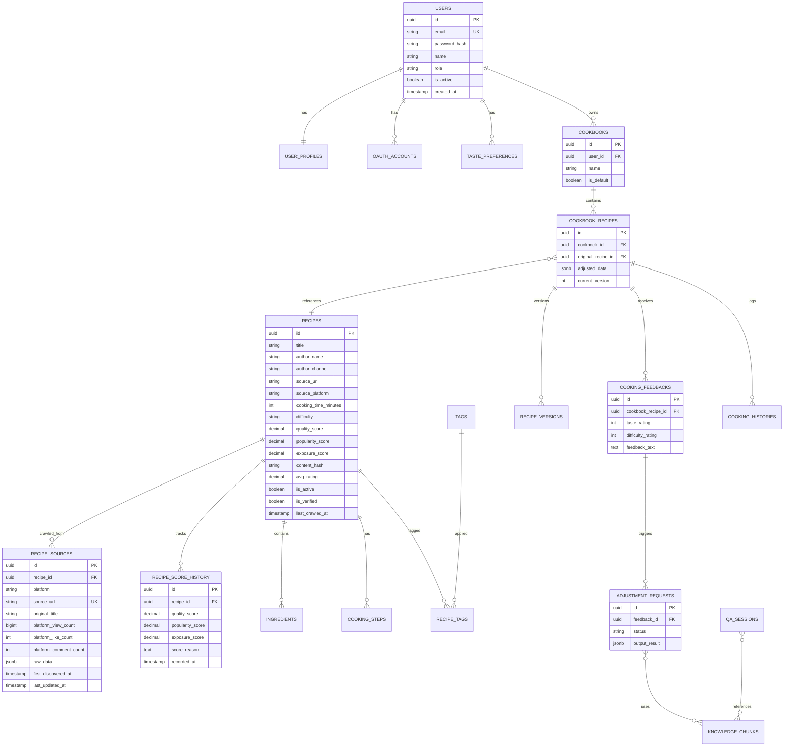

# 내시피(Naecipe) 보안 및 품질

> 상위 문서: [5-1SERVICE_ARCHITECTURE.md](./5-1SERVICE_ARCHITECTURE.md)

---

## 1. 보안 아키텍처

### 1.1 3계층 보안 모델



### 1.2 OWASP Top 10 대응

| 취약점 | 대응 방안 | 구현 |
|--------|----------|------|
| **A01 - Broken Access Control** | RBAC, 리소스 소유권 검증 | Middleware + Policy |
| **A02 - Cryptographic Failures** | TLS 1.3, AES-256 암호화 | AWS KMS |
| **A03 - Injection** | Parameterized Query, Input Validation | SQLAlchemy + Pydantic |
| **A04 - Insecure Design** | Threat Modeling, Security Review | Architecture Review |
| **A05 - Security Misconfiguration** | IaC, Security Baseline | Terraform + CIS Benchmark |
| **A06 - Vulnerable Components** | Dependency Scanning, Auto-update | Dependabot + Snyk |
| **A07 - Auth Failures** | MFA, Rate Limiting, Secure Session | JWT + Redis |
| **A08 - Data Integrity Failures** | Signed Artifacts, Version Pinning | Cosign + SBOM |
| **A09 - Security Logging Failures** | Centralized Logging, Alerting | Loki + Alertmanager |
| **A10 - SSRF** | URL Allowlist, Request Validation | Middleware |

### 1.5 크롤링 보안 정책

#### 외부 데이터 수집 보안

| 위협 | 대응 방안 | 구현 |
|------|----------|------|
| **악성 콘텐츠 주입** | LLM 파싱 결과 검증, 입력 Sanitization | Pydantic + 패턴 검사 |
| **플랫폼 차단** | Rate Limiting, User-Agent 로테이션, 존중하는 크롤링 | robots.txt 준수 |
| **저작권 이슈** | 출처 명시, 원본 링크 보존, 삭제 요청 대응 | 소스 테이블 관리 |
| **데이터 품질** | 이상치 탐지, 수동 검수 플래그 | 품질 점수 시스템 |
| **API 키 노출** | 환경 변수, Secrets Manager | K8s Secrets |

#### Crawler Bot 보안 설정

```python
# crawler/security.py

from pydantic import BaseModel, field_validator
import re
import bleach

class RecipeInputValidator(BaseModel):
    """크롤링된 레시피 데이터 검증"""

    title: str
    description: str
    author_name: str
    ingredients: list[dict]
    steps: list[dict]

    @field_validator('title', 'description', 'author_name')
    @classmethod
    def sanitize_text(cls, v: str) -> str:
        # HTML 태그 제거
        v = bleach.clean(v, tags=[], strip=True)
        # 스크립트 패턴 검사
        if re.search(r'<script|javascript:|on\w+=', v, re.IGNORECASE):
            raise ValueError('Potentially malicious content detected')
        # 길이 제한
        if len(v) > 10000:
            raise ValueError('Content too long')
        return v.strip()

    @field_validator('ingredients', 'steps')
    @classmethod
    def validate_list_items(cls, v: list) -> list:
        if len(v) > 100:
            raise ValueError('Too many items')
        return v


class CrawlerRateLimiter:
    """플랫폼별 Rate Limiting"""

    RATE_LIMITS = {
        'youtube': {'requests_per_minute': 30, 'delay_seconds': 2},
        'instagram': {'requests_per_minute': 20, 'delay_seconds': 3},
        'naver_blog': {'requests_per_minute': 10, 'delay_seconds': 6},
    }

    def __init__(self, platform: str):
        self.config = self.RATE_LIMITS.get(platform, {'delay_seconds': 5})

    async def wait(self):
        await asyncio.sleep(self.config['delay_seconds'])
```

#### robots.txt 준수

```python
# crawler/robots.py

from urllib.robotparser import RobotFileParser
from functools import lru_cache

class RobotsChecker:
    """robots.txt 준수 검사"""

    @lru_cache(maxsize=100)
    def _get_parser(self, base_url: str) -> RobotFileParser:
        rp = RobotFileParser()
        rp.set_url(f"{base_url}/robots.txt")
        rp.read()
        return rp

    def can_fetch(self, url: str) -> bool:
        from urllib.parse import urlparse
        parsed = urlparse(url)
        base_url = f"{parsed.scheme}://{parsed.netloc}"
        parser = self._get_parser(base_url)
        return parser.can_fetch("NaecipeBot", url)
```

### 1.3 인증 보안



### 1.4 데이터 암호화

| 데이터 유형 | 저장 시 암호화 | 전송 시 암호화 | 키 관리 |
|------------|---------------|---------------|---------|
| **사용자 비밀번호** | bcrypt (cost 12) | TLS 1.3 | N/A |
| **개인정보 (이메일, 이름)** | AES-256-GCM | TLS 1.3 | AWS KMS |
| **세션 토큰** | N/A | TLS 1.3 | Redis Memory |
| **API 키** | AES-256-GCM | TLS 1.3 | AWS Secrets Manager |
| **DB 데이터** | RDS 암호화 (AES-256) | TLS 1.3 | AWS KMS CMK |
| **백업** | AES-256 | N/A | AWS KMS CMK |

---

## 2. 성능 최적화

### 2.1 데이터베이스 최적화

#### 인덱스 전략

```sql
-- Recipe 검색 최적화
CREATE INDEX idx_recipes_search ON recipes USING gin(
    to_tsvector('korean', title || ' ' || COALESCE(description, ''))
);

-- 복합 인덱스: 필터링 + 정렬
CREATE INDEX idx_recipes_filter_sort ON recipes(
    difficulty,
    cooking_time_minutes,
    created_at DESC
) WHERE is_active = true;

-- 커버링 인덱스: 목록 조회
CREATE INDEX idx_recipes_list_covering ON recipes(
    id,
    title,
    thumbnail_url,
    cooking_time_minutes,
    difficulty,
    avg_rating
) WHERE is_active = true;

-- Cookbook 조회 최적화
CREATE INDEX idx_cookbook_recipes_user ON cookbook_recipes(
    cookbook_id,
    created_at DESC
);

-- 피드백 조회 최적화
CREATE INDEX idx_feedbacks_recipe_date ON cooking_feedbacks(
    cookbook_recipe_id,
    created_at DESC
);
```

#### 쿼리 최적화

```sql
-- Before: N+1 문제
SELECT * FROM recipes WHERE id = $1;
-- Then for each recipe:
SELECT * FROM ingredients WHERE recipe_id = $1;
SELECT * FROM cooking_steps WHERE recipe_id = $1;

-- After: JOIN + JSON 집계
SELECT
    r.*,
    (
        SELECT json_agg(i ORDER BY i.order_index)
        FROM ingredients i
        WHERE i.recipe_id = r.id
    ) as ingredients,
    (
        SELECT json_agg(s ORDER BY s.step_number)
        FROM cooking_steps s
        WHERE s.recipe_id = r.id
    ) as steps
FROM recipes r
WHERE r.id = $1;
```

### 2.2 캐시 최적화



### 2.3 프론트엔드 최적화

| 최적화 항목 | 적용 기술 | 목표 |
|------------|----------|------|
| **번들 크기** | Tree Shaking, Code Splitting | < 200KB (gzipped) |
| **이미지** | Next.js Image, WebP, AVIF | LCP < 2.5s |
| **폰트** | Font Subsetting, `font-display: swap` | FCP < 1.8s |
| **JavaScript** | Lazy Loading, Preload | TTI < 3.8s |
| **CSS** | Tailwind Purge, Critical CSS | CLS < 0.1 |

```typescript
// next.config.js - 번들 최적화

/** @type {import('next').NextConfig} */
const nextConfig = {
  experimental: {
    optimizePackageImports: ['lucide-react', '@radix-ui/*'],
  },
  images: {
    formats: ['image/avif', 'image/webp'],
    deviceSizes: [640, 750, 828, 1080, 1200],
    imageSizes: [16, 32, 48, 64, 96, 128, 256],
  },
  webpack: (config, { isServer }) => {
    if (!isServer) {
      config.optimization.splitChunks = {
        chunks: 'all',
        cacheGroups: {
          default: false,
          vendors: false,
          framework: {
            name: 'framework',
            test: /[\\/]node_modules[\\/](react|react-dom|scheduler)[\\/]/,
            priority: 40,
            enforce: true,
          },
          lib: {
            test: /[\\/]node_modules[\\/]/,
            name(module) {
              const match = module.context.match(
                /[\\/]node_modules[\\/](.*?)([\\/]|$)/
              );
              return `npm.${match[1].replace('@', '')}`;
            },
            priority: 30,
            minChunks: 1,
            reuseExistingChunk: true,
          },
        },
      };
    }
    return config;
  },
};
```

---

## 3. 테스트 전략

### 3.1 테스트 피라미드



### 3.2 커버리지 목표

| 테스트 유형 | 커버리지 목표 | 도구 |
|------------|--------------|------|
| **Unit Tests** | 80%+ | Vitest, Jest |
| **Integration Tests** | 핵심 API 100% | Supertest, TestContainers |
| **E2E Tests** | Critical Paths | Playwright |
| **Contract Tests** | 서비스 간 API | Pact |
| **Performance Tests** | 부하 테스트 | k6 |
| **Security Tests** | OWASP Top 10 | OWASP ZAP |

### 3.3 테스트 코드 예시

```python
# services/recipe-service/tests/test_recipes_service.py

import pytest
from unittest.mock import AsyncMock, MagicMock
from fastapi import HTTPException

from app.services.recipes_service import RecipesService
from app.models.recipe import Recipe
from app.cache.cache_service import CacheService
from app.search.search_service import SearchService


@pytest.fixture
def mock_repository():
    repo = AsyncMock()
    repo.find_by_id = AsyncMock()
    repo.find_all = AsyncMock()
    repo.save = AsyncMock()
    return repo


@pytest.fixture
def mock_cache_service():
    cache = AsyncMock(spec=CacheService)
    cache.get = AsyncMock()
    cache.set = AsyncMock()
    cache.delete = AsyncMock()
    return cache


@pytest.fixture
def mock_search_service():
    search = AsyncMock(spec=SearchService)
    search.search = AsyncMock()
    search.index = AsyncMock()
    return search


@pytest.fixture
def recipes_service(mock_repository, mock_cache_service, mock_search_service):
    return RecipesService(
        repository=mock_repository,
        cache_service=mock_cache_service,
        search_service=mock_search_service
    )


class TestRecipesService:

    @pytest.mark.asyncio
    async def test_find_by_id_returns_cached_recipe(
        self, recipes_service, mock_cache_service, mock_repository
    ):
        """캐시에 레시피가 있으면 캐시에서 반환"""
        cached_recipe = {"id": "1", "title": "김치찌개"}
        mock_cache_service.get.return_value = cached_recipe

        result = await recipes_service.find_by_id("1")

        mock_cache_service.get.assert_called_once_with("recipe:1")
        mock_repository.find_by_id.assert_not_called()
        assert result == cached_recipe

    @pytest.mark.asyncio
    async def test_find_by_id_fetches_from_db_on_cache_miss(
        self, recipes_service, mock_cache_service, mock_repository
    ):
        """캐시 미스 시 DB에서 조회 후 캐시에 저장"""
        db_recipe = Recipe(id="1", title="김치찌개", is_active=True)
        mock_cache_service.get.return_value = None
        mock_repository.find_by_id.return_value = db_recipe

        result = await recipes_service.find_by_id("1")

        mock_repository.find_by_id.assert_called_once_with(
            "1", include_relations=["ingredients", "steps", "tags"]
        )
        mock_cache_service.set.assert_called_once()
        assert result.id == "1"

    @pytest.mark.asyncio
    async def test_find_by_id_raises_not_found(
        self, recipes_service, mock_cache_service, mock_repository
    ):
        """레시피가 없으면 404 에러"""
        mock_cache_service.get.return_value = None
        mock_repository.find_by_id.return_value = None

        with pytest.raises(HTTPException) as exc_info:
            await recipes_service.find_by_id("1")

        assert exc_info.value.status_code == 404

    @pytest.mark.asyncio
    async def test_search_with_filters(
        self, recipes_service, mock_search_service
    ):
        """필터와 함께 검색"""
        search_results = {
            "hits": [{"id": "1", "title": "김치찌개"}],
            "total": 1,
        }
        mock_search_service.search.return_value = search_results

        result = await recipes_service.search(
            query="김치",
            difficulty="easy",
            max_cooking_time=30
        )

        mock_search_service.search.assert_called_once()
        call_args = mock_search_service.search.call_args
        assert call_args.kwargs["query"] == "김치"
        assert len(result.items) == 1
```

### 3.4 E2E 테스트

```typescript
// e2e/core-loop.spec.ts

import { test, expect } from '@playwright/test';

test.describe('Core Loop', () => {
  test.beforeEach(async ({ page }) => {
    // 테스트 사용자로 로그인
    await page.goto('/login');
    await page.fill('[name="email"]', 'test@example.com');
    await page.fill('[name="password"]', 'password123');
    await page.click('button[type="submit"]');
    await expect(page).toHaveURL('/');
  });

  test('complete core loop: search -> cook -> feedback', async ({ page }) => {
    // 1. 레시피 검색
    await page.goto('/recipes/search');
    await page.fill('[name="query"]', '김치찌개');
    await page.click('button[type="submit"]');

    await expect(page.locator('[data-testid="recipe-card"]')).toHaveCount(
      { min: 1 }
    );

    // 2. 레시피 상세 보기
    await page.click('[data-testid="recipe-card"]:first-child');
    await expect(page.locator('h1')).toContainText('김치찌개');

    // 3. 레시피북에 저장
    await page.click('[data-testid="save-to-cookbook"]');
    await expect(page.locator('[data-testid="toast"]')).toContainText('저장되었습니다');

    // 4. 조리 시작
    await page.click('[data-testid="start-cooking"]');
    await expect(page.locator('[data-testid="cooking-mode"]')).toBeVisible();

    // 5. 단계 진행
    const totalSteps = await page.locator('[data-testid="total-steps"]').textContent();
    for (let i = 1; i < parseInt(totalSteps!); i++) {
      await page.click('[data-testid="next-step"]');
    }

    // 6. 조리 완료
    await page.click('[data-testid="complete-cooking"]');
    await expect(page.locator('[data-testid="feedback-form"]')).toBeVisible();

    // 7. 피드백 입력
    await page.click('[data-testid="taste-rating-4"]');
    await page.click('[data-testid="difficulty-rating-3"]');
    await page.fill('[name="feedbackText"]', '맛있었어요! 다음엔 소금을 조금 줄여볼게요.');
    await page.click('[data-testid="submit-feedback"]');

    // 8. AI 보정 결과 확인
    await expect(page.locator('[data-testid="adjustment-status"]')).toContainText('보정 완료');
  });
});
```

---

## 4. 데이터 마이그레이션

### 4.1 마이그레이션 전략



### 4.2 마이그레이션 규칙

```python
# migrations/versions/2024_01_01_add_recipe_rating.py

"""Add avg_rating column to recipes table

Revision ID: a1b2c3d4e5f6
Revises: previous_revision
Create Date: 2024-01-01 00:00:00.000000
"""

from alembic import op
import sqlalchemy as sa

# revision identifiers
revision = 'a1b2c3d4e5f6'
down_revision = 'previous_revision'
branch_labels = None
depends_on = None


def upgrade() -> None:
    # 1. 새 컬럼 추가 (NULL 허용으로 시작)
    op.add_column(
        'recipes',
        sa.Column('avg_rating', sa.Numeric(2, 1), nullable=True)
    )

    # 2. 기존 데이터 마이그레이션 (배치 처리)
    op.execute("""
        UPDATE recipes r
        SET avg_rating = (
            SELECT COALESCE(AVG(f.taste_rating), 0)
            FROM cooking_feedbacks f
            JOIN cookbook_recipes cr ON f.cookbook_recipe_id = cr.id
            WHERE cr.original_recipe_id = r.id
        )
    """)

    # 3. NOT NULL 제약 추가 (필요시)
    op.alter_column(
        'recipes',
        'avg_rating',
        nullable=False,
        server_default='0'
    )

    # 4. 인덱스 추가 (CONCURRENTLY는 직접 SQL로)
    op.execute("""
        CREATE INDEX CONCURRENTLY idx_recipes_avg_rating
        ON recipes(avg_rating DESC)
        WHERE is_active = true
    """)


def downgrade() -> None:
    op.execute("DROP INDEX IF EXISTS idx_recipes_avg_rating")
    op.drop_column('recipes', 'avg_rating')
```

### 4.3 Zero-Downtime 마이그레이션



---

## 5. 데이터 관계도 (ER Diagram)

### 5.1 전체 ER 다이어그램



---

## 변경 이력

| 버전 | 날짜 | 변경 내용 |
|-----|------|----------|
| v1.0 | 2025.11.30 | 초기 문서 작성 |

---

> **이전 문서:** [5-1-6_INFRA.md](./5-1-6_INFRA.md) - 인프라 및 배포
> **다음 문서:** [5-1-8_OPERATIONS.md](./5-1-8_OPERATIONS.md) - 운영 가이드
