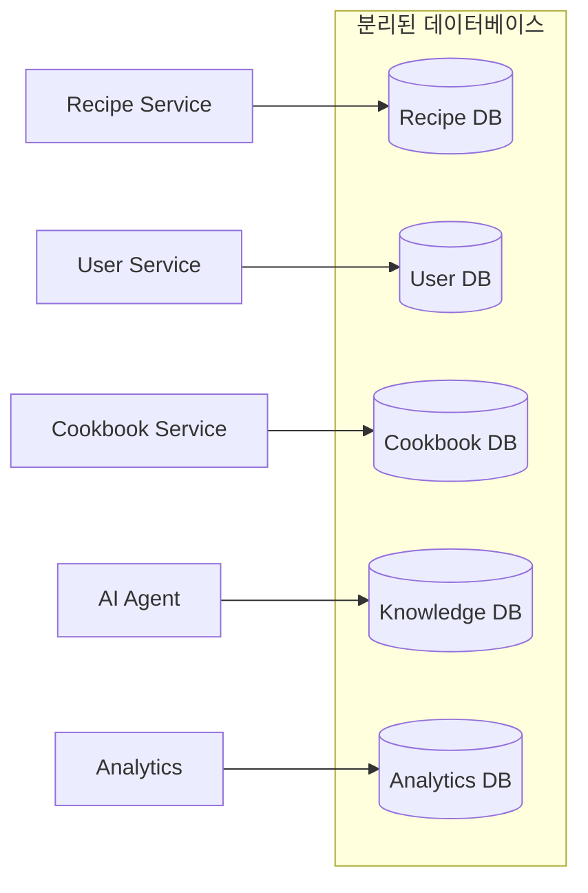
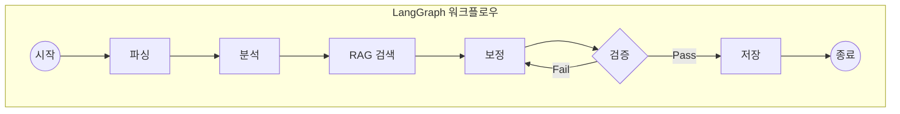
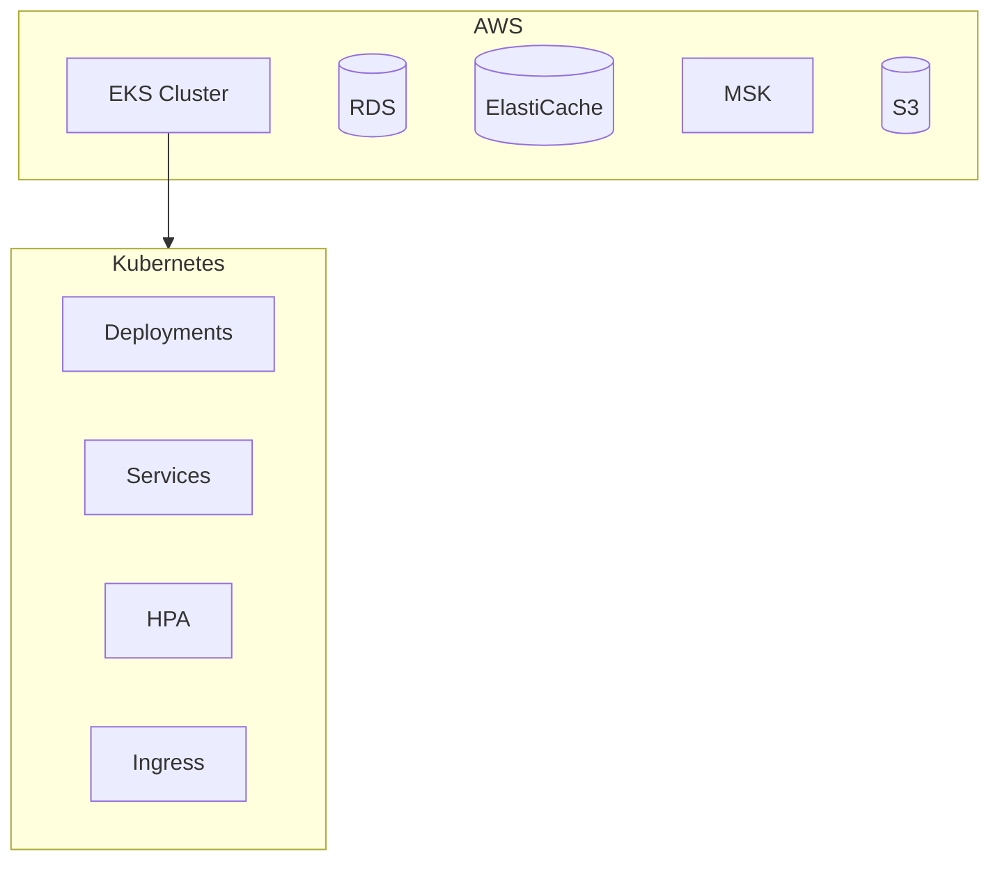
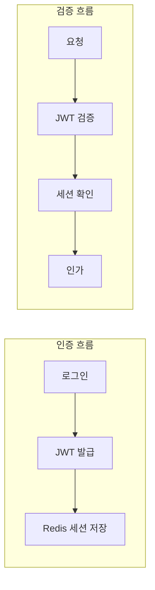
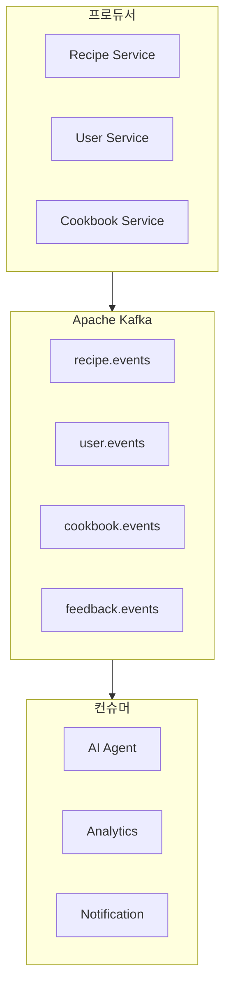
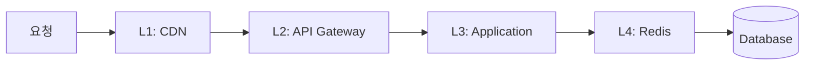
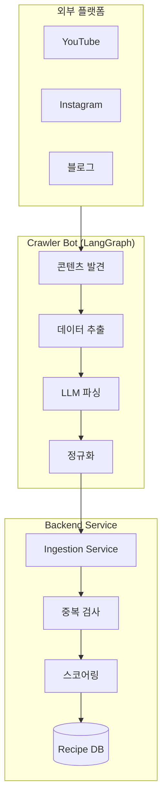
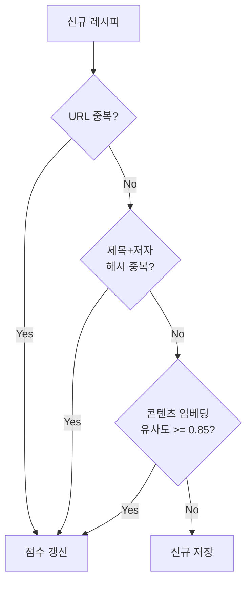

# 내시피(Naecipe) 아키텍처 결정 기록 (ADR)

> 상위 문서: [5-1SERVICE_ARCHITECTURE.md](./5-1SERVICE_ARCHITECTURE.md)

---

## ADR 개요

아키텍처 결정 기록(Architecture Decision Record)은 중요한 설계 결정과 그 근거를 문서화한다.
각 ADR은 다음 구조를 따른다:

- **상태**: Proposed | Accepted | Deprecated | Superseded
- **컨텍스트**: 결정이 필요한 상황
- **결정**: 선택한 방안
- **근거**: 선택 이유
- **결과**: 예상되는 영향

---

## ADR-001: 데이터베이스 분리 전략

### 메타데이터
- **상태**: Accepted
- **결정일**: 2025.11.30
- **결정자**: Tech Lead, Backend Team

### 컨텍스트

내시피 서비스는 여러 도메인(Recipe, User, Cookbook, AI, Analytics)을 가지며, 각 도메인은 서로 다른 데이터 특성과 확장 요구사항을 갖는다.

**고려 사항:**
- 도메인 간 독립적 확장 필요
- 장애 격리 요구
- 팀별 독립적 개발/배포
- 데이터 일관성 vs 가용성 트레이드오프

### 결정

**도메인별 물리적 데이터베이스 분리 (Database per Service)**



### 근거

| 대안 | 장점 | 단점 | 결론 |
|------|------|------|------|
| **단일 DB** | 단순함, 트랜잭션 | 확장 제한, 단일 장애점 | ❌ |
| **스키마 분리** | 관리 용이 | 확장 제한, 리소스 경합 | ❌ |
| **DB 분리** | 독립 확장, 장애 격리 | 복잡성, 분산 트랜잭션 | ✅ 선택 |

**선택 이유:**
1. **독립적 확장**: Recipe DB는 읽기 집중, Analytics DB는 쓰기 집중으로 서로 다른 최적화 필요
2. **장애 격리**: Analytics DB 장애가 Core Loop에 영향을 주지 않음
3. **기술 다양성**: Analytics에 TimescaleDB, Knowledge에 pgvector 적용 가능
4. **팀 자율성**: 각 팀이 스키마 변경을 독립적으로 수행

### 결과

**긍정적:**
- 서비스별 독립 배포/확장 가능
- 장애 도메인 분리
- 도메인별 최적화된 DB 설정

**부정적:**
- 크로스 도메인 쿼리 불가 (API 호출 필요)
- 분산 트랜잭션 복잡성 (Saga 패턴 필요)
- 운영 복잡성 증가

**완화 전략:**
- 이벤트 기반 데이터 동기화 (Kafka)
- 읽기용 Materialized View (필요시)
- 통합 모니터링 대시보드

---

## ADR-002: AI 에이전트 프레임워크 선택

### 메타데이터
- **상태**: Accepted
- **결정일**: 2025.11.30
- **결정자**: AI Team, Tech Lead

### 컨텍스트

레시피 보정 AI 에이전트는 복잡한 워크플로우(피드백 분석 → RAG 검색 → 보정 생성 → 검증)를 수행해야 한다. 적절한 에이전트 프레임워크 선택이 필요하다.

### 결정

**LangGraph 선택**



### 근거

| 프레임워크 | 장점 | 단점 | 적합성 |
|-----------|------|------|--------|
| **LangChain** | 생태계, 문서화 | 복잡한 흐름 제어 어려움 | ⚠️ |
| **LangGraph** | 상태 머신, 조건 분기 | 러닝 커브 | ✅ 선택 |
| **AutoGen** | 멀티 에이전트 | 과도한 복잡성 | ❌ |
| **직접 구현** | 완전한 제어 | 개발 비용 | ❌ |

**선택 이유:**
1. **상태 기반 워크플로우**: 복잡한 조건 분기와 루프 처리 용이
2. **LangChain 호환**: 기존 LangChain 컴포넌트 재사용
3. **디버깅 용이**: 각 노드 실행 상태 추적 가능
4. **확장성**: 새로운 노드 추가 용이

### 결과

**긍정적:**
- 명확한 워크플로우 정의
- 실패 지점 식별 용이
- 재시도 로직 간편 구현

**부정적:**
- LangGraph 특화 학습 필요
- LangChain 버전 의존성

---

## ADR-003: 인프라 플랫폼 선택

### 메타데이터
- **상태**: Accepted
- **결정일**: 2025.11.30
- **결정자**: Infra Team, CTO

### 컨텍스트

서비스 배포 및 운영을 위한 클라우드 플랫폼과 컨테이너 오케스트레이션 선택이 필요하다.

### 결정

**AWS EKS (Kubernetes) 선택**



### 근거

| 옵션 | 장점 | 단점 | 결론 |
|------|------|------|------|
| **AWS EKS** | 관리형 K8s, AWS 통합 | 비용, 복잡성 | ✅ 선택 |
| **AWS ECS** | 단순함, AWS 네이티브 | K8s 생태계 제한 | ❌ |
| **GKE** | K8s 원조 | 멀티클라우드 제한 | ❌ |
| **Self-hosted K8s** | 완전한 제어 | 운영 부담 | ❌ |

**선택 이유:**
1. **AWS 통합**: RDS, ElastiCache, MSK와 네이티브 통합
2. **Kubernetes 생태계**: Helm, ArgoCD, Prometheus 등 활용
3. **관리형 서비스**: Control Plane 관리 부담 감소
4. **확장성**: Node Group으로 유연한 확장

### 결과

**긍정적:**
- 표준화된 배포 방식
- 풍부한 도구 생태계
- 팀 확장 시 온보딩 용이

**부정적:**
- 월 $73의 Control Plane 비용
- Kubernetes 학습 곡선
- 소규모에서는 과도할 수 있음

---

## ADR-004: 인증/인가 전략

### 메타데이터
- **상태**: Accepted
- **결정일**: 2025.11.30
- **결정자**: Security Team, Backend Team

### 컨텍스트

사용자 인증과 서비스 간 인가를 위한 전략 수립이 필요하다.

### 결정

**JWT + Redis 세션 하이브리드**



### 근거

| 방식 | 장점 | 단점 | 결론 |
|------|------|------|------|
| **JWT Only** | Stateless, 확장성 | 즉시 무효화 불가 | ❌ |
| **Session Only** | 즉시 무효화 | 확장성 제한 | ❌ |
| **JWT + Redis** | 둘의 장점 결합 | 복잡성 | ✅ 선택 |

**선택 이유:**
1. **보안**: 세션 즉시 무효화 가능 (로그아웃, 비밀번호 변경)
2. **확장성**: JWT로 기본 인증, Redis로 세션 상태 관리
3. **성능**: Redis 캐시로 빠른 세션 조회

### 결과

**구현 상세:**
- Access Token: 1시간 만료, RS256 서명
- Refresh Token: 7일 만료, Redis 저장
- 세션 무효화: Redis에서 삭제 시 즉시 적용

---

## ADR-005: 이벤트 버스 선택

### 메타데이터
- **상태**: Accepted
- **결정일**: 2025.11.30
- **결정자**: Backend Team, Infra Team

### 컨텍스트

마이크로서비스 간 비동기 통신을 위한 메시지 브로커 선택이 필요하다.

### 결정

**Apache Kafka (AWS MSK) 선택**



### 근거

| 옵션 | 장점 | 단점 | 결론 |
|------|------|------|------|
| **Kafka (MSK)** | 처리량, 내구성, 리플레이 | 운영 복잡성 | ✅ 선택 |
| **RabbitMQ** | 단순함, 라우팅 | 확장 제한 | ❌ |
| **SQS/SNS** | 관리형, 단순 | 기능 제한 | ❌ |
| **Redis Streams** | 가볍고 빠름 | 내구성 제한 | ❌ |

**선택 이유:**
1. **이벤트 리플레이**: 장애 복구 시 이벤트 재처리 가능
2. **높은 처리량**: 초당 수만 건 이벤트 처리
3. **Consumer Group**: 병렬 처리 및 부하 분산
4. **데이터 보존**: 7일간 이벤트 보존

### 결과

**긍정적:**
- 안정적인 이벤트 전달
- 서비스 간 느슨한 결합
- 이벤트 소싱 패턴 지원

**부정적:**
- MSK 비용 (월 ~$660)
- 파티션 관리 복잡성

---

## ADR-006: 캐시 전략

### 메타데이터
- **상태**: Accepted
- **결정일**: 2025.11.30
- **결정자**: Backend Team

### 컨텍스트

응답 시간 개선과 데이터베이스 부하 감소를 위한 캐시 전략 수립이 필요하다.

### 결정

**다층 캐시 (Multi-Layer Cache)**



### 근거

| 계층 | 대상 데이터 | TTL | 히트율 목표 |
|------|------------|-----|-----------|
| **L1 CDN** | 정적 자산, 인기 API | 1h+ | 90% |
| **L2 Gateway** | 읽기 전용 API | 1-5m | 70% |
| **L3 App** | Hot Data (LRU) | 5m | 80% |
| **L4 Redis** | 세션, 사용자 데이터 | 15m-24h | 95% |

### 결과

**무효화 전략:**
- Write-Through: 데이터 변경 시 캐시 갱신
- Event-Based: Kafka 이벤트로 관련 캐시 무효화
- TTL: 시간 기반 자동 만료

---

## ADR-007: 프론트엔드 프레임워크 선택

### 메타데이터
- **상태**: Accepted
- **결정일**: 2025.11.30
- **결정자**: Frontend Team

### 컨텍스트

웹 프론트엔드 개발을 위한 프레임워크 선택이 필요하다.

### 결정

**Next.js 14 (App Router) 선택**

### 근거

| 옵션 | 장점 | 단점 | 결론 |
|------|------|------|------|
| **Next.js** | SSR/SSG, React 생태계 | 복잡성 | ✅ 선택 |
| **Remix** | 웹 표준, 성능 | 생태계 작음 | ❌ |
| **Nuxt (Vue)** | Vue 생태계 | React 선호 | ❌ |
| **SPA (Vite)** | 단순함 | SEO, 초기 로드 | ❌ |

**선택 이유:**
1. **SEO**: 레시피 페이지 검색 노출 중요
2. **성능**: Server Components로 초기 로드 최적화
3. **생태계**: React 개발자 풀, 컴포넌트 라이브러리
4. **개발 경험**: Fast Refresh, TypeScript 지원

---

## ADR-008: API 버전 관리 전략

### 메타데이터
- **상태**: Accepted
- **결정일**: 2025.11.30
- **결정자**: Backend Team, Frontend Team

### 컨텍스트

API 변경 시 하위 호환성 유지와 버전 관리 전략이 필요하다.

### 결정

**URL 경로 기반 버전 관리**

```
/api/v1/recipes
/api/v2/recipes
```

### 근거

| 방식 | 장점 | 단점 | 결론 |
|------|------|------|------|
| **URL 경로** | 명확함, 라우팅 용이 | URL 변경 | ✅ 선택 |
| **Header** | URL 깔끔 | 디버깅 어려움 | ❌ |
| **Query Param** | 유연함 | 캐싱 복잡 | ❌ |

**버전 정책:**
- Major 버전만 URL에 표시 (v1, v2)
- 이전 버전 최소 6개월 유지
- Deprecation 헤더로 사전 공지

---

## ADR-009: 레시피 크롤링 및 데이터 수집 전략

### 메타데이터
- **상태**: Accepted
- **결정일**: 2025.11.30
- **결정자**: Backend Team, AI Team, Tech Lead

### 컨텍스트

내시피의 Core Loop가 작동하려면 사용자가 검색할 수 있는 **원본 레시피 데이터베이스**가 필요하다. 이 데이터를 어떻게 구축하고 유지할지 결정이 필요하다.

**고려 사항:**
- 유명 쉐프/인플루언서의 레시피를 수집해야 함
- 다양한 플랫폼(YouTube, Instagram, 블로그) 지원 필요
- 중복 레시피 관리
- 데이터 품질 및 저작권 문제
- 지속적인 데이터 갱신

### 결정

**LLM 기반 Crawler Bot + Ingestion Service 아키텍처**



### 근거

| 대안 | 장점 | 단점 | 결론 |
|------|------|------|------|
| **수동 입력** | 품질 보장 | 확장 불가, 비용 | ❌ |
| **외부 API 구매** | 즉시 사용 | 비용, 커스터마이징 제한 | ❌ |
| **규칙 기반 크롤링** | 단순, 빠름 | 비정형 데이터 처리 어려움 | ⚠️ |
| **LLM 기반 크롤링** | 비정형 데이터 처리, 유연성 | LLM 비용, 정확도 | ✅ 선택 |

**선택 이유:**
1. **비정형 데이터 처리**: 영상 자막, 블로그 글에서 구조화된 레시피 추출 가능
2. **플랫폼 독립성**: 새 플랫폼 추가 시 파서 구현 부담 감소
3. **품질 향상**: LLM이 맥락을 이해하여 더 정확한 파싱
4. **유연한 중복 검사**: 의미적 유사도 기반 중복 판단

### 결과

**긍정적:**
- 다양한 플랫폼의 레시피 자동 수집
- 일관된 데이터 형식으로 정규화
- 인기도/품질 점수 기반 검색 최적화

**부정적:**
- LLM API 비용 (월 ~$200)
- 파싱 정확도 100% 미만
- 플랫폼 정책 변경 대응 필요

**완화 전략:**
- 비용 효율적인 모델 선택 (GPT-4 Turbo)
- 수동 검수 시스템 도입 (is_verified 플래그)
- robots.txt 준수 및 Rate Limiting

### 중복 검사 전략



| 검사 단계 | 방식 | 임계값 |
|----------|------|--------|
| **1단계** | 소스 URL 일치 | 100% |
| **2단계** | 제목+저자 해시 | 100% |
| **3단계** | 콘텐츠 임베딩 유사도 | >= 0.85 |

---

## 변경 이력

| 버전 | 날짜 | 변경 내용 |
|-----|------|----------|
| v1.0 | 2025.11.30 | 초기 ADR 작성 (ADR-001 ~ ADR-008) |
| v1.1 | 2025.11.30 | ADR-009 레시피 크롤링 전략 추가 |

---

## ADR 색인

| ADR | 제목 | 상태 |
|-----|------|------|
| [ADR-001](#adr-001-데이터베이스-분리-전략) | 데이터베이스 분리 전략 | Accepted |
| [ADR-002](#adr-002-ai-에이전트-프레임워크-선택) | AI 에이전트 프레임워크 선택 | Accepted |
| [ADR-003](#adr-003-인프라-플랫폼-선택) | 인프라 플랫폼 선택 | Accepted |
| [ADR-004](#adr-004-인증인가-전략) | 인증/인가 전략 | Accepted |
| [ADR-005](#adr-005-이벤트-버스-선택) | 이벤트 버스 선택 | Accepted |
| [ADR-006](#adr-006-캐시-전략) | 캐시 전략 | Accepted |
| [ADR-007](#adr-007-프론트엔드-프레임워크-선택) | 프론트엔드 프레임워크 선택 | Accepted |
| [ADR-008](#adr-008-api-버전-관리-전략) | API 버전 관리 전략 | Accepted |
| [ADR-009](#adr-009-레시피-크롤링-및-데이터-수집-전략) | 레시피 크롤링 및 데이터 수집 전략 | Accepted |

---

> **이전 문서:** [5-1-8_OPERATIONS.md](./5-1-8_OPERATIONS.md) - 운영 가이드
