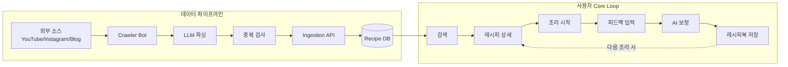
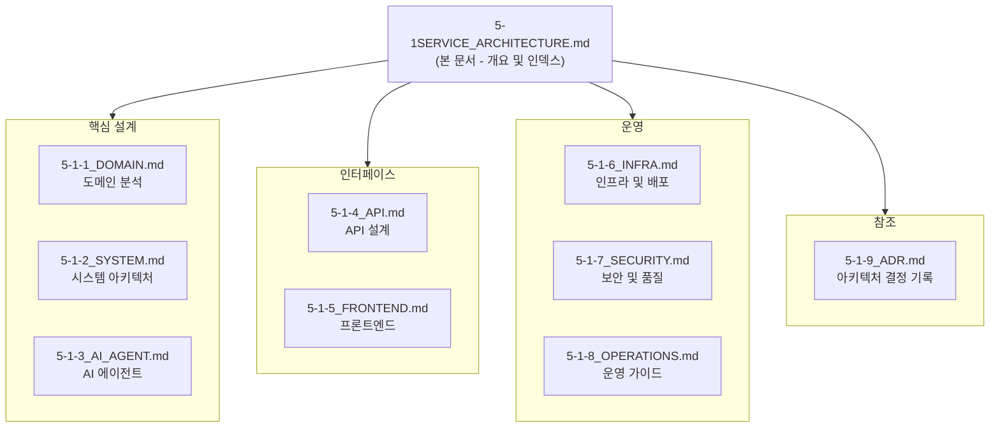

# 내시피(Naecipe) 서비스 아키텍처 v1.1

작성일: 2025.11.30
버전: v1.1
대상: 개발팀, 인프라팀, 데이터팀, 보안팀, FinOps팀, SRE팀, 경영진

> 본 문서는 PRD, 요구사항 정의서, 기능 명세서의 도메인 분석을 기반으로 **내시피 서비스에 특화된 아키텍처**를 정의한다.
> v1.1은 Recipe Crawler Pipeline 및 Ingestion Service 추가를 포함한 업데이트 버전이다.

---

## Executive Summary

### 내시피 서비스 개요

**내시피(Naecipe)**는 "나만의 레시피"를 의미하는 AI 기반 개인화 요리 플랫폼이다. 사용자가 외부 레시피를 따라 요리하고, 피드백을 입력하면 AI가 개인 취향에 맞게 레시피를 보정해주는 것이 핵심 가치이다.

### 핵심 비즈니스 플로우 (Core Loop)

**데이터 파이프라인**: 유명 셰프/인플루언서의 레시피를 외부 플랫폼에서 수집 → LLM으로 정규화 → 중복 검사 후 DB 저장
**사용자 Core Loop**: Recipe DB에서 검색 → 조리 → 피드백 → AI 보정 → 개인화 레시피 저장

### 아키텍처 하이라이트

| 영역 | 선택 | 근거 |
|------|------|------|
| **백엔드** | Python (FastAPI) | 고성능, 타입 힌트, AI/ML 통합 용이 |
| **프론트엔드** | Next.js 14 (App Router) | SSR/SSG 지원, React 생태계 |
| **데이터베이스** | PostgreSQL (도메인별 분리) | 관계형 데이터, ACID, pgvector |
| **캐시** | Redis Cluster | 고성능 캐싱, 세션 관리 |
| **메시징** | Apache Kafka | 이벤트 소싱, 비동기 처리 |
| **AI 에이전트** | LangGraph + OpenAI/Anthropic | 워크플로우 제어, 품질 |
| **크롤러** | LangGraph + Playwright | 레시피 수집, LLM 파싱 |
| **인프라** | AWS EKS | 컨테이너 오케스트레이션, 확장성 |
| **CI/CD** | GitHub Actions + ArgoCD | GitOps, 자동화 |

### 주요 품질 속성 목표

| 속성 | 목표 |
|------|------|
| 가용성 | 99.9% (월 43분 이하 다운타임) |
| 응답 시간 | 검색 < 200ms, 상세 < 100ms (p99) |
| 동시 사용자 | Phase 1: 50,000명 |
| AI 보정 시간 | < 10초 |
| 데이터 손실 | RPO < 5분 |
| 복구 시간 | RTO < 30분 |

---

## 문서 구성

본 아키텍처 문서는 **8개의 세부 문서**로 구성되어 있다. 각 문서는 특정 영역을 담당하며, 필요한 팀이 해당 문서만 참조할 수 있도록 설계되었다.

---

## 세부 문서 목록

### 1. 도메인 분석 (`5-1-1_DOMAIN.md`)

**대상 독자:** 전체 팀, 특히 기획/PM

핵심 비즈니스 도메인과 데이터 흐름을 정의한다.

| 섹션 | 내용 |
|------|------|
| 핵심 데이터 흐름 | Core Loop 기반 데이터 흐름도 |
| 도메인 경계 식별 | Recipe, User, Cookbook, AI Agent, Analytics |

---

### 2. 시스템 아키텍처 (`5-1-2_SYSTEM.md`)

**대상 독자:** 백엔드 개발팀, 인프라팀, DBA

전체 시스템 구조, 데이터베이스 설계, 캐시 전략을 정의한다.

| 섹션 | 내용 |
|------|------|
| 전체 시스템 아키텍처 | 4계층 구조 (Client, Gateway, Service, Data) |
| Database 상세 설계 | 5개 도메인별 DB 분리, 상세 스키마 |
| 캐시 전략 상세 | Redis 캐시 구조, 무효화 전략 |

---

### 3. AI 에이전트 (`5-1-3_AI_AGENT.md`)

**대상 독자:** AI/ML 팀, 백엔드 개발팀

AI 서비스 아키텍처와 이벤트 흐름을 정의한다.

| 섹션 | 내용 |
|------|------|
| AI Agent 서비스 상세 | LangGraph 기반 Adjustment/Q&A Agent |
| Recipe Crawler Agent | 외부 레시피 수집 및 LLM 파싱 에이전트 |
| 이벤트 흐름 상세 | Core Loop 이벤트 시퀀스, 이벤트 스키마 |

---

### 4. API 설계 (`5-1-4_API.md`)

**대상 독자:** 백엔드 개발팀, 프론트엔드 개발팀

API 설계 원칙, 엔드포인트, 서비스 간 통신을 정의한다.

| 섹션 | 내용 |
|------|------|
| API 설계 원칙 | RESTful, 버전 관리, 응답 형식 |
| 서비스별 API | Recipe, User, Cookbook, AI Service API |
| Ingestion Service API | 크롤러 연동, 중복 검사, 레시피 등록 |
| 서비스 간 통신 | gRPC, Kafka 이벤트 버스 |
| 성능 요구사항 | SLA, 응답 시간 목표 |

---

### 5. 프론트엔드 (`5-1-5_FRONTEND.md`)

**대상 독자:** 프론트엔드 개발팀, UI/UX 팀

프론트엔드 아키텍처, 인증, 에러 처리를 정의한다.

| 섹션 | 내용 |
|------|------|
| 프론트엔드 아키텍처 | Next.js 14 App Router, 디렉토리 구조 |
| 인증 및 인가 | JWT, OAuth2, 세션 관리 |
| 에러 처리 | 클라이언트/서버 에러 처리 전략 |

---

### 6. 인프라 및 배포 (`5-1-6_INFRA.md`)

**대상 독자:** 인프라팀, DevOps, SRE

AWS 인프라, Kubernetes, CI/CD, 모니터링을 정의한다.

| 섹션 | 내용 |
|------|------|
| 클라우드 인프라 | AWS EKS, RDS, ElastiCache, MSK |
| Crawler 인프라 | EC2, K8s CronJob, 스케줄링 |
| Kubernetes 구성 | Deployment, HPA, 리소스 관리 |
| CI/CD 파이프라인 | GitHub Actions, ArgoCD |
| 모니터링 | Prometheus, Grafana, ELK, Jaeger |

---

### 7. 보안 및 품질 (`5-1-7_SECURITY.md`)

**대상 독자:** 보안팀, QA팀, 백엔드 개발팀

보안 아키텍처, 성능 최적화, 테스트, 마이그레이션 전략을 정의한다.

| 섹션 | 내용 |
|------|------|
| 보안 아키텍처 | 3계층 보안, OWASP Top 10 대응 |
| 크롤링 보안 정책 | 입력 검증, Sanitization, 악성 콘텐츠 필터링 |
| 성능 최적화 | DB 인덱스, 다층 캐시, 프론트엔드 최적화 |
| 테스트 전략 | Unit/Integration/E2E, 커버리지 목표 |
| 데이터 마이그레이션 | 버전 관리, 롤백 전략 |
| 데이터 관계도 | ER 다이어그램 (recipe_sources, recipe_score_history 포함) |

---

### 8. 운영 가이드 (`5-1-8_OPERATIONS.md`)

**대상 독자:** SRE, FinOps, 전체 개발팀

비용 최적화, 확장성, DR, On-Call, 개발 환경을 정의한다.

| 섹션 | 내용 |
|------|------|
| 비용 최적화 | AWS 비용 관리, FinOps |
| Crawler Bot 운영 | 모니터링, 비용, 트러블슈팅 |
| 확장성 설계 | 수평 확장, 샤딩 전략 |
| 장애 복구 (DR) | Multi-Region, RTO/RPO |
| 운영 가이드 | On-Call, Runbook (Crawler 포함) |
| 개발 환경 가이드 | 로컬 설정, Docker Compose |
| 상세 데이터 플로우 | 전체 시퀀스 다이어그램 |

---

### 9. 아키텍처 결정 기록 (`5-1-9_ADR.md`)

**대상 독자:** 전체 팀, 특히 Tech Lead

주요 아키텍처 결정 사항과 그 근거를 기록한다.

| 섹션 | 내용 |
|------|------|
| ADR-001 | 데이터베이스 분리 전략 |
| ADR-002 | AI 에이전트 프레임워크 선택 |
| ADR-003 | 인프라 플랫폼 선택 |
| ADR-004 | 인증/인가 전략 |
| ADR-005 | 이벤트 버스 선택 |
| ADR-009 | 레시피 크롤링 전략 (중복 검사, 스코어링) |
| 변경 이력 | 문서 버전 관리 |

---

## 빠른 참조

### 팀별 필수 문서

| 팀 | 필수 문서 |
|----|----------|
| **백엔드 개발** | SYSTEM, AI_AGENT, API |
| **프론트엔드 개발** | FRONTEND, API |
| **인프라/DevOps** | INFRA, OPERATIONS |
| **보안** | SECURITY |
| **SRE** | INFRA, OPERATIONS, SECURITY |
| **DBA** | SYSTEM (DB 섹션) |
| **AI/ML** | AI_AGENT (Crawler Agent 포함) |
| **QA** | SECURITY (테스트 섹션), API |
| **PM/기획** | DOMAIN, 본 문서 |

### 주요 다이어그램 위치

| 다이어그램 | 문서 |
|-----------|------|
| Core Data Flow | DOMAIN |
| 시스템 아키텍처 | SYSTEM |
| Crawler Service Flow | SYSTEM |
| ER 다이어그램 | SECURITY |
| AI Agent Flow | AI_AGENT |
| Crawler Agent Flow | AI_AGENT |
| 이벤트 시퀀스 | AI_AGENT |
| AWS 인프라 | INFRA |
| K8s CronJob (Crawler) | INFRA |
| CI/CD 파이프라인 | INFRA |
| DR 아키텍처 | OPERATIONS |
| 중복 검사 Flow | ADR (ADR-009) |

---

## 변경 이력

| 버전 | 날짜 | 변경 내용 |
|-----|------|----------|
| v0.1 | 2025.11.30 | 초안 작성 |
| v0.2 | 2025.11.30 | 내시피 특화 구조로 전면 개편 |
| v0.3 | 2025.11.30 | AI Agent, 성능 요구사항, 이벤트 스키마 추가 |
| v0.4 | 2025.11.30 | 인프라, CI/CD, 모니터링 추가 |
| v0.5 | 2025.11.30 | 보안, 성능, 테스트, 마이그레이션 추가 |
| v0.6 | 2025.11.30 | 비용, 확장성, DR, 운영, 개발 환경 추가 |
| v0.7 | 2025.11.30 | 상세 데이터 플로우, 개발 환경 보완 |
| v1.0 | 2025.11.30 | Executive Summary, ADR, 최종 검토 완료, 문서 분리 |
| v1.1 | 2025.11.30 | Recipe Crawler Pipeline 추가: Ingestion API, 크롤러 인프라, 보안 정책, 운영 가이드, ADR-009 |

---

> **Note:** 각 세부 문서의 상세 내용은 해당 파일을 참조하세요.
